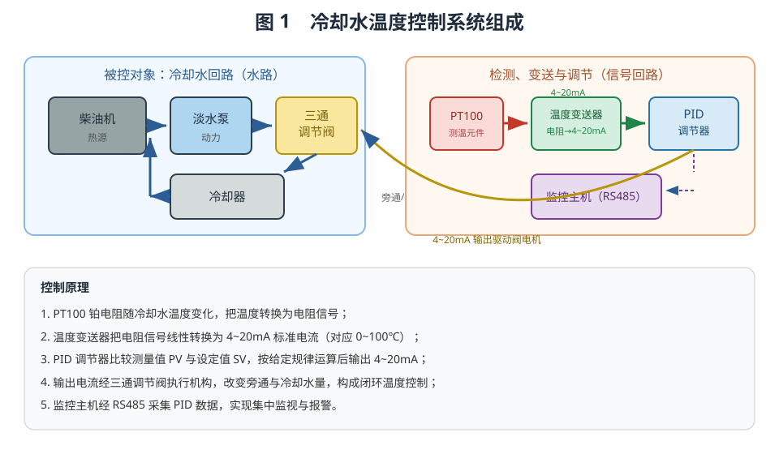
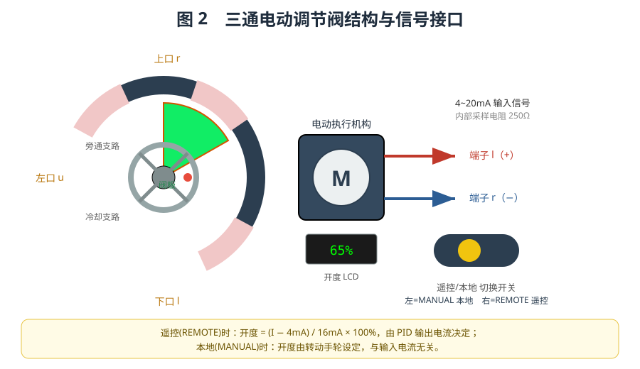
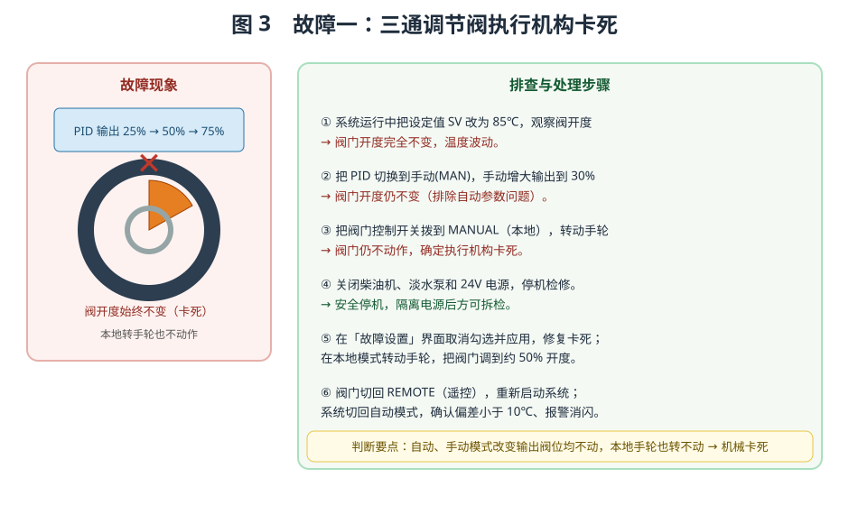
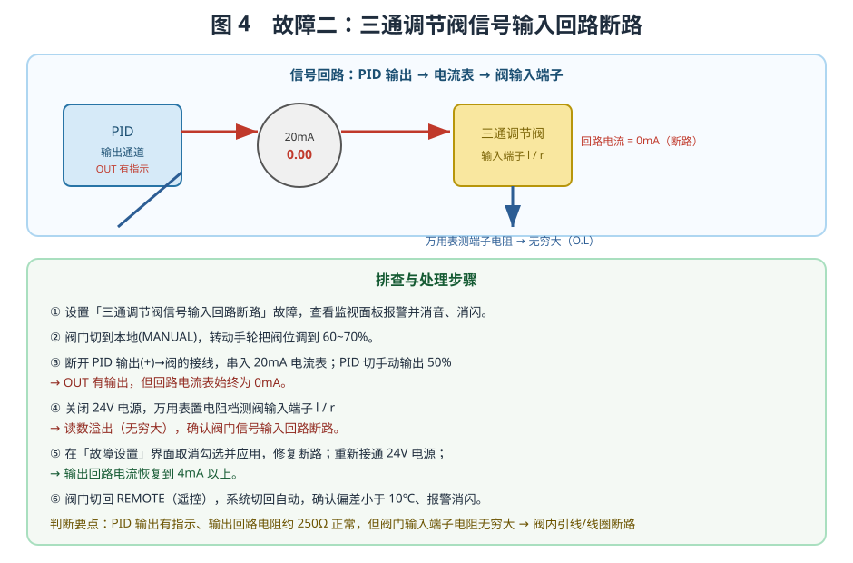
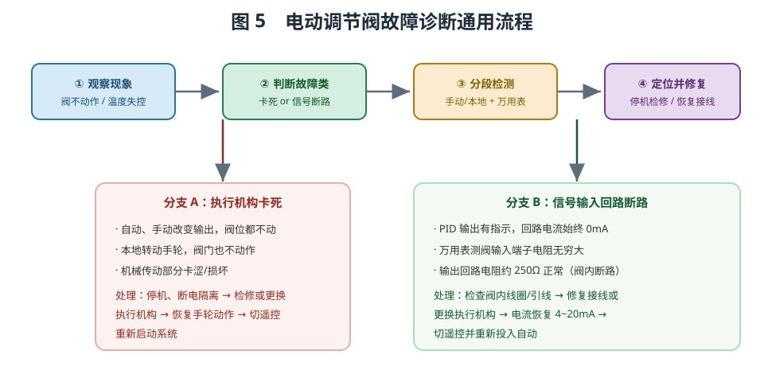

# 电动调节阀的故障诊断

## 一、实训目的

电动调节阀是过程控制系统中的核心执行机构，它接收调节器输出的标准信号，改变阀门开度，从而调节被控介质的流量。在船舶冷却水温度控制系统中，三通调节阀通过改变旁通水量与冷却水量，把柴油机的冷却水温稳定在设定值附近。本实训以"大管轮·冷却水温度控制系统"为载体，围绕三通电动调节阀开展两项典型故障的诊断与排除训练：

1. 掌握三通电动调节阀的结构、工作原理与信号接口；
2. 掌握"执行机构卡死"与"信号输入回路断路"两类故障的现象、排查方法与处理流程；
3. 熟练使用数字万用表进行回路电阻测量、使用监控主机进行报警确认；
4. 培养"先现象、后判断、分段检测、定位修复"的规范化故障诊断思维。

## 二、系统组成与工作原理

冷却水温度控制系统由被控对象和检测调节两大回路构成，如图 1 所示。水路上，柴油机产生热量，淡水泵提供循环动力，三通调节阀按开度分配"旁通支路"与"冷却支路"的水量，冷却器对冷却支路的水进行降温；信号回路上，PT100 铂电阻把水温转换为电阻信号，温度变送器将其线性转换为 4~20mA 标准电流，送入 PID 调节器。

PID 调节器把测量值 PV 与设定值 SV 比较后，按比例、积分、微分规律运算，输出 4~20mA 电流驱动三通调节阀的电动机。当水温偏高时，PID 控制阀门开大，让更多水经过冷却器，水温下降；反之则关小阀门，让更多水直接旁通。如此反复，构成闭环温度控制。监控主机经 RS485 总线采集 PID 数据，实现集中监视与故障报警。

## 三、三通电动调节阀的结构

三通电动调节阀的结构如图 2 所示，主要由三部分构成：

**阀体与阀板**——阀腔有三个流体接口：左口 u、下口 l、上口 r。左口与下口分别连接旁通支路和冷却支路，上口为公共出口。腔内的扇形阀板随开度旋转，改变两条支路的水量分配比例。开度为 0% 时全部旁通，开度为 100% 时全部经冷却器。

**电动执行机构**——由电动机（图 2 中的 M）经传动机构驱动阀杆，带动阀板旋转。执行机构接受 4~20mA 电流信号（也可由本地手轮操控），把电流大小转换为阀门的开度位置。

**电气接口与本地/遥控切换开关**——阀的电气端子为 l（+）和 r（−），内部为 250Ω 采样电阻。遥控（REMOTE）模式下，阀门开度由输入电流决定：

$$\text{开度} = \frac{I - 4\text{mA}}{16\text{mA}} \times 100\%$$

例如 4mA 对应 0%、12mA 对应 50%、20mA 对应 100%。本地（MANUAL）模式下，开度由转动手轮设定，与输入电流无关，便于现场检修和应急操作。面板上的 LCD 实时显示开度百分比，模式开关指示当前控制方式。

## 四、4~20mA 信号链与开度换算

三通调节阀的"遥控"功能依赖于一条完整的 4~20mA 电流信号链，理解这条信号链是故障诊断的基础。信号从 PID 调节器的输出通道（po1/n1）出发，经信号线送到阀门执行机构的输入端（l/r）。阀门内部的 250Ω 采样电阻把电流转换为电压：4mA 对应 1V、12mA 对应 3V、20mA 对应 5V。执行机构据此把电流线性映射为 0~100% 的开度。

这条信号链的任一环节出问题，都会导致阀门失控，因此诊断时要把"信号源—传输线—执行机构"三段分开检查：

- **信号源**：PID 是否上电、输出通道是否为 4~20mA 模式、OUT 是否有输出；
- **传输线**：输出正负极接线是否正确、端子有无松脱、信号线有无断点；
- **执行机构**：阀内采样电阻（约 250Ω）是否完好、线圈与引线是否断路。

在遥控模式下，阀门的实际开度由输入电流实时决定，不随人的主观意愿改变；而本地模式下阀门由手轮操控，与输入电流无关。正因如此，**"本地/遥控切换"和"自动/手动切换"是区分故障类型的两把钥匙**：它们能帮助操作者快速判断故障究竟在信号侧还是机械侧。

> **实际参数对照（量程 0~100℃）**：
> | 电流 | 阀输入电压 | 阀门开度 | 对应温度 |
> |------|-----------|---------|---------|
> | 4mA | 1.0V | 0% | 0℃ |
> | 12mA | 3.0V | 50% | 50℃ |
> | 20mA | 5.0V | 100% | 100℃ |

## 五、故障一：三通调节阀执行机构卡死

### 1. 故障现象

系统运行中，无论 PID 输出如何变化，阀门开度始终不变，被控温度随之波动失控。该故障的典型特征是：**自动、手动模式下改变输出阀位，阀门都不动作；切到本地转动手轮，阀门也不动作。** 这说明问题不在电气信号回路，而在阀门执行机构的机械部分（阀杆卡涩、传动机构损坏等）。

### 2. 排查与处理流程（如图 3）

1. **改变设定值观察**：把 PID 设定值 SV 改为 85℃，观察阀门开度。若开度完全不变、温度波动，初步怀疑阀门不动作。
2. **切手动验证**：把 PID 切换到手动（MAN）模式，手动增大输出到 30%。阀门开度仍不变，可排除"自动参数失调"的可能。
3. **本地操作验证**：把阀门控制开关拨到 MANUAL（本地），转动手轮。若阀门仍不动作，即可确定执行机构卡死。
4. **安全停机**：关闭柴油机、淡水泵和 24V 电源，隔离电源后方可拆检。
5. **修复处理**：在「故障设置」界面取消勾选并应用，修复卡死；在本地模式转动手轮，把阀门调到约 50% 开度。
6. **恢复运行**：阀门切回 REMOTE（遥控），重新启动系统，切回自动模式，确认 PV 与 SV 偏差小于 10℃、报警已消音消闪。

**判断要点**：自动、手动模式改变输出阀位均不动，本地手轮也转不动，即可判定为执行机构机械卡死，应停机检修或更换执行机构。

## 六、故障二：三通调节阀信号输入回路断路

### 1. 故障现象

PID 调节器 OUT 有输出指示，但输出回路电流始终为 0mA，阀门不动作。用万用表测量三通阀信号输入端子，电阻为无穷大。该故障的典型特征是：**PID 输出有指示、输出回路电阻约 250Ω 正常，但阀门信号输入端子电阻趋于无穷大。** 这说明断路点在阀门执行机构的输入线圈或其内部引线上（也可能是接线端子松脱）。

### 2. 排查与处理流程（如图 4）

1. **设置故障**：设置「三通调节阀信号输入回路断路」故障，查看监视面板报警并消音、消闪。
2. **本地定位**：阀门切到本地（MANUAL），转动手轮把阀位调到 60~70%，便于对比观察。
3. **串表测流**：断开 PID 输出（+）到阀的接线，串入 20mA 电流表；把 PID 切手动、输出 50%。此时 OUT 有输出，但回路电流表始终为 0mA。
4. **测阻判断**：关闭 24V 电源，把万用表置电阻档，测量阀输入端子 l、r。读数溢出（无穷大），确认阀门信号输入回路断路。
5. **修复处理**：在「故障设置」界面取消勾选并应用，修复断路；重新接通 24V 电源，观察输出回路电流恢复到 4mA 以上。
6. **恢复运行**：阀门切回 REMOTE（遥控），系统切回自动，确认偏差小于 10℃、报警已消音消闪。

**判断要点**：输出回路电阻约 250Ω 说明执行机构本身完好，而阀门输入端子电阻无穷大，说明断路点在阀门内部。处理时应停机检查阀门的信号输入回路（接线端子、线圈），修复或更换执行机构后确认电流恢复到 4~20mA，再把阀门投入遥控并重新启动系统。

### 3. 两种"断路"的区分

在输出侧回路中，容易混淆的另一种故障是"PID 输出回路断路"。两者的现象相似（都是回路电流为 0、阀门不动作），但故障点不同：

- **PID 输出回路断路**：断路点在 PID 输出端子到阀门之间的信号线上。用万用表测量 PID 输出端子（po1/no1）之间的电阻会异常（开路），而阀门输入端子的电阻正常。
- **阀门信号输入断路**：断路点在阀门内部（线圈或引线）。用万用表测量阀门输入端子（l/r）的电阻趋于无穷大，而 PID 输出回路的等效电阻（约 250Ω）正常。

因此，**测量"测谁那一侧的电阻"是区分两者的关键**：测量端子电阻时应针对被怀疑的一侧，且必须断电后进行，避免带电测阻损坏万用表或造成误判。

> **重要提示**：在仿真平台中，当阀门处于本地（MANUAL）模式时，其开度完全由手轮设定，即使输入回路仍然带电、或用万用表跨接在输入端子上测量，阀位也**不会**因为电流变化而改变。这一设计符合真实设备的本地控制逻辑。若在本地模式下发现阀位随输入信号变化，应检查是否为软件模型异常。

> **提示**：实际调试中，若在 PID 输出回路中串入电流表测量，要注意电流表的接入不能使回路开路。本仿真平台中，电流表为理想 0Ω 串联表，接入后回路电阻仅增加约 0.01Ω，不会改变回路电流；检修完成后应及时恢复原接线。

## 七、故障诊断通用流程

综合上述两类故障，可以归纳出电动调节阀故障诊断的通用流程，如图 5 所示。

**第一步：观察现象。** 从阀门是否动作、被控温度是否失控等现象入手，判断故障的大致范围。

**第二步：判断故障类别。** 通过"自动/手动切换 + 本地/遥控切换"进行区分：若自动、手动、本地操作均无效，属于执行机构机械故障；若输出有指示而阀门不动，则属于信号回路故障。

**第三步：分段检测。** 对信号回路，串入电流表测量电流、用万用表测量端子电阻，逐段缩小故障范围；对执行机构，手动操作验证机械传动是否灵活。

**第四步：定位并修复。** 根据检测结果确定故障点，停机隔离后检修或更换相应部件，恢复接线后投入运行，确认回路电流恢复正常、系统重新稳定。

## 八、安全操作与检修注意事项

电动调节阀的故障检修涉及停机、断电和拆检，必须遵守以下安全规范：

1. **先停机、后检修**：检修前应关闭柴油机、淡水泵，切断 24V 电源，防止阀门在检修过程中突然动作伤人。
2. **断电测阻**：用万用表测量回路电阻时，务必先切断电源，带电测量会使读数失真甚至损坏仪表。
3. **隔离工艺介质**：检修阀门本体前应先关闭相关截止阀，释放管路压力，防止高温冷却水喷溅。
4. **恢复接线要核对**：修复后重新接线时，应核对极性（l 为 +、r 为 −），避免接反导致阀门反向动作。
5. **投入运行前确认**：先切回遥控模式、恢复 4~20mA 回路，确认电流正常、报警已消音确认后，再把系统投入自动运行。

规范的操作流程不仅能快速定位故障，更是保障人身和设备安全的前提。在实训中要养成"先观察、再判断、后动手"的习惯，切忌盲目拆检。

## 九、常见故障对照表

| 故障名称 | 关键现象 | 检测要点 | 处理方法 |
|---------|---------|---------|---------|
| 执行机构卡死 | 自动/手动/本地操作阀位均不变 | 本地手轮转不动 | 停机检修或更换执行机构 |
| 信号输入断路 | OUT 有指示，回路电流始终 0mA | 阀输入端子电阻无穷大，输出回路电阻约 250Ω | 修复阀内接线或更换执行机构 |

## 十、思考与练习

1. 为什么判断"执行机构卡死"时，要分别在自动、手动、本地三种方式下操作阀门？
2. 测量阀门信号输入端子电阻前，为什么必须先关闭 24V 电源？
3. 若输出回路电流表读数不是 0 而是 4mA 左右，阀门却仍不动作，应如何进一步排查？
4. 试说明"信号输入回路断路"与"PID 输出回路断路"在现象上的异同，并设计区分两种故障的检测步骤。
