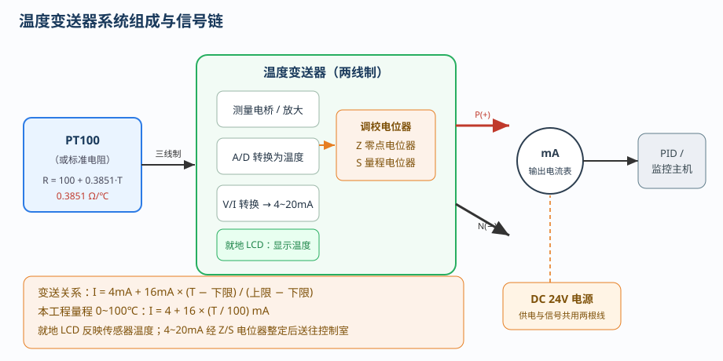
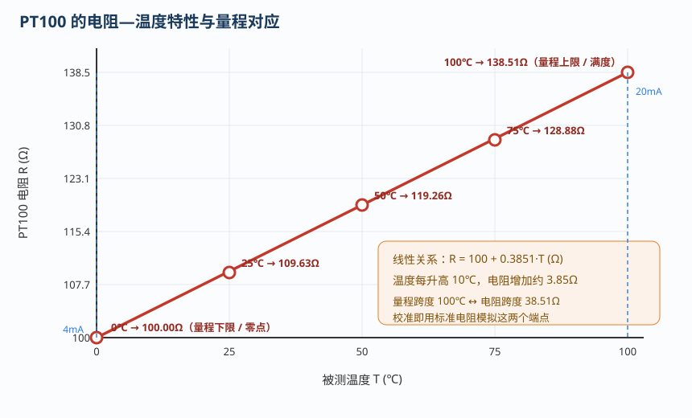
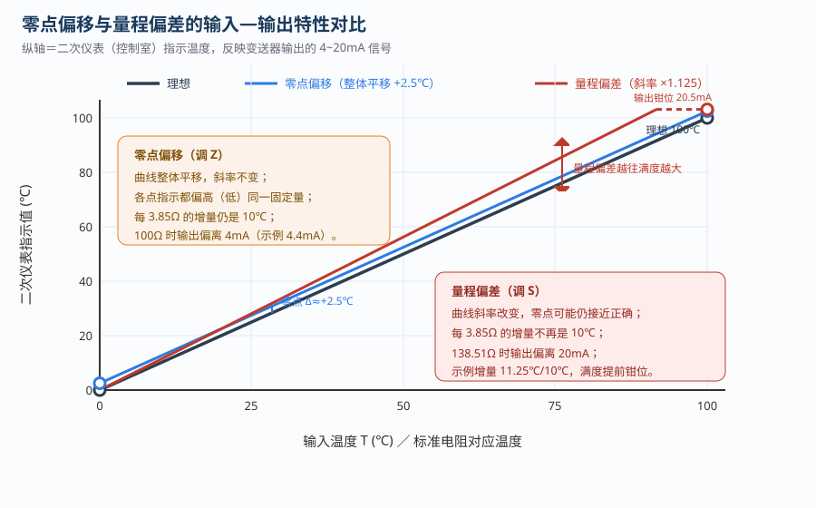
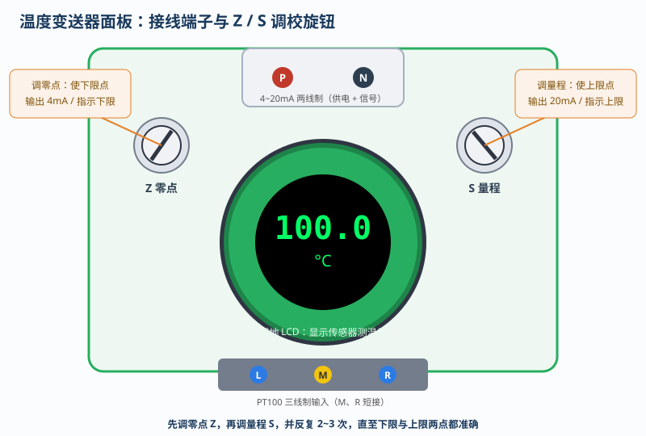
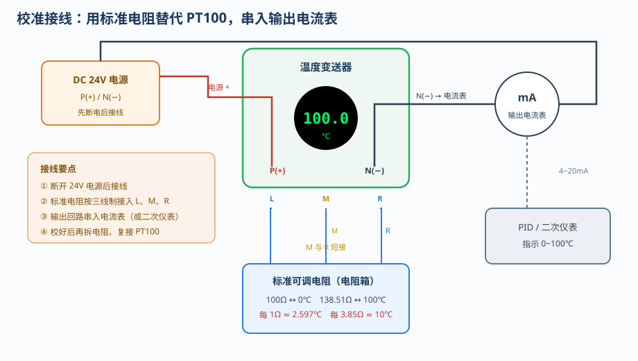
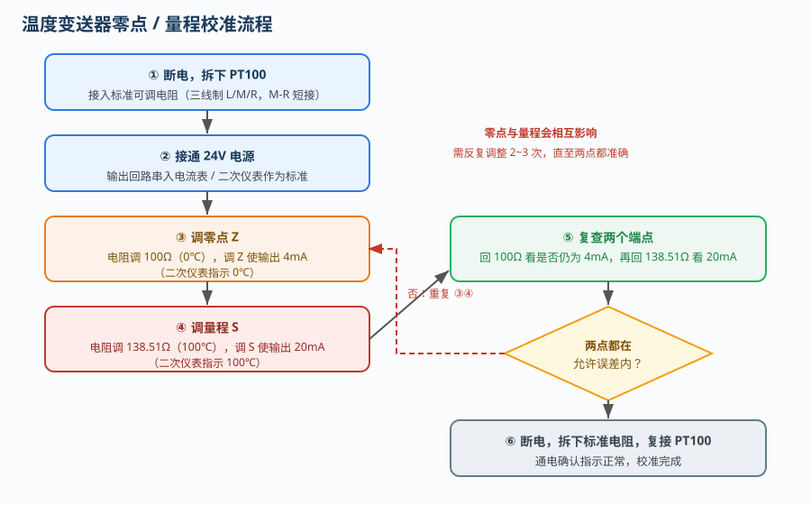

# 变送器的校准方法

> 适用对象：两线制 4~20mA 温度变送器（配 PT100 三线制输入）
> 本文围绕**零点偏移的原因与校准**、**量程调整的原理与方法**两条主线展开，配合本工程仿真平台的校准流程，图文对照、可逐步实操。
> 校准口诀：**先调零点 Z，再调量程 S；零点、量程相互影响，反复 2~3 次直至两端点都准确。**

---

## 一、概述

变送器是过程控制系统的“感知与转换”环节，它把传感器测得的物理量（温度、压力、液位等）线性转换为**统一的标准信号**，送往电流表、调节器或监控主机。工程上最通用的是 **4~20mA 两线制**：供电与信号共用两根导线，**4mA 对应量程下限（零点）、20mA 对应量程上限（满度）**。

变送器出厂后，由于元件老化、温度漂移、电源波动、机械振动等原因，其“输入—输出”关系会慢慢偏离出厂标定的理想直线，表现为**零点偏移**或**量程偏差**。因此，仪表在安装投运前以及定期检修时，都必须进行**校准（标定）**。所谓校准，就是用标准输入量（本章用**标准电阻**模拟 PT100 的温度）去核对变送器的输出，并通过**零点（Z）**和**量程（S）**两个电位器把特性曲线调回理想位置。

校准还要服从仪表的**精度等级**要求。精度等级如 0.5 级，表示变送器输出的**允许基本误差**为量程的 ±0.5%，即 16mA 的满度输出对应 ±0.08mA、折合约 ±0.5℃。只有当各校准点的偏差都落在允许误差带以内，校准才算合格；一旦超差，应先判断是零点问题还是量程问题，再有针对性地调整，而不是“见哪个旋钮就拧哪个”。

---

## 二、温度变送器的工作原理



### 2.1 PT100 的电阻—温度关系

温度变送器的输入是 **PT100 铂电阻**。在 0~100℃ 范围内，PT100 的阻值随温度**近似线性**增长：

```
R = 100 + 0.3851 × T   (Ω)
```

即 **0℃ 时 100.00Ω，100℃ 时 138.51Ω，温度每变化 10℃，阻值变化约 3.85Ω**（量程跨度 100℃ 对应 38.51Ω）。变送器内部为 PT100 提供恒流激励，把电阻变化转换成电压信号，再经放大、A/D 转换得到温度值。三线制接线（L、M、R，其中 M、R 短接）的目的，是**自动补偿导线电阻**带来的误差。



### 2.2 4~20mA 与变送关系

变送器把温度按量程线性映射为回路电流：

```
I = 4mA + 16mA × (T − 下限) / (上限 − 下限)
```

本工程量程为 0~100℃，故 `I = 4 + 16 × (T/100) mA`：0℃→4mA，25℃→8mA，50℃→12mA，75℃→16mA，100℃→20mA。控制室（二次仪表 / PID 调节器）按 `T = (I − 4)/16 × 量程` 反算温度。因此**只要电流准确，指示就准确**。

### 2.3 就地显示与输出信号

变送器表头上有绿色 LCD，直接显示传感器测得的温度（就地指示），它反映的是**传感器的真实温度**，不受 Z、S 校准量影响。而真正送往控制室的是**经零点、量程整定后的 4~20mA 电流**，二次仪表按此电流反算并显示。校准时要认准这一点：**校的是输出回路的电流／二次仪表读数，而不是只看 LCD**。当 PT100 断路、短路或输入回路故障时，变送器输出专用故障电流，LCD 分别提示 `HHHH` / `LLLL`。

---

## 三、为什么变送器需要校准

变送器的理想特性是一条过 (0℃, 4mA)、(100℃, 20mA) 的直线。实际特性可能出现三种情况：

1. **理想**——两端点都准确；
2. **零点偏移**——直线整体平移，斜率不变；
3. **量程偏差**——直线斜率改变，两端（或一端）偏离。



校准的任务，就是识别属于哪一种偏差，并分别用 Z、S 电位器修正。

---

## 四、变送器零点偏移的原因

### 4.1 什么是零点

零点即**量程下限对应的输出**。变送器量程 0~100℃ 时，零点就是 0℃／100Ω，对应输出应为 **4mA**。零点偏移，指输入为下限时输出不再是 4mA，而多出（或少去）一个固定量。

### 4.2 零点偏移的产生原因

- **电子元件老化与温漂**：测量电桥、运算放大器的失调电压随时间和温度缓慢变化，使下限点“漂”离 4mA；
- **供电电压波动**：两线制变送器的供电与信号共用回路，电源电压变化会影响内部基准，进而抬高或压低零点；
- **零点电位器（Z）松动或受振漂移**：调校后未锁紧，运输、振动使电位器滑动端位置改变；
- **传感器引线／接触电阻**：三线制补偿不良、端子氧化、接触电阻增大，等效为附加电阻，被误当成温度；
- **传感器本身零点变化**：PT100 在 0℃ 时实际阻值偏离 100Ω；
- **电磁干扰与共模电压**：信号回路与动力线并行敷设时，工频干扰经放大后表现为零点不稳、读数跳动；
- **接地不良**：两线制回路的接地点漂移会改变内部基准电位。

### 4.3 零点偏移的特征

零点偏移的**斜率不变**：各校准点的指示值都偏高（或偏低）**同一个固定量**，而“每 3.85Ω 对应 10℃”的增量关系仍成立。例如本平台设置“零点偏移”故障后 Z 偏差约 +0.4mA，则**二次仪表（控制室）**各点指示都上移约 **+2.5℃**（0℃ 显示 2.5℃、100℃ 显示 102.5℃），但每隔 3.85Ω 仍是增加 10℃。**只改变固定量、不改变增量，就是零点问题。**



---

## 五、变送器零点的校准方法

### 5.1 校准接线（标准电阻法）

现场 PT100 的“温度”无法随意给定，因此校准用**标准可调电阻（电阻箱）替代 PT100** 作为输入标准。接线要点：断开 24V 电源后，把标准电阻按三线制接入变送器 L、M、R 端子（M、R 短接），在输出回路串入电流表或接二次仪表作为标准读数。



### 5.2 零点校准步骤

1. **断电接线**：拆下 PT100，接入标准电阻，接好输出电流表；确认 M、R 短接；
2. **送电观察**：接通 24V 电源，变送器开始工作；
3. **给定下限**：把标准电阻调到 **100.00Ω**（对应 0℃）；
4. **调 Z**：缓慢旋转变送器左侧**零点电位器 Z**，直到输出电流为 **4.00mA**（二次仪表指示 0℃）；
5. **记录**：若调不到 4mA，检查接线、供电与量程是否被误动。

### 5.3 注意事项

- 校零点必须在**量程下限点**进行，而不是在任意温度点；
- 调 Z 期间量程不应被改动，否则会引入新的斜率误差；
- 两线制回路中，标准电阻与变送器输入端的接触必须可靠，接触电阻（几十毫欧）在 100Ω 量级下即可带来可观误差。

---

## 六、变送器量程调整的原理

### 6.1 量程与满度

**量程**是输出从 4mA 变到 20mA 所对应的输入跨度（此处 100℃）。**满度**是量程上限对应的输出（20mA）。量程偏差的本质，是变送器内部“放大倍数／转换系数”发生变化，使**输入—输出直线的斜率**改变。

### 6.2 量程偏差的产生原因

- **放大电路增益变化**：反馈电阻、基准电压源随温度或时间漂移；
- **量程电位器（S）漂移或误调**：这是最常见的原因；
- **A/D 或 V/I 转换环节的基准偏移**：使满度电流不再是 20mA；
- **传感器灵敏度变化**：PT100 的电阻温度系数偏离标称值。

### 6.3 量程偏差的特征

量程偏差表现为**斜率改变**：零点可能仍然接近正确，但**不同校准点的增量不再符合 10℃/3.85Ω**。例如本平台“量程偏差”故障使 S 变为 1.125 倍，则每增加 3.85Ω，指示增加约 **11.25℃**；到 138.51Ω（100℃）时输出会超过 20mA，甚至提前被 **20.5mA** 上限钳位，造成满度附近严重失真。**增量偏离 10℃、或满度对不上 20mA，就是量程问题。**

---

## 七、变送器量程的调整方法

零点和量程会相互影响：调 Z 时若电位器结构不完全独立，会略微牵动量程；调 S 也会影响已经调好的零点。因此标准做法是**先调零、后调量、再复查零点，反复 2~3 次**。



**量程调整步骤：**

1. 保持标准电阻接法不变，把电阻调到**量程上限 138.51Ω（100℃）**；
2. 缓慢旋转变送器右侧**量程电位器 S**，直到输出电流为 **20.00mA**（二次仪表指示 100℃）；
3. 把标准电阻**调回 100Ω**，复查零点是否仍为 4mA；若偏离，重新微调 Z；
4. 再把电阻调到 138.51Ω 复查满度；如此**交替调整 2~3 次**，直到下限 4mA、上限 20mA 两点都在允许误差内；
5. 校准完成后断电，拆下标准电阻，**重新接回 PT100**，通电确认指示正常。

> 提示：若某一点怎么调都到不了标准值，应检查变送器是否损坏、量程设置是否被改、回路是否串入了额外负载，而不要只盯着电位器硬拧。

---

## 八、零点偏移与量程偏差的判别

| 对比项 | 零点偏移 | 量程偏差 |
|--------|----------|----------|
| 特性曲线 | 整体**平移**，斜率不变 | **斜率改变** |
| 二次仪表各点指示 | 都偏高/偏低**同一固定量** | 偏离量随输入增大而变大 |
| 每 3.85Ω 增量 | 仍为 **10℃** | **不等于 10℃**（本平台约 11.25℃） |
| 两端点表现 | 下限对不上、上限也同量偏移 | 下限可能接近，上限明显对不上 |
| 修正电位器 | **Z（零点）** | **S（量程）** |
| 口诀 | 增量正常、整体挪 → 调零 | 增量不对、斜率变 → 调量程 |

判别时的实用方法：**先看两点的“增量”是否等于 10℃/3.85Ω**——增量正常就是零点问题，增量异常就是量程问题。

> **为什么零点与量程会相互影响？** 变送器内部无论是**叠加式**还是**比例式**校正，零点电位器接在放大环节的输入端、量程电位器接在反馈回路中，两者并不完全独立：改变量程（调反馈）会同时改变放大器的偏置等效值，于是已调好的零点发生小量移动；反之调零点也会轻微牵动量程。所以一次调整很难同时满足两点，必须按“**调零 → 调量 → 复查 → 再微调**”的顺序迭代。实践中通常交替 2~3 次即可使两端点同时进入允许误差带；若反复迭代仍收敛不了，往往说明变送器存在非线性或硬件损坏，应送修或更换，而不能靠电位器“凑”。

---

## 九、本仿真平台操作要点

1. **接线**：用工具栏【自动接线】或手动按三线制把标准电阻接到变送器 L、M、R，输出回路串入电流表；
2. **参数设置**：标准电阻阻值在“右键 → 参数设置”对话框中修改，演示会完整展示“弹出对话框 → 改值 → 点击保存”；
3. **调校**：鼠标拖动变送器表头左右两侧的 **Z（零点）/ S（量程）** 旋钮；
4. **观察对象**：校准读的是**输出电流表 / 二次仪表（PID 的 PV、监控主机）**的指示，变送器就地 LCD 显示的是传感器真实温度；
5. **故障演示**：通过工具栏【故障设置】分别设置“温度变送器零点偏移”“温度变送器量程偏差”，用标准电阻逐点校验、判别后调整 Z 或 S 修复。

---

## 十、思考与练习

1. 为什么零点校准要在量程**下限**进行，而量程校准要在**上限**进行？
2. 用 100Ω 和 138.51Ω 两点校验时，若两点指示都偏高 2.5℃，但每 3.85Ω 的增量都是 10℃，应判断为哪种偏差？调哪个旋钮？
3. 若 100Ω 时指示接近 0℃，但 138.51Ω 时只有 91.7℃、且每 3.85Ω 的增量只有约 9℃，问题出在哪里？
4. 两线制变送器为什么可以只用两根线既供电又传信号？4mA 起点有什么作用？
5. 三线制接法中 M、R 为什么要短接？若把三线改成两线，会带来什么误差？
6. 校准完成后为什么必须把标准电阻拆掉、重新接回 PT100，而不能把标准电阻长期留在回路中？

---

*本文档依据本工程仿真平台的校准流程编写，与“温度变送器零点偏移故障排除”“温度变送器量程偏差故障排除”两个自动演示流程配套使用，可作为变送器零点、量程校准的实训参考资料。*
