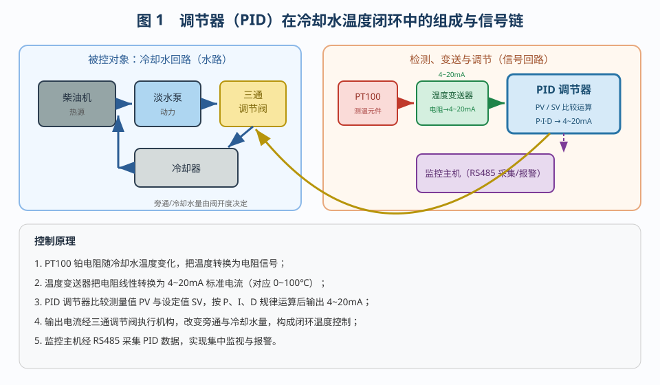
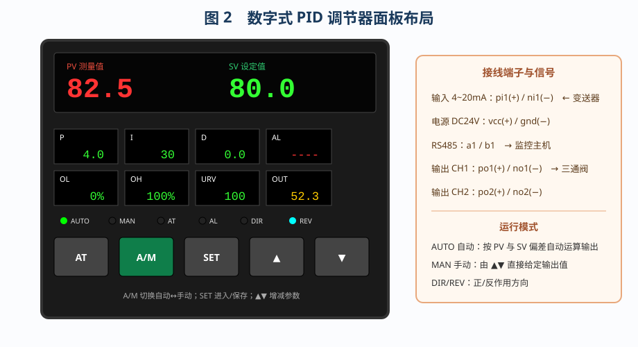
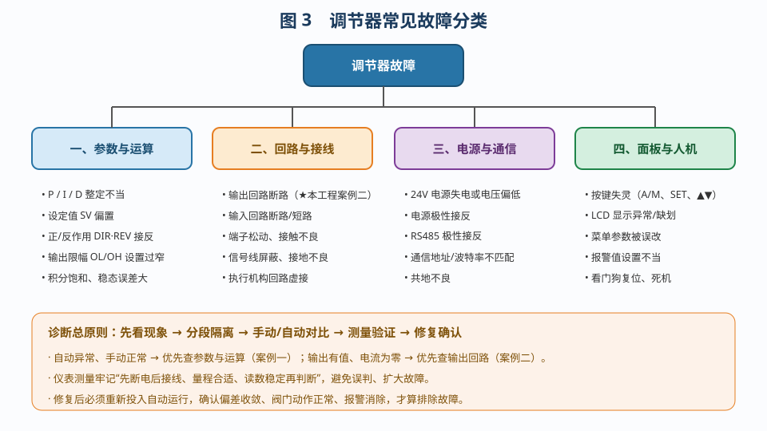
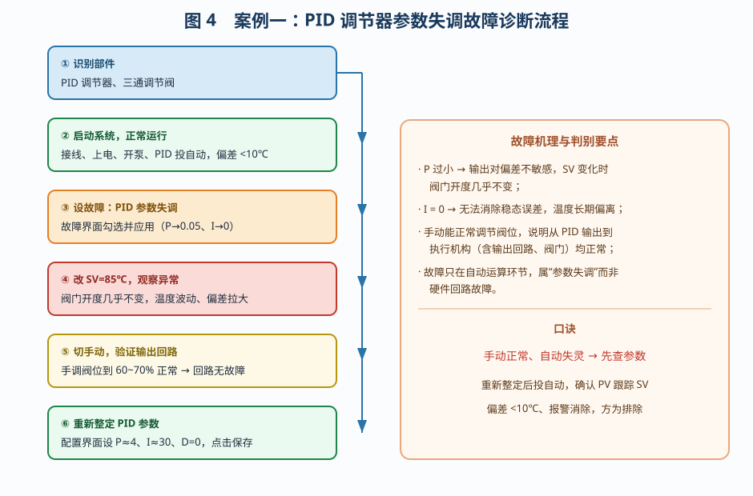
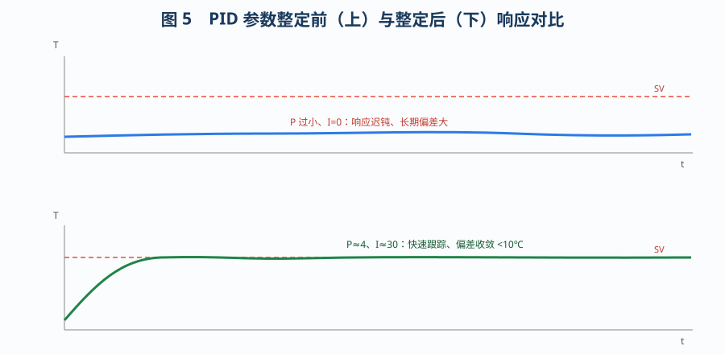
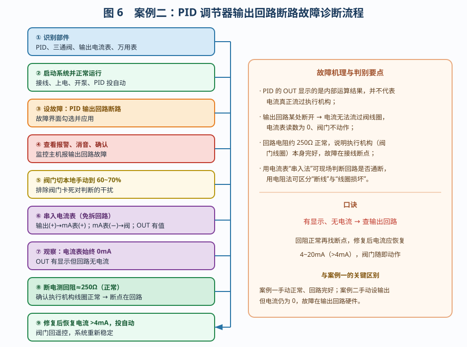

# 调节器的故障诊断

> 适用对象：工业数字式 PID 调节器（4~20mA 输入 / 输出）。
> 主线一：调节器的**常见故障分类与诊断思路**；主线二：本仿真工程「PID 参数失调」「PID 输出回路断路」两个案例的完整分析。
> 诊断口诀：**手动正常、自动失灵 → 查参数；有显示、无电流 → 查输出回路。**

---

## 一、调节器在过程控制中的作用

调节器是过程控制系统的"大脑"。它把变送器送来的被控量测量信号 **PV** 与工艺**设定值 SV** 相比较，按预先整定的控制规律（P、I、D）运算，输出统一的标准信号（4~20mA 或 PWM）去驱动执行机构，使被控量稳定在设定值附近。

以本工程的柴油机冷却水温度控制为例（图 1）：PT100 测冷却水温度 → 温度变送器把电阻转换为 4~20mA → **PID 调节器**比较 PV 与 SV 运算后输出 4~20mA → 三通调节阀改变旁通与冷却水量 → 温度回落到设定值，构成闭环。调节器一旦故障，整个闭环就失去"判断与决策"能力。

调节器的面板是认识它的第一步（图 2）：主屏显示 **PV / SV**；参数区显示 P、I、D、输出限幅 OL/OH、量程 URV、输出 OUT；**AUTO / MAN** 灯表示运行模式，**DIR / REV** 灯表示正 / 反作用；按键 **A/M** 切换自动↔手动、**SET** 进入菜单并保存、**▲▼** 增减数值。很多所谓"故障"，其实是参数被误改或运行模式放错。

---

## 二、调节器的常见故障

按故障部位，调节器故障可分为四大类（图 3）。

### 1. 参数与运算类

- **PID 参数整定不当**：P 过小响应迟钝，P 过大易振荡；I=0 存在稳态误差，I 过小积分作用弱；
- **设定值 SV 偏移**：误改设定值，造成工艺偏差；
- **正 / 反作用接反**：DIR/REV 与工艺要求相反，被控量越高输出反而越小，闭环失控；
- **输出限幅 OL/OH 过窄**：输出被压在很小范围，阀门不动或到不了位；
- **积分饱和**：长期偏差使积分项饱和，恢复设定值后输出迟迟不变。

### 2. 回路与接线类

- **输出回路断路**（本工程案例二）、输入回路断路 / 短路；
- 端子松动、接触不良、信号线氧化；
- 屏蔽与接地不良引起干扰。

### 3. 电源与通信类

- 24V 电源失电、电压偏低、极性接反；
- RS485 极性接反、地址 / 波特率不匹配、共地不良。

### 4. 面板与人机类

- 按键失灵、LCD 显示异常、菜单参数被误改、报警值设置不当。

### 5. 常见故障的快速判别

| 现象 | 可能原因 | 优先检查 |
|------|----------|----------|
| 显示全灭、无输出 | 24V 电源失电 / 极性接反 | 电源端子 vcc/gnd |
| PV 显示 `HHHH`/`LLLL` | 输入回路断 / 短路、变送器故障 | 输入回路、变送器输出 |
| OUT 有值、阀不动、电流 0 | 输出回路断路 | 输出端子、信号线 |
| 自动不动作、手动正常 | P·I·D 参数失调 | 参数界面 P/I/D、SV |
| 被控量越高输出越小 | 正 / 反作用接反 | DIR / REV 设置 |
| 输出到不了 0% 或 100% | 限幅 OL/OH 过窄 | 输出限幅参数 |
| 数据传不上监控主机 | RS485 极性接反、地址不匹配 | a1/b1 接线与通信参数 |

**诊断总原则：先看现象 → 分段隔离 → 手动 / 自动对比 → 测量验证 → 修复确认。** 即先记录故障现象，再沿信号链把系统分成"输入—运算—输出—执行"几段，用调节器自身的"手动 / 自动"功能快速缩小范围：手动正常说明输出与执行环节完好，问题在运算或输入；再用电流表、万用表测量验证，最后修复并重新投运确认。其中"自动异常、手动正常 → 查参数"与"输出有值、电流为零 → 查输出回路"是两条最快的判别准则，恰好对应下面两个案例。

---

## 三、案例一：PID 调节器参数失调故障诊断

### 3.1 故障现象

系统正常运行后，把设定值 SV 从 80℃ 调到 85℃，却发现三通调节阀开度几乎不变，冷却水温度迟迟不下降、波动明显，调节器 OUT 变化很小。

### 3.2 诊断步骤（图 4）

1. **识别部件**：PID 调节器、三通调节阀；
2. **启动系统**至正常（PID 自动、PV 与 SV 偏差 <10℃、报警消音）；
3. 通过【故障设置】界面设置「PID 调节器参数失调」（P→0.05、I→0）；
4. 右键 PID →「参数设置」，把 **SV 改为 85℃**，观察阀门开度几乎不变、温度波动；
5. 按 **A/M** 键切到手动，用 ▲▼ 把阀位调到 **60~70%**——阀门开度正常变化；
6. 进入参数界面把 **P 调到约 4、I 调到约 30、D=0**，点击保存；
7. 切回自动，确认偏差 <10℃、报警消除；
8. 完成知识测验。

### 3.3 机理分析

PID 输出 `OUT = 50 + P·e + ∫e/I + D·de/dt`。当 **P 很小、I=0** 时，OUT 对误差 e 很不敏感：SV 增大后虽然偏差变大，但 P·e 变化极小、积分项又不累积，OUT 几乎不动，阀门自然不动，温度无法收敛（图 5）。切到手动后由人直接给定 OUT，阀门能正常动作，说明从 PID 输出端子、输出回路到执行机构都完好，故障只出在"自动运算"环节，属于参数整定问题而非硬件损坏。

### 3.4 判别要点

- **手动正常、自动失灵 → 参数问题**；
- 特征：OUT 变化小、响应迟钝、偏差长期存在；
- 处理：重新整定 P、I、D（本工程 P≈4、I≈30、D=0），投自动后观察 PV 是否跟踪 SV，偏差收敛、报警消除方为合格。

> **为什么"手动试验"能一步定位？** 手动模式下 OUT 由按键直接给定，不经过 P·I·D 运算，相当于"绕过大脑、直接用手推执行机构"。因此手动能正常动作，就证明输出回路、执行机构这条"手脚"是好的，故障只能在"自动运算"这个"大脑"里，把排查范围从整条闭环一下缩小到参数整定，避免了盲目拆线、换表。这也是现场诊断最经济、最常用的方法。

---

## 四、案例二：PID 调节器输出回路断路故障诊断

### 4.1 故障现象

PID 的 OUT 显示有数值，但输出回路电流表始终为 **0mA**，三通调节阀不动作，监控主机报故障报警。

### 4.2 诊断步骤（图 6）

1. **识别部件**：PID、三通调节阀、输出电流表、万用表；
2. **启动系统**至正常；
3. 通过【故障设置】界面设置「PID 调节器输出回路断路」；
4. 查看监控主机报警，**消音、确认**；
5. 把三通调节阀控制开关拨到 **MANUAL（本地）**，手轮调到 60~70%，排除"阀门卡死"造成的误判；
6. 断开 PID 输出(+)→阀门的接线，**串入 20mA 电流表**（输出(+)→电流表(+)、电流表(−)→阀门）；PID 切手动、OUT=50%，观察电流表仍为 **0mA**；
7. 断开 24V 电源，调出数字万用表置 **2kΩ 档**，跨接测量输出回路电阻约 **250Ω（正常）**；
8. 在【故障设置】界面取消勾选并应用修复，接通电源，输出电流恢复到 **4mA 以上**；
9. 阀门拨回 **REMOTE（遥控）**，PID 切回自动，系统重新稳定；
10. 完成知识测验。

### 4.3 机理分析

调节器的 OUT 只是**内部运算结果的显示**，并不代表电流真正流过了执行机构。当输出回路（输出端子、信号线、接线端子）某处断开时，回路电流为零，阀门因得不到驱动电流而不动作；但执行机构自身的线圈（电阻约 250Ω）是好的，所以断电用万用表测回阻仍为 250Ω 左右。**测到 250Ω 正常，恰恰说明故障不是阀门损坏，而是回路中的"接线断点"。** 修复断点后电流恢复到 4~20mA，阀门随即动作。

### 4.4 判别要点

- **有显示、无电流 → 输出回路问题**；
- 回阻约 250Ω 正常 → 排除执行机构损坏，找接线断点；
- 处理：逐段检查输出端子、信号线及端子——**电流表串入法**判断回路通断，**电阻法**区分"断线"与"线圈损坏"；修复后确认电流恢复 4~20mA。

> **为什么要先做"回阻测量"再修复？** 如果一上来就认定是阀门坏、直接换阀，既费时又费钱。先断电测输出回路的电阻：测到约 250Ω，说明电流本可以流过执行机构线圈，回路的"末梢"没问题，故障必然在"沿路"的某个断点；若测得开路（∞），才进一步怀疑线圈烧断或接线彻底脱落。**先测回阻、再定位断点**，可以避免误换执行机构，是检修中"先判断、后动手"的典型体现。另外，测量前必须断开 24V 电源并确认调节器已失电，防止带电测量损坏万用表或造成短路。

---

## 五、两个案例的对比与总结

| 对比项 | 案例一：参数失调 | 案例二：输出回路断路 |
|--------|------------------|----------------------|
| 典型现象 | 阀门开度几乎不变，温度波动 | OUT 有显示，回路电流 0mA |
| 切手动试验 | 阀位能正常调到 60~70% | 手动设 OUT，电流仍为 0 |
| 回路电阻测量 | 正常 | 约 250Ω（正常） |
| 故障部位 | 自动运算 / 参数 P·I·D | 输出回路接线断点 |
| 判别口诀 | 手动正常、自动失灵 | 有显示、无电流 |
| 处理方法 | 重新整定并投自动 | 修复断点，恢复 4~20mA |
| 报警表现 | 温度偏差使 H / L 报警 | 监控主机直接报回路故障 |

**结论**：调节器的"故障"往往不是调节器本身坏了，而是参数整定、回路接线或电源通信等外围问题。诊断时应善用**"手动 / 自动对比"**和**"分部位测量"**两大手段，先分清故障位于"运算环节"还是"回路环节"，再针对性处理；修复后必须**重新投入自动运行**，确认偏差收敛、阀门动作正常、报警消除，才算真正排除。

---

## 六、调节器的日常维护与预防

调节器故障中相当一部分源于维护不当，做好以下几点可显著降低故障率：

1. **参数备份与记录**：投运后把 SV、P、I、D、量程、报警值等记录在案，检修前先核对，防止误改；
2. **接线牢固、防振防潮**：端子定期紧固，信号线远离动力线敷设，屏蔽层单端接地；
3. **电源与接地可靠**：24V 电源容量足够、极性正确，调节器与变送器共地良好；
4. **运行监视**：利用监控主机（RS485）持续采集 PV、OUT、报警状态，发现偏差漂移及时处理；
5. **规范检修**：测量前先断电，先判断后动手；修复后必须重新投入自动运行并确认偏差收敛、阀门动作正常、报警消除。

---

## 七、思考与练习

1. 为什么"切手动后阀门能正常调节"可以判断输出回路和阀门都是好的？
2. PID 中 P 过小、I=0 时，为什么设定值变化后阀门开度几乎不变？
3. 输出回路断路时，为什么 OUT 仍有显示？能否据此判断回路正常？
4. 测得输出回路电阻约 250Ω，说明什么？如果测得为开路（∞），又说明什么？
5. 正 / 反作用（DIR/REV）接反会出现什么现象？如何与参数失调区分？
6. 修复故障后为什么必须把阀门切回 REMOTE、PID 切回 AUTO 再确认？

---

*本文档依据本工程仿真平台的两个自动演示流程——"PID 调节器参数失调故障排除""PID 调节器输出回路故障排除"编写，可作为调节器故障诊断的实训参考资料。*
