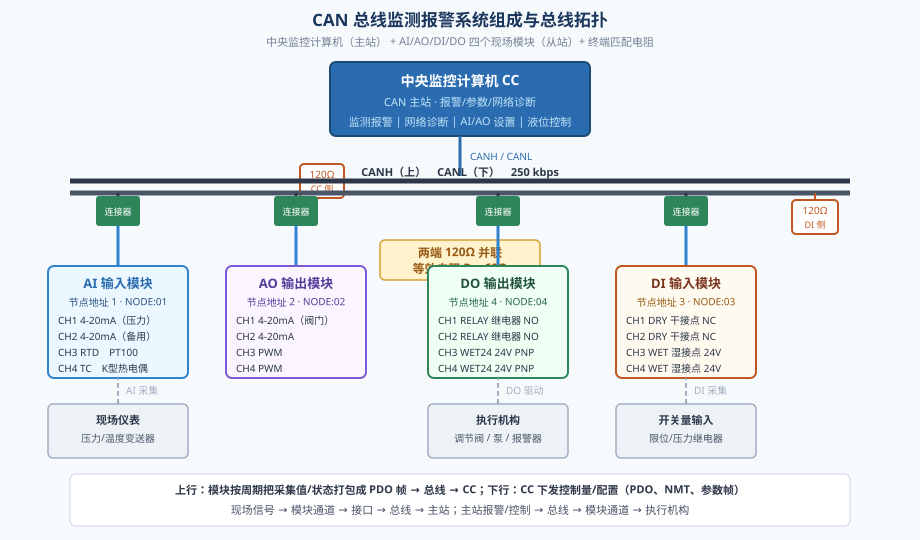
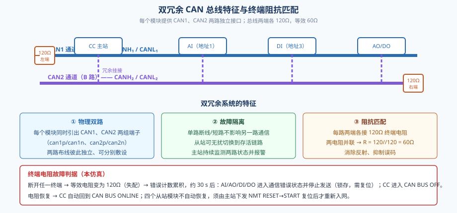
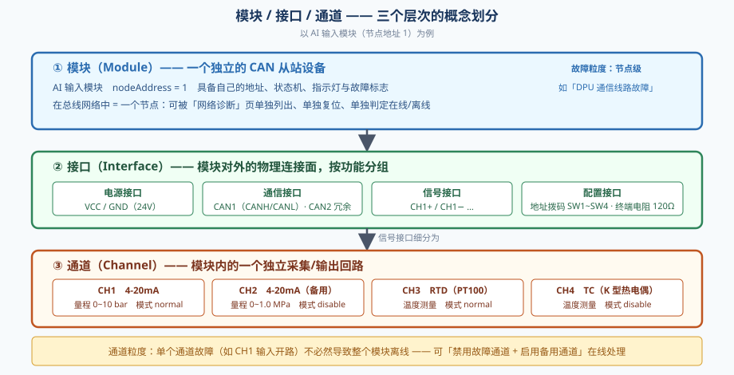
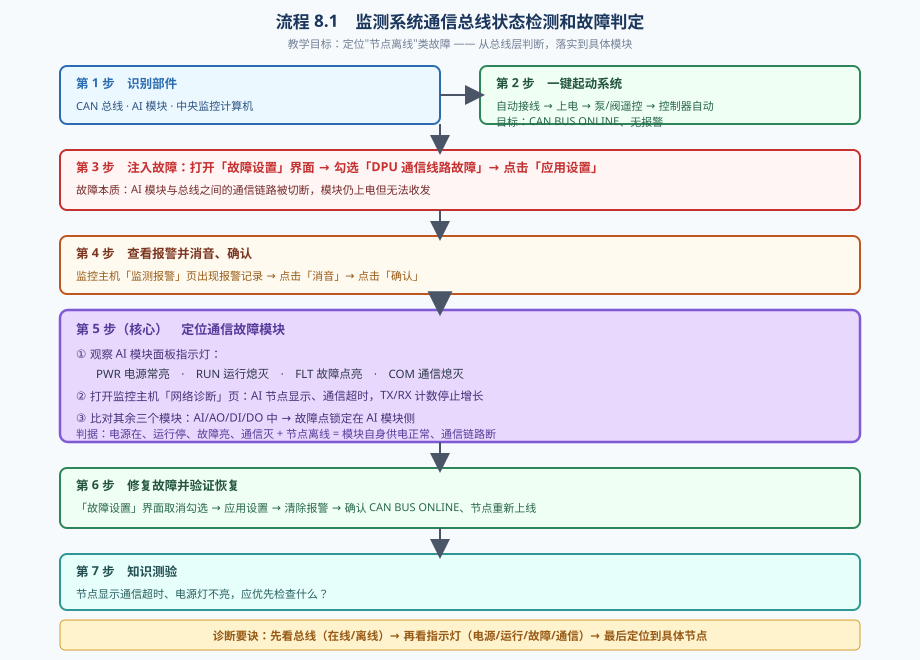
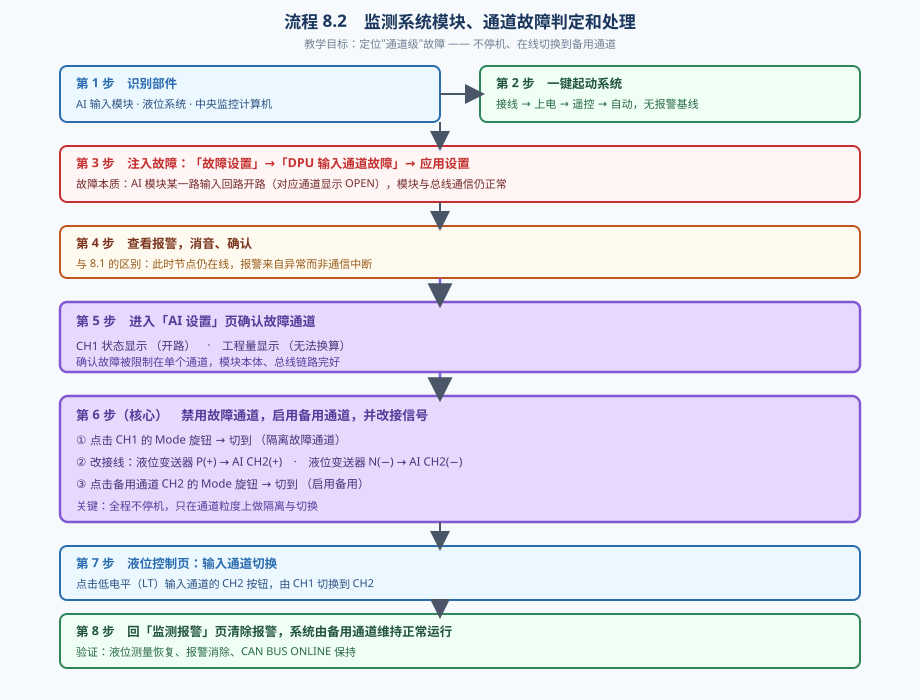

# 监测系统的故障诊断

> 本文档配合仿真工程「监测系统的故障诊断」使用，涵盖 **CAN 总线监测报警系统的工作原理、双冗余系统的特征、AI/DI/AO/DO 四种模块的特征、模块/接口/通道三层概念，以及本仿真两个操作流程所涉及的故障诊断与处理方法**。

---

## 引言

在船舶机舱、电站、化工装置等场合，监测报警系统需要把分散在各处的温度、压力、液位、阀位、开关状态等信号集中送到值班员面前，并在越限时自动报警。传统的点对点硬接线方式线缆多、扩展难、故障排查困难，因此现代监测报警系统普遍采用**现场总线**结构：现场仪表就近接入智能 I/O 模块，模块再通过一根总线把数据统一送到中央监控计算机。

本仿真所采用的就是以 **CAN（Controller Area Network，控制器局域网）总线**为骨干的监测报警系统。CAN 总线具有多主站、非破坏性仲裁、硬件 CRC 校验、错误自恢复等优点，广泛应用于工业与船舶电子系统。

学习本仿真，重点掌握四件事：

1. 数据从现场到屏幕、控制从屏幕到现场的**完整链路**；
2. **双冗余**总线在物理与逻辑上的体现；
3. **模块、接口、通道**三个层次的区别，以及故障应该判定在哪一层；
4. 两种典型故障（**节点离线**与**通道开路**）的诊断思路与处理步骤。

---

## 一、CAN 总线监测报警系统的工作原理

### 1.1 系统组成



系统由三类要素组成：

| 要素 | 本仿真实例 | 作用 |
|------|-----------|------|
| 主站 | 中央监控计算机（CC） | 汇总数据、显示画面、发出报警、下发控制与配置、网络管理 |
| 从站 | AI、AO、DI、DO 四个模块 | 就地完成信号采集/输出，按周期把结果上传到总线 |
| 传输 | CANH/CANL 双绞线 + 总线连接器 | 提供物理链路与阻抗匹配 |
| 配套 | 终端电阻 120Ω ×2、24V 电源 | 终端匹配（60Ω）、现场设备供电 |

每个从站模块在总线上有**唯一的节点地址**：AI = 1、AO = 2、DI = 3、DO = 4。地址由模块面板上的四位拨码开关（SW1~SW4）设定，主站依靠地址区分是哪台设备发来的帧，也依靠地址把控制指令定向发给某台设备。地址冲突会导致节点相互覆盖、通信紊乱，是总线类故障中较隐蔽的一类。

### 1.2 数据流：现场 → 模块 → 总线 → 主站

以"液位 44.5% 上屏"为例，一条数据要走完这样的路径：

1. **现场**：液位变送器把液位转换成 4~20mA 电流信号；
2. **通道**：AI 模块的 CH1 输入回路把电流转换为工程量（量程 0~100%），并做断线判定；
3. **接口**：模块把该通道的值、质量位、状态打包；
4. **总线**：模块按上报周期（典型 200ms）构造一帧 PDO 数据发到 CANH/CANL；
5. **主站**：CC 接收并解析，写入内部数据镜像；
6. **画面**：监控主机的「液位控制」「参数一览」等页面据此刷新数值与曲线；
7. **反向**：若液位越限，CC 产生报警并在「监测报警」页列出记录，同时可经总线下发控制命令驱动 DO/AO。

需要特别注意的是：**上行与下行是两条独立的方向**。上行是"模块主动汇报"，下行是"主站主动下发"。两者都依赖总线物理通电、节点在线、波特率一致、地址正确，缺一不可。因此"某个节点不上线"与"某路信号值异常"是两类完全不同的故障。

### 1.3 通信与周期节拍

本仿真的总线参数与节拍如下：

| 参数 | 数值 | 说明 |
|------|------|------|
| 波特率 | 250 kbps | 影响总线负载率的计算基准 |
| 模块内部更新节拍 | 100 ms（10Hz） | 采集、判错、状态灯、画面刷新统一节拍 |
| 模块上报周期 | 200 ms 起（可配） | 决定主站数据的刷新延迟 |
| 心跳帧 | CC 周期广播 | 用于从站判断主站存活，超时则退出 RUN 态 |
| COM 指示灯 | 近期有收发则按 1Hz 闪烁 | 反映"当前是否还有报文在跑" |

模块内部普遍采用**累计式分频**：把 20fps 的主循环 `dt` 累加到 100ms 才执行一次真正的业务逻辑。这样既保证物理计算每帧都在跑，又把绘图与协议处理的开销降下来。

### 1.4 节点状态管理（NMT）

CAN 总线上的每个从站都有一个运行状态机，主站通过 NMT（网络管理）帧控制：

| 命令 | 含义 | 状态迁移 |
|------|------|---------|
| `0x01` START | 启动 | → RUN（开始周期上报） |
| `0x02` STOP | 停止 | → STOP（停止上报） |
| `0x81` RESET | 复位 | → INIT（清零计数，随后需再 START） |

因此"**复位一个节点**"在工程上是一条两步序列：先 `RESET` 让节点回到 INIT，再 `START` 让它重新进入 RUN。仿真中监控主机「网络诊断」页每个节点旁的 **启动 / 停止 / 复位** 三个按钮正是对应这三条命令；点「复位」会自动补发 START，使节点直接回到通信状态。

### 1.5 总线监测与状态显示

监控主机底部状态栏实时反映总线健康度：

- **● CAN BUS ONLINE**：物理链路通、终端匹配正常、有节点在线；
- **⚠ CAN: AI·AO·DI·DO 超时**：链路通但某些节点长时间没有上报（节点掉线或停发）；
- **✖ CAN BUS OFF**：总线被判为不可用（终端失配超过 30s、或物理断链），同时 `NODE` 列表清为 `------`。

「网络诊断」页进一步给出 TX/RX/ERR 帧计数、总线负载率、BUS-OFF 标志与每个节点的 NMT 状态，是"总线层"故障的第一诊断入口。

### 1.6 总线终端电阻的在线监测

CAN 要求总线两端各接一个 120Ω 终端电阻，两者并联后总线等效电阻为 **60Ω**，此时特性阻抗匹配、信号反射最小。本仿真中，一端是监控主机侧的独立 120Ω 电阻（位于其总线连接器左侧），另一端是 **DI 模块自带的终端电阻**（起动系统时默认接通），AI/AO/DO 三者默认不接，正好构成两个终端。

其故障响应设计为**分级的**，体现了工程上的"抗扰动"思想：

1. 断开任一终端 → 等效电阻变为 120Ω（失配），开始累积错误计数；
2. 约 **30 秒**内状态仍维持在线，避免因瞬时干扰造成误动作；
3. 计数到阈值后：**四个从站模块进入通信错误状态并停止发送（commFault 锁存）**，同时 **CC 进入 CAN BUS OFF**；
4. 电阻恢复 → **CC 自动回到 CAN BUS ONLINE**（无需人工干预）；
5. 四个从站**不自动恢复**，必须由主站下发 NMT RESET→START 复位后才重新入网。

这种"主站自愈、从站需复位"的差异，是为了让运维人员明确：**总线层问题可自恢复，节点层问题必须人工确认**。

---

## 二、双冗余系统的特征

所谓"双冗余"，是指关键信号通路配置**两套彼此独立、功能等价**的传输资源，任意一套失效时系统仍能维持工作。在本仿真中体现在三个层面。



### 2.1 物理双路：每模块两个 CAN 接口

每个模块底部都引出**两组**总线端子：

```
can1p / can1n   → CAN1 通道（A 路）
can2p / can2n   → CAN2 通道（B 路）
```

两路各自独立、可分别敷设，主站侧同样具备双路收发能力。本仿真当前接线使用 **CAN1 一路**，CAN2 端子预留，学员可在理解拓扑后自行扩展接线，验证"断 A 路仍可通信"的冗余特性。

### 2.2 逻辑双路：链路与节点故障相互隔离

- **链路故障**（断线、短路、终端失配）表现为节点整体超时、总线 OFF；
- **节点故障**（模块掉电、死机）表现为单个节点离线，而其余节点照常收发。

"总线层"与"节点层"的故障在监控主机上会显示成不同的现象，这是双冗余系统可维护性的关键：**看是"一整条路都断了"还是"只有一个人掉队了"，即可把故障定位到链路还是设备**。

### 2.3 双终端阻抗匹配

每路总线两端各设一个 120Ω 电阻，两端并联 = 60Ω。双冗余的两路各自独立匹配，因此某一路终端失效只影响该路的信号质量，不会把两路一起拖垮。这也是"终端电阻故障"在教学中被单独设置成一个可观察故障点的原因——它演示的是**无源器件**失效如何逐步演变成通信错误。

### 2.4 双冗余系统的特征小结

1. **独立性**：两套资源物理分离，故障不相互传播；
2. **等价性**：任一套都能单独完成传输任务；
3. **可切换性**：主站/从站能感知链路状态并在必要时切换；
4. **可观测性**：每一路的状态都被监测并显示，便于定位失效的那一路；
5. **分区恢复**：链路恢复可自愈，节点恢复需复位，恢复路径各不相同。

---

## 三、AI / DI / AO / DO 四种模块的特征

四种模块构成完整的"输入—处理—输出"闭环：AI、DI 负责**采集**（现场→系统），AO、DO 负责**执行**（系统→现场）。

### 3.1 四模块特征对比

| 对比项 | **AI 模块**<br>模拟量输入 | **DI 模块**<br>开关量输入 | **AO 模块**<br>模拟量输出 | **DO 模块**<br>开关量输出 |
|--------|------------------------|------------------------|------------------------|------------------------|
| 节点地址 | 1 | 3 | 2 | 4 |
| 数据方向 | 现场 → 系统 | 现场 → 系统 | 系统 → 现场 | 系统 → 现场 |
| CH1 / CH2 | 4-20mA（压力等） | DRY 干接点 NC（无源触点） | 4-20mA（调节阀） | RELAY 继电器触点 NO |
| CH3 / CH4 | CH3 RTD(PT100)、CH4 TC(K型) | WET 湿接点 24V（有源） | PWM 脉宽输出 | WET24 24V PNP |
| 主要显示 | 工程量、单位、RUN/ERR 指示 | 开关状态 ON/OFF、计数器 | 百分比/电流、输出模式 | 输出状态、脉冲参数 |
| 典型模式 | normal / disable / test | —（直采） | hand / auto | hand / auto / pulse |
| 关键故障表现 | 通道 OPEN、工程量 `---` | 抖动、断线误判 | 输出保持/预设 | 继电器不动作 |
| 安全策略 | 断线报警、禁用通道 | 去抖、计数 | Safe: hold/preset/zero | Safe: off/hold/preset |

### 3.2 AI 模块（模拟量输入，节点地址 1）

AI 负责把**连续变化的物理量**转换成工程量。四路通道类型不同，这决定了它们的判据不同：

- **CH1/CH2（4-20mA）**：电流低于 4mA 即判定断线（OPEN），显示 `---` 或 `OPEN`；电流 >20mA 判定短路。
- **CH3（RTD / PT100）**：按电阻换算温度，三线制接法，电阻异常（如 1MΩ）判为开路。
- **CH4（TC / K 型热电偶）**：按毫伏电压换算温度，冷端补偿。

面板上有四只灯：**PWR（电源）**、**RUN（运行）**、**ERR/FLT（故障）**、**COM（通信）**。这四只灯的组合是判断"故障发生在哪一层"的最快手段：

| PWR | RUN | FLT | COM | 含义 |
|-----|-----|-----|-----|------|
| 亮 | 亮 | 灭 | 闪 | 正常工作 |
| 亮 | 灭 | 亮 | 灭 | 供电正常但通信中断（本仿真 8.1 的典型现象） |
| 亮 | 亮 | 亮 | 闪 | 模块在线但某通道故障（8.2） |
| 灭 | 灭 | 灭 | 灭 | 模块未上电 |

### 3.3 DI 模块（开关量输入，节点地址 3）

DI 采集的是**只有两种状态**的信号，难点在于**抖动**与**接点类型**：

- **DRY 干接点**（CH1/CH2，Dry NC）：现场只提供一对无源触点，由模块内部提供检测电流；NC 表示常闭，断线等同于动作，因此断线可被识别。
- **WET 湿接点**（CH3/CH4，Wet 24V）：现场直接送入 24V 电平，模块判断电压是否越限。

DI 内部有**去抖（debounce）**与**边沿计数**机制：输入电平必须稳定保持一段时间才被采信，避免触点抖动造成误计数；`counter` 字段记录动作次数，可用于事件顺序分析。DI 还自带一路 120Ω 终端电阻（本仿真默认接通），承担总线一端的匹配任务。

### 3.4 AO 模块（模拟量输出，节点地址 2）

AO 把主站给定的 0~100% 输出转换成现场可执行的连续量：

- **CH1/CH2（4-20mA）**：`percent = 0%` 对应 4mA，`100%` 对应 20mA；用于驱动调节阀、变频器给定。
- **CH3/CH4（PWM）**：以占空比表示输出，用于电加热、比例控制。

AO 有三种输出模式：**hand（手动给定）**、**auto（自动/主站给定）**、**disable（禁止输出）**。此外还有**安全输出（Safe Output）**策略：当模块检测到通信故障或看门狗超时，会强制输出到安全值（hold 保持、preset 预设、zero 归零），避免执行机构停在危险位置。

需要强调：**通信故障时，AO 设置页仍应正常显示**，只是工程值切换为安全预设值（黄色提示），以便值班员一眼看出"当前实际输出是多少"。

### 3.5 DO 模块（开关量输出，节点地址 4）

DO 驱动离散执行器，难点在于**负载类型**与**故障保护**：

- **CH1/CH2（RELAY，NO）**：干接点继电器输出，用于交流回路通断（如报警测试回路）；
- **CH3/CH4（WET24，24V PNP）**：有源 24V 输出，直接驱动电磁阀、指示灯。

DO 也支持 **hand / auto / pulse** 三种模式，其中 **pulse 模式**可设置导通时间、关断时间与相位，用于周期性动作。安全输出策略与 AO 类同。

**重要联动**：本仿真 8.3 类故障中，继电器板线圈由 DO CH3 驱动。若 CH3 处于 **hand** 模式，其输出跟随手动值（默认 false），线圈不得电 → 即使按下了报警测试按钮，报警器也不会响应。因此起动系统时应把 CH1（液位水泵控制）、CH3（线圈驱动）统一置为 **auto**，由控制逻辑驱动。

---

## 四、模块 / 接口 / 通道 的概念

这三个词在故障定位时含义截然不同，混用会导致判错粒度。



### 4.1 三层定义

**① 模块（Module）** —— 一个独立的 CAN 从站设备，有唯一地址、独立状态机、独立指示灯与故障标志。
在总线网络中，**一个模块 = 一个节点**。"节点离线""节点超时""节点复位"都是模块级概念。

**② 接口（Interface）** —— 模块对外的**物理连接面**，按功能分组：

| 接口 | 端子 | 作用 |
|------|------|------|
| 电源接口 | VCC / GND | 24V 供电，失电则模块整体不工作 |
| 通信接口 | CAN1(CANH/CANL)、CAN2 | 接入总线，可双冗余 |
| 信号接口 | CH1+ / CH1− … | 连接现场仪表或执行器 |
| 配置接口 | 地址拨码、终端电阻 | 决定节点身份与总线匹配 |

**③ 通道（Channel）** —— 模块内的**一个独立采集/输出回路**，有自己的类型、量程、模式与故障标志。
通道级概念包括：`OPEN/SHORT`、量程 LRV/URV、`normal/disable/test` 模式、备用通道切换。

### 4.2 三层结构决定了三类故障的判据不同

| 故障层次 | 典型现象 | 判据 | 处理手段 | 对应流程 |
|---------|---------|------|---------|---------|
| **模块级** | 节点离线、通信超时、COM 灯灭 | 网络诊断页节点状态 + 面板四灯 | 修复线路、复位节点 | 8.1 |
| **通道级** | 某通道 OPEN、工程量 `---` | AI 设置页该通道状态 | 禁用故障通道、切备用通道 | 8.2 |
| **接口级** | 接线松动、端子接反、地址冲突 | 拔插检查、地址核对 | 重新接线、修改拨码 | （基础操作） |

**记忆口诀**：看**总线层**判定"是不是断了链路"；看**面板灯**判定"模块本身好不好"；看**设置页**判定"是哪一路通道出的问题"。三层由外向内收敛，避免一上来就盲目换模块。

### 4.3 备用通道：通道级冗余

通道层同样可以做冗余——AI 的 CH2 常被配置为备用通道（`disable` 待命）。当 CH1 故障时，按"**禁用故障通道 → 改接信号到备用通道 → 启用备用通道 → 主站切换输入源**"四步，即可在不停机的前提下恢复测量。这与总线层的双冗余思想一脉相承，只是作用域更细。

---

## 五、本仿真两个操作流程的故障诊断与处理方法

本仿真提供两个操作流程，分别对应**模块级**与**通道级**两类故障，构成一组完整的对比教学案例。

### 5.1 流程 8.1：监测系统通信总线状态检测和故障判定



**故障背景**：DPU（分布式处理单元）通信线路故障——AI 模块与总线之间的链路被切断。模块仍然上电，但无法与主站交换任何报文。

**完整步骤**：

1. **识别部件**：CAN 总线、AI 模块、中央监控计算机。
2. **一键起动系统**：自动接线 → 上电 → 泵/阀遥控 → 控制器自动，建立无报警基线，确认状态栏为 `● CAN BUS ONLINE`。
3. **注入故障**：打开「故障设置」界面，勾选「DPU 通信线路故障」，点击「应用设置」。
4. **查看并处理报警**：监控主机「监测报警」页出现报警记录 → 点「消音」停止声响 → 点「确认」消掉闪烁。
5. **定位通信故障模块（核心）**：
   - 观察 AI 模块指示灯：**PWR 常亮、RUN 熄灭、FLT 点亮、COM 熄灭**；
   - 打开「网络诊断」页：**AI 节点显示离线、通信超时**，TX/RX 计数停止增长；
   - 对比其余三个模块仍在线 → **故障点锁定在 AI 模块侧的通信链路**。
6. **修复并验证**：「故障设置」中取消勾选 → 应用 → 清除报警 → 确认 `CAN BUS ONLINE`、AI 节点重新上线。
7. **知识测验**：巩固"电源在、运行停、故障亮、通信灭"这一判据。

**诊断要点**：本流程的四灯组合是关键。**供电正常（PWR 亮）+ 运行停止（RUN 灭）+ 通信熄灭（COM 灭）**，说明问题不在电源，而在通信链路；再加上"节点离线"这一总线层证据，即可排除"模块死机""模块未上电"等其它可能。

**与硬接线系统的区别**：在点对点系统中需要逐根线测量通断；在总线系统中，主站一次轮询即可知道**是哪一台掉线**，这正是总线架构带来的可维护性优势。

### 5.2 流程 8.2：监测系统模块、通道故障判定和处理



**故障背景**：DPU 输入通道故障——AI 模块某一路输入回路开路。**模块与总线的通信完全正常**，只是这一路测不到值。

**完整步骤**：

1. **识别部件**：AI 输入模块、液位系统、中央监控计算机。
2. **一键起动系统**，建立无报警基线。
3. **注入故障**：「故障设置」→「DPU 输入通道故障」→ 应用设置。
4. **查看并处理报警**：消音、确认。此时注意——**节点仍然在线**，报警来自通道级异常，不是通信中断。
5. **进入「AI 设置」页确认故障通道**：CH1 状态显示 **OPEN**（开路），工程量显示 **`---`**（无法换算），其余通道正常。
6. **禁用故障通道、启用备用通道、改接信号（核心）**：
   - 点击 **CH1 的 Mode 旋钮** → 切到 `disable`，隔离故障通道；
   - **改接线**：液位变送器 P(+) → AI CH2(+)，液位变送器 N(−) → AI CH2(−)；
   - 点击 **CH2 的 Mode 旋钮** → 切到 `normal`，启用备用通道。
7. **进入「液位控制」页**：点击低电平（LT）输入通道的 **CH2** 按钮，把输入源由 CH1 切到 CH2。
8. **回到「监测报警」页清除报警**，确认系统由备用通道维持正常运行：液位恢复显示、报警消除、`CAN BUS ONLINE` 保持。
9. **知识测验**。

**诊断要点**：本流程里 AI 的 **COM 灯会持续闪烁、网络诊断页节点在线**，这与 8.1 形成鲜明对比。判断依据下移到**设置页的通道状态**：只有 CH1 显示 OPEN、工程量为 `---`，即可确认是通道级故障，不必更换模块。

**处理要点**：四步顺序不可颠倒——**先隔离（disable CH1）→ 再改线 → 再启用（normal CH2）→ 最后切主站输入源**。若先改线后隔离，会把故障通道继续接入系统；若先切主站输入源，会让液位测量先出现空窗而触发误报警。

### 5.3 两个流程对比：如何选对诊断层次

| 对比维度 | 流程 8.1（模块级） | 流程 8.2（通道级） |
|---------|------------------|------------------|
| 故障本质 | 通信链路断开 | 单路输入回路开路 |
| 节点在线状态 | **离线**、超时 | **在线**、正常上报 |
| 面板 COM 灯 | 熄灭 | 正常闪烁 |
| 面板 FLT 灯 | 点亮 | 点亮（因通道故障） |
| 关键观察页面 | 「网络诊断」页 | 「AI 设置」页 |
| 主要判据 | 四灯组合 + 节点状态 | 通道状态 OPEN + 工程量 `---` |
| 是否可在线处理 | 否，需先修复链路 | **是**，可切换备用通道 |
| 处理手段 | 修复线路、复位节点 | 禁用/启用通道 + 改接线 + 切输入源 |
| 恢复验证 | CAN BUS ONLINE、节点上线 | 液位恢复、报警清除、总线保持在线 |

**通用诊断顺序（推荐）**：

```
第一步  看状态栏：ONLINE / 超时 / OFF  → 判断链路层
第二步  看网络诊断页：哪些节点离线      → 判断节点层
第三步  看模块面板灯：PWR/RUN/FLT/COM → 判断模块层
第四步  看设置页：通道状态、工程量      → 判断通道层
第五步  定位后按对应手段处理并复位验证
```

---

## 六、操作要点与常见问题

### 6.1 起动系统的正确姿势

点击工具栏「起动系统」会依次完成：清空接线与状态 → 自动接线（含两根终端电阻连线）→ 上电 → 泵/阀切遥控 → 控制器切自动。**起动系统同时是一次"复位基线"**：会清除节点的通信错误锁存、清零总线终端错误计数，并把终端电阻恢复默认（CC 侧接通、DI 侧接通）。

因此在做完故障实验后，**先点「起动系统」再开始下一个流程**，可以保证实验从干净状态出发。

### 6.2 复位一个节点的正确操作

在「网络诊断」页点节点的「复位」按钮，会依次发送 `NMT RESET (0x81)` 与 `NMT START (0x01)`。注意：

- 只发 RESET 会让节点停在 INIT 状态，**不再上报**，看起来像"复位后彻底没反应"；
- 模块在通信错误锁存期间会**停止发送**，但仍能接收 NMT 命令，因此"先恢复链路 → 再复位"的顺序是可行且必须的；
- 四个从站不会因为电阻恢复就自动入网，**必须复位**——这是设计意图，用于强制人工确认。

### 6.3 报警处理三步

「消音」停止声响与闪烁（故障仍未消除）→ 「确认」确认已知晓 → 「清除」把已确认的记录从列表移除。注意「清除」的完成判据是**报警列表被清空**，而不只是全部标记为已确认。

### 6.4 常见问题速查

| 现象 | 可能原因 | 排查动作 |
|------|---------|---------|
| 状态栏一直 `OFF` | 终端断开超 30s、CANH/CANL 未接 | 查两根终端连线、总线连接器 L/R 互联 |
| 某节点不在线 | 地址冲突、电源缺失、线序接反 | 核对拨码地址、查 VCC/GND、调换 CANH/CANL |
| 在线但数值不动 | 通道被 disable、信号线松脱 | 「AI 设置」页看通道模式与状态 |
| 工程量显示 `---` | 输入开路、量程配置错误 | 查 OPEN 标志、核对 LRV/URV |
| 按钮动作无响应 | 驱动通道处于 hand、线圈回路断 | 看 DO 通道模式（应为 auto）、查继电器接线 |

---

## 附录：关键参数速查

| 项目 | 数值/取值 |
|------|----------|
| 总线波特率 / 模块节拍 | 250 kbps / 100 ms(10Hz) |
| 终端电阻 | 120Ω×2 → 等效 60Ω，失配 30s 触发 |
| 节点地址 | AI=1、AO=2、DI=3、DO=4 |
| NMT 命令 | 0x01 START、0x02 STOP、0x81 RESET |

---

## 小结

CAN 总线监测报警系统的本质，是把"**分散采集、集中管理**"用一根总线串起来。理解它要抓住三条主线：

1. **工作原理主线**：现场量 → 通道换算 → 模块打包 → 总线传输 → 主站解析 → 画面与报警；反向则由主站下发控制。任一环节中断，都会以特定的、可辨识的现象暴露出来。
2. **可靠性主线**：物理双路 CAN 接口、双端 120Ω 终端匹配、主站自愈与从站复位相结合，保证"部分失效仍可运行、彻底失效可快速定位"。
3. **故障层次主线**：**模块 / 接口 / 通道**三层粒度不同，判据与处理手段也不同。8.1 训练"从总线层与面板灯定位离线节点"，8.2 训练"在设置页定位故障通道并在线切换备用"。

把这三条主线串起来，面对任何"监测系统不正常"的现象，都能按"**先看总线 → 再看节点 → 后看通道**"的顺序，逐步收敛到唯一原因，而不是停留在"报警了"的表象上。
