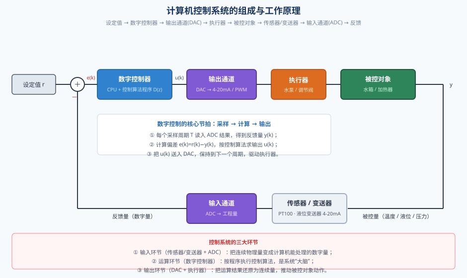
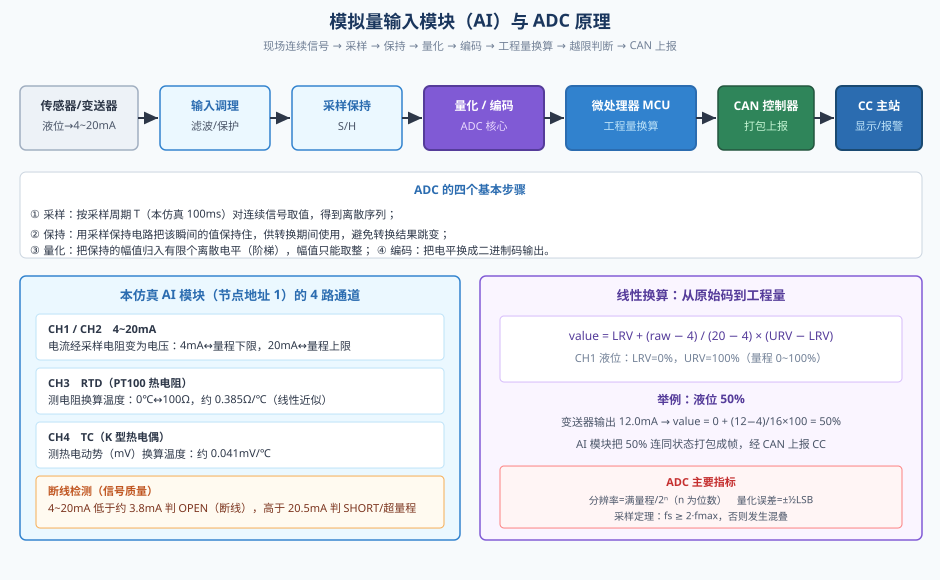
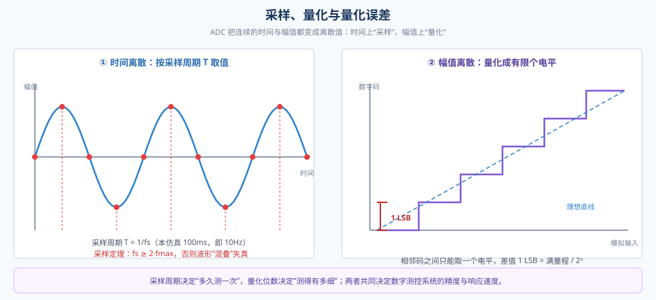
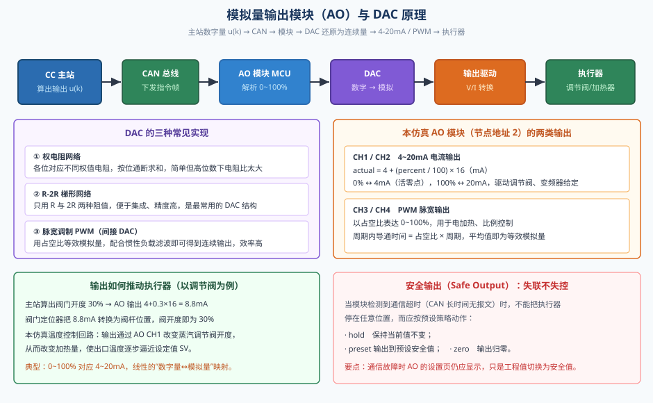
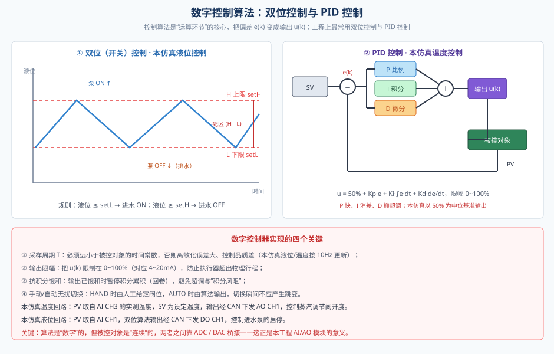
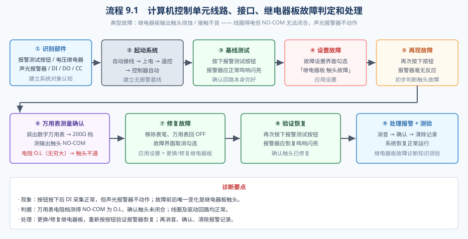
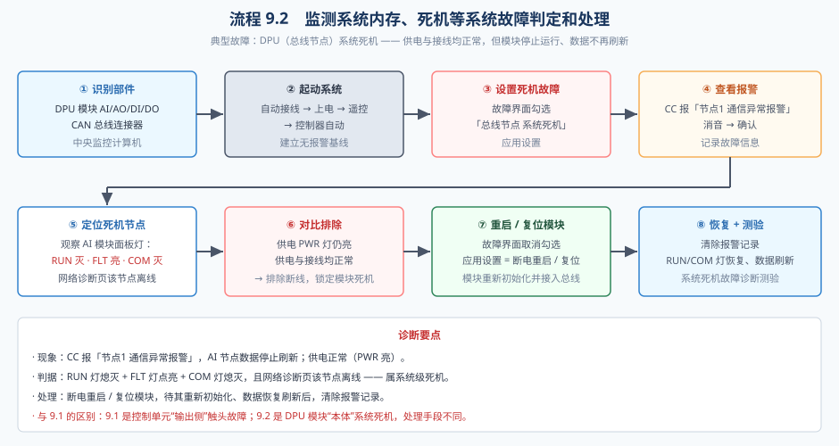

# 计算机控制系统的常见故障及排除

> 本文档配合仿真工程「计算机控制系统的常见故障及排除」使用，内容涵盖 **计算机控制系统的组成与工作原理、模拟量输入/输出模块（ADC / DAC）的原理、数字控制算法（双位控制与 PID），以及本仿真工程涉及的两个操作流程（9.1 计算机控制单元线路·接口·继电器板故障、9.2 监测系统内存·死机等系统故障）的诊断与处理方法**。

---

## 引言

在船舶机舱、电站、化工装置里，温度、压力、液位、流量这些被控量原本都是连续变化的物理量，而计算机只能处理"数字"。把连续量交给计算机运算、再让运算结果去操纵连续变化的设备，中间必须有一套完整的转换与传输链路。这套以计算机为核心、对生产过程自动进行检测与控制的系统，就是**计算机控制系统**。

随着现场总线技术的普及，现代计算机控制系统普遍采用"**分散采集、集中管理**"的结构：现场仪表就近接入智能 I/O 模块（DPU，分布式处理单元），模块再通过一根总线把数据统一送到中央监控计算机（CC）。计算机完成显示、报警、控制和记录，并把控制指令沿总线发回模块，由模块驱动执行器。

学习本工程，重点掌握四件事：

1. 计算机控制系统由哪些环节组成，数据如何闭环流动；
2. 输入模块如何用 **ADC** 把模拟量变成数字量，输出模块如何用 **DAC** 把数字量还原为模拟量；
3. 数字控制算法（**双位控制、PID 控制**）如何在计算机里实现；
4. 两个典型故障流程（**继电器板触头故障、DPU 系统死机**）如何判定与处理。

---

## 一、计算机控制系统的组成与工作原理

### 1.1 系统组成



一个完整的计算机控制系统，可以按信号流动方向划分为"输入环节—运算环节—输出环节"三段，再加上被控对象与反馈通道，构成闭环。用工程语言描述，包含以下要素：

| 环节 | 组成 | 作用 | 本仿真实例 |
|------|------|------|-----------|
| 被控对象 | 生产设备/过程 | 被控制的过程量载体 | 水箱、燃油加热器 |
| 检测变送 | 传感器、变送器 | 把物理量变成标准电信号 | 液位变送器（4~20mA）、PT100 |
| 输入环节 | 输入模块 + ADC | 模拟量 → 数字量 | AI 模块（节点地址 1） |
| 运算环节 | 计算机 + 控制算法 | 按算法由偏差算输出 | 中央监控计算机 CC |
| 输出环节 | 输出模块 + DAC | 数字量 → 模拟量/开关量 | AO 模块（2）、DO 模块（4） |
| 执行器 | 泵、阀、加热器 | 改变被控对象状态 | 进水泵、蒸汽调节阀 |
| 通信 | 总线与连接器 | 连接主站与各从站 | CAN 总线（CANH/CANL） |
| 辅助 | 电源、终端电阻 | 供电与阻抗匹配 | 24V 电位端子、120Ω×2 |
| 软件 | 系统软件 + 应用软件 | 调度与实现控制逻辑 | 各页签界面与报警程序 |

其中，**输入环节**负责"采集"，**输出环节**负责"执行"，**运算环节**是系统的"大脑"。输入输出模块合称 **I/O 模块**，是计算机与现场之间的桥梁。

### 1.2 工作原理：采样—计算—输出

计算机控制系统的运行是一个**周期性闭环过程**，每个采样周期 T 重复三步：

1. **采样**：输入模块经 ADC 把现场模拟量转换成数字量，计算机读入得到反馈量 y(k)；
2. **计算**：计算机用设定值 r(k) 减去反馈量得到偏差 e(k)=r(k)−y(k)，按控制算法算出输出量 u(k)；
3. **输出**：把 u(k) 送入输出模块，经 DAC 还原为模拟量或开关量，驱动执行器动作，使被控量向设定值靠拢。

这样，被控量的变化又被下一次采样捕获，形成"测量—比较—调节—再测量"的闭环。计算机控制系统之所以"实时"，就是因为这个循环不断进行；之所以"数字"，就是因为信号在运算环节被离散成了数字。

### 1.3 本仿真系统的组成

本仿真以"船舶机舱 CAN 总线监测报警系统"为背景，组成如下：

- **主站**：中央监控计算机 CC，含"监测报警、参数一览、网络诊断、AI 设置、AO 设置、DI 设置、DO 设置、液位控制、温度控制"九个页签；
- **从站**：AI、AO、DI、DO 四个 DPU 节点，节点地址分别为 1、2、3、4，地址由面板拨码开关设定；
- **传输**：CANH/CANL 双绞线 + 总线连接器，波特率 250kbps，模块内部更新节拍 100ms（10Hz）；
- **配套**：各模块右上角就近的 24V 电位端子与接地端子、两端各一个 120Ω 终端电阻（并联等效 60Ω）；
- **被控对象与执行器**：水箱（液位）由进水泵控制，燃油加热器（温度）由蒸汽调节阀控制；
- **报警回路**：压力继电器（YT1226）、报警测试按钮、电压继电器（继电器板）、声光报警器，由 DI 采集、DO 驱动。

---

## 二、模拟量输入模块（AI）与 ADC 原理

### 2.1 为什么需要 ADC

现场的温度、压力、液位是随时间连续变化的模拟量，而计算机内部只能存储和运算二进制数。**ADC（Analog-to-Digital Converter，模数转换器）** 的作用，就是把连续的模拟信号转换成离散的数字量。没有 ADC，计算机就"看不见"现场；正如没有人的感官，大脑就无从判断。

### 2.2 ADC 的四个基本步骤



1. **采样**：按采样周期 T 对连续信号取值，得到离散序列 y(0)、y(1)、y(2)……T 越小采样越密，但计算量越大。
2. **保持**：ADC 转换需要一定时间，用采样保持电路把采样瞬间的幅值保持住，避免转换期间信号变化导致结果失真。
3. **量化**：把保持的幅值归入有限个离散电平。模拟量有无穷多取值，量化后只能取有限档，必然产生**量化误差**。
4. **编码**：把量化结果转换为二进制码，交给计算机处理。

### 2.3 ADC 的主要指标



- **分辨率**：能分辨的最小输入变化，等于满量程 / 2ⁿ（n 为 ADC 位数）。位数越多，分辨越细。
- **量化误差**：量化带来的固有误差，绝对值不超过 ±½ LSB，只能减小、无法彻底消除。
- **转换时间/转换速率**：完成一次转换所需时间及其倒数，决定最高采样频率。
- **采样定理**：采样频率 fs 必须不低于信号最高频率 fmax 的 2 倍（fs ≥ 2·fmax），否则会发生**混叠**，高频信号被误认为低频信号，造成假象。

**分辨率与采样率是一对矛盾**：提高位数可提高精度但转换变慢，提高采样率可提高响应速度但精度下降，工程上要按被控对象特性折中。

### 2.4 本仿真 AI 模块的通道与换算

本仿真 AI 模块有 4 路通道，覆盖了工业上最常见的几种模拟输入：

| 通道 | 类型 | 物理量 | 换算方式 |
|------|------|--------|----------|
| CH1/CH2 | 4~20mA | 压力、液位 | 电流经采样电阻转电压，线性换算 |
| CH3 | RTD（PT100） | 温度 | 电阻换算温度，约 0.385Ω/℃ |
| CH4 | TC（K 型） | 温度 | 热电动势换算温度，约 0.041mV/℃ |

以 **CH1 液位（量程 0~100%）** 为例，模块把原始电流码 raw 换算成工程量的公式为：

```
value = LRV + (raw − 4) / (20 − 4) × (URV − LRV)
      = 0 + (raw − 4) / 16 × 100
```

变送器输出 12.0mA 时，value = (12−4)/16×100 = 50%，即液位 50%。这就是"**原始码 → 工程量**"的线性标定过程，量程上下限 LRV/URV 可在 AI 设置页配置。

### 2.5 断线检测与信号质量

ADC 不仅要转换数值，还要判断信号是否可信。对于 4~20mA 回路，**4mA 是"活零点"**：正常信号的电流上限为 20mA，而断线（回路断开）时电流为 0。因此：

- 电流低于约 3.8mA → 判 **OPEN（断线）**，工程量为 `---`；
- 电流高于约 20.5mA → 判 **SHORT / 超量程**。

这与"值为 0"有本质区别：**0 可能是一个真实的测量值，而断线意味着测量根本不可信**。上位机据此产生通道故障报警，而不是把断线当成"液位为零"，这正是信号质量位存在的意义。

---

## 三、模拟量输出模块（AO）与 DAC 原理

### 3.1 DAC 的职责与原理

与 ADC 相反，**DAC（Digital-to-Analog Converter，数模转换器）** 把计算机输出的数字量还原为模拟量，去驱动连续动作的执行器。常见实现有三种：

1. **权电阻网络**：每一位对应一个按 2 的幂次加权的电阻，按位通断后求和，结构简单，但高位数下电阻阻值比过大；
2. **R-2R 梯形网络**：只用 R 和 2R 两种阻值，便于集成、精度高，是最常用的 DAC 结构；
3. **脉宽调制（PWM）**：用导通时间与周期的比值（占空比）等效模拟量，配合惯性负载滤波即可得到连续输出，效率高，广泛用于电加热、比例阀。

### 3.2 本仿真 AO 模块的两类输出



本仿真 AO 模块（节点地址 2）提供两类输出：

- **CH1/CH2（4~20mA 电流输出）**：`actual = 4 + (percent / 100) × 16 (mA)`。0% 对应 4mA，100% 对应 20mA，用于驱动调节阀、变频器给定；
- **CH3/CH4（PWM 脉宽输出）**：以占空比表达 0~100%，周期内导通时间 = 占空比 × 周期，平均值即为等效模拟量。

以温度控制为例：计算机算出阀门开度 30% → AO 输出 4 + 0.3×16 = 8.8mA → 阀门定位器把 8.8mA 转换为阀杆位置 → 阀开度即为 30% → 加热量改变。整条链路中，DAC 是把"数字决定"变成"物理动作"的关键一环。

### 3.3 安全输出：失联不失控

通信中断时，输出模块不能让执行器随意停在某个位置。为此 AO/DO 设有**安全输出（Safe Output）**策略：检测到通信超时后，按预设把输出置为 **hold（保持）、preset（预设值）、zero（归零）** 之一，避免执行机构进入危险状态。例如调节阀可设为"故障开"或"故障关"，保证工艺安全。

需要强调：**通信故障时 AO 设置页仍应正常显示**，只是工程值切换为安全预设值，以便值班员一眼看出"当前实际输出是多少"。

### 3.4 为什么工业现场偏爱 4~20mA

模拟量传输广泛采用 4~20mA 电流信号，原因有三：其一，电流环抗干扰能力强，长距离传输不易受感应电压影响；其二，**活零点 4mA** 使"断线"（0mA）与"零值"区分开，便于故障诊断；其三，两线制变送器可由同一对线同时取电，接线简单。本仿真中液位与温度信号都采用 4~20mA，正是这一工业惯例的体现。

---

## 四、数字控制算法

### 4.1 从模拟控制到数字控制

传统模拟调节器用运放实现比例、积分、微分运算，连续地改变输出。计算机则不同：它每隔一个采样周期才计算一次，输出在一段时间内保持不变。因此计算机里的控制算法必须是**离散的**——这就是数字控制算法。它把偏差序列 e(k) 映射为输出序列 u(k)，再经 DAC/DO 作用于连续的被控对象。

### 4.2 双位（开关）控制——本仿真的液位控制



最简单也最常用的数字控制是**双位控制**（又称开关控制、通断控制）。它只有两种输出状态：

```
液位 ≤ setL（下限） → 进水泵 ON，液位上升
液位 ≥ setH（上限） → 进水泵 OFF，液位下降
```

本仿真液位回路的默认参数为：上限 setH=70%、下限 setL=30%，另有高高/低低报警值 setHH=80%、setLL=20%。由于上下限之间留有一段**死区（H−L）**，泵不会在临界点反复通断，液位呈三角波在 30%~70% 之间往复。双位控制的优点是简单、可靠、成本低，缺点是被控量始终在设定值附近波动，无法精确稳定。水位控制、温度电加热、压力开关等大量场合都采用这种方式。

### 4.3 PID 控制——本仿真的温度控制

当要求被控量稳定在设定值附近时，就要用 **PID 控制**。它由三项叠加而成：

```
u(k) = Kp·e(k) + Ki·Σe(k)·T + Kd·[e(k)−e(k−1)]/T
```

- **比例项 P**：与偏差成正比，偏差越大输出越大，响应快，但单靠 P 会留下稳态误差；
- **积分项 I**：对偏差累积，只要还有偏差就继续调整，能消除稳态误差，但过强会引起超调、振荡；
- **微分项 D**：与偏差变化率有关，能"预判"趋势、抑制超调，但对噪声敏感。

本仿真温度回路用 AI 的 CH3 采集出口温度作为 PV，在温度控制页设定 SV（默认 120℃），按 `u = 50% + P·e + I·∫e·dt + D·de/dt` 计算阀开度，输出限幅 0~100%，经 CAN 下发 AO CH1 驱动蒸汽调节阀。其中 **50% 是基准输出（阀门中位）**，PID 在此基础上增减。默认参数为 P=4.0、I=0、D=0，即先按纯比例调节，学员可在运行中观察调整效果。

### 4.4 数字实现的关键要素

把 PID 从理论落实到程序，有四个要点：

1. **采样周期 T**：必须远小于被控对象的时间常数，否则离散化误差大、控制品质变差。本仿真按 10Hz 节拍更新控制回路；
2. **输出限幅**：把 u(k) 限制在 0~100%（对应 4~20mA），防止执行器超出物理行程；
3. **抗积分饱和**：当输出已达上限/下限仍无法消除偏差时，暂停积分累积（回卷），否则积分项会越积越大，一旦偏差反向就产生大幅超调；
4. **手动/自动无扰切换**：HAND 时由人工给定，AUTO 时由算法输出，切换瞬间应保持输出连续，避免扰动被控过程。

### 4.5 控制回路与总线的配合

数字控制算法在 CC 中运行，但它的"眼睛"和"手"都在总线上：PV 来自 AI 模块上报的数据帧，输出 u(k) 又经 CAN 下发到 AO/DO 模块。因此**控制品质不仅取决于算法，还取决于通信的实时性与可靠性**。一旦总线中断、节点掉线，控制回路就会"失明"——这正是本工程两类故障的共同危害，也是流程 9.2 要处理的核心问题。

---

## 五、本仿真工程的两个操作流程

本工程提供两个操作流程，分别对应"**控制单元输出侧（继电器板）**"和"**DPU 模块本体（系统死机）**"两类故障，构成一组完整的对比教学案例。

### 5.1 流程 9.1：计算机控制单元线路、接口、继电器板故障判定和处理



**故障背景**：继电器板（电压继电器）的输出触头烧蚀或接触不良。线圈驱动回路完全正常，但 **NO-COM 触头无法闭合**，导致声光报警器回路不通、报警不动作。

**完整步骤**：

1. **识别部件**：报警测试按钮、压力继电器、电压继电器（继电器板）、声光报警器、DI/DO 模块、CC；
2. **一键起动系统**：自动接线 → 上电 → 泵/阀遥控 → 控制器自动，建立无报警基线；
3. **基线测试**：按下报警测试按钮，声光报警器应正常鸣响闪亮，确认回路本身完好；
4. **设置故障**：打开「故障设置」界面，勾选「继电器板 触头故障」，点击「应用设置」；
5. **再现故障**：再次按下报警测试按钮，声光报警器毫无反应——初步判断继电器的输出触头未闭合；
6. **万用表测量确认**：调出数字万用表并置 200Ω 电阻档，把红/黑表笔分别接到触头的 NO 与 COM 端，保持按钮按下使线圈得电。测得电阻为 **O.L（无穷大）**，确认触头不通；
7. **修复故障**：移除表笔、万用表旋钮回 OFF；在「故障设置」界面取消勾选并应用（相当于更换/修复继电器板）；
8. **验证恢复**：再次按下按钮，声光报警器恢复鸣响闪亮，确认触头已修复；
9. **处理报警**：消音 → 确认 → 清除已确认的报警记录，系统恢复正常运行；
10. **知识测验**：线圈电压、电阻均正常而报警不动作，故障最可能在输出触头。

**诊断要点**：本流程的关键是"**分段隔离**"。按钮按下后 DI 能采到信号，说明输入侧正常；再用万用表测量输出触头通断，把故障锁定在"继电器输出侧"这一具体环节，而不是笼统地"换一块板子"。这体现了控制系统故障诊断"**先分段、后定位**"的基本方法。

### 5.2 流程 9.2：监测系统内存、死机等系统故障判定和处理



**故障背景**：某 DPU 节点（本仿真为 AI 模块）发生系统死机——供电与接线均正常，但模块停止运行、程序不再执行、数据停止刷新，CC 报出通信异常。

**完整步骤**：

1. **识别部件**：AI/AO/DI/DO 四个 DPU 模块、CAN 总线连接器、中央监控计算机；
2. **一键起动系统**，建立无报警基线，确认总线在线、四节点全部上报；
3. **设置故障**：打开「故障设置」界面，勾选「总线节点 系统死机」，点击「应用设置」；
4. **查看报警**：CC 出现「节点1 通信 异常报警」，执行消音、确认；
5. **定位死机节点**：观察 AI 模块面板灯——**PWR 常亮、RUN 熄灭、FLT 点亮、COM 熄灭**；在「网络诊断」页确认该节点通信中断、数据停止刷新；
6. **对比排除**：PWR 灯仍亮说明供电正常，接线与供电均无问题，从而排除"断线/掉电"，把故障锁定为**模块自身死机**；
7. **重启/复位模块**：在「故障设置」界面取消勾选并应用（相当于断电重启或复位模块），模块重新初始化并接入总线；
8. **恢复验证**：RUN/COM 灯恢复、数据重新刷新，清除报警记录，系统恢复正常运行；
9. **知识测验**：供电与接线正常而模块"死机"，最合理的处理是重启/复位模块。

**诊断要点**：本流程靠**四灯组合**快速判断故障层次。PWR 亮而 RUN 灭、FLT 亮、COM 灭，说明模块"有电但不运行"，属于系统级死机（内存错误、程序跑飞等），而非通信链路故障。处理手段是重启/复位，使其重新初始化，而不是换电缆或删除节点。

### 5.3 两个流程对比

| 对比维度 | 流程 9.1（继电器板触头故障） | 流程 9.2（DPU 系统死机） |
|---------|------------------------------|--------------------------|
| 故障对象 | 控制单元输出侧（继电器板） | DPU 模块本体 |
| 故障本质 | 触头无法闭合，回路不通 | 模块停止运行、数据处理中断 |
| 供电状态 | 正常 | 正常（PWR 灯亮） |
| 面板灯现象 | 报警器不动作 | RUN 灭、FLT 亮、COM 灭 |
| 关键观察 | 万用表测触头通断 | 模块灯 + 网络诊断页节点状态 |
| 主要判据 | NO-COM 电阻 O.L | 节点离线、数据停更 |
| 处理手段 | 更换/修复继电器板 | 断电重启 / 复位模块 |
| 恢复验证 | 按按钮报警器恢复 | RUN/COM 恢复、数据刷新 |

**通用诊断顺序（推荐）**：

```
第一步  看总线状态：ONLINE / 超时 / OFF   → 判断链路层
第二步  看网络诊断页：哪些节点离线         → 判断节点层
第三步  看模块面板灯：PWR/RUN/FLT/COM     → 判断模块是否死机
第四步  看具体回路：用万用表分段测量       → 判断接口/触头层
第五步  定位后按对应手段处理并复位验证
```

---

## 六、操作要点与常见问题

### 6.1 起动系统的正确姿势

点击工具栏「起动系统」会依次完成：复位并清空接线与状态 → 自动接线 → 上电 → 泵/阀切遥控 → 控制器切自动。**起动系统同时是一次"复位基线"**：会清除节点的通信错误锁存、清零总线终端错误计数，并把终端电阻恢复默认。做完一个故障实验后，先点「起动系统」再进入下一个流程，可保证实验从干净状态出发。

### 6.2 通道模式与回路驱动的关系

液位水泵由 DO CH1 驱动、报警线圈由 DO CH3 驱动。**只有对应通道处于 auto 模式时，控制逻辑才能驱动它**；若通道处于 hand 模式，则只能由「DO 设置」页手动控制。因此起动系统会把 CH1、CH3 统一置为 auto，否则会出现"按了按钮报警器却不响"的假故障。

### 6.3 报警处理三步

「消音」停止声响与闪烁（故障仍未消除）→「确认」表示已知晓 →「清除」把已确认的记录从列表移除。注意「清除」的完成判据是**报警列表被清空**，而不只是全部标记为已确认。

### 6.4 常见问题速查

| 现象 | 可能原因 | 排查动作 |
|------|---------|---------|
| 液位/温度显示 `---` | 输入断线、通道被 disable | 查 AI 设置页通道状态与模式 |
| 数值长期不变 | 节点离线、通道 hand | 查网络诊断页节点、查 DO/AO 通道模式 |
| 按钮按下报警器不响 | 继电器触头故障、DO CH3 非 auto | 万用表测触头、查 DO 设置页模式 |
| 模块 RUN 灭 FLT 亮 | 模块死机 | 断电重启/复位模块 |
| 总线显示 OFF | 终端断开、CANH/CANL 未接 | 查两端 120Ω 电阻与总线连接器 |

---

## 小结

计算机控制系统的本质，是用计算机把"**连续的生产过程**"纳入"**离散的数字运算**"：输入端靠 **ADC** 把模拟量变成数字量，输出端靠 **DAC** 把数字量还原为模拟量，中间由**数字控制算法**（双位控制、PID）完成闭环运算，全部数据经**总线**在主站与 I/O 模块之间往返。

理解本工程要抓住三条主线：

1. **组成与原理主线**：被控对象 → 变送器 → ADC → 计算机 → DAC → 执行器 → 被控对象，形成采样—计算—输出的实时闭环；
2. **算法主线**：液位用双位控制（上下限 + 死区），温度用 PID（P 快、I 消差、D 抑超调），数字实现要注意采样周期、限幅与抗积分饱和；
3. **故障处理主线**：9.1 训练"用万用表分段测量，把故障定位到继电器输出触头"；9.2 训练"用模块四灯与节点状态，把故障定位到 DPU 本体并重启复位"。

把这三条主线串起来，面对任何"控制系统不正常"的现象，都能按"**先看总线 → 再看节点 → 后看回路**"的顺序，由外向内逐步收敛到唯一原因，而不是停留在"报警了"的表象上。
