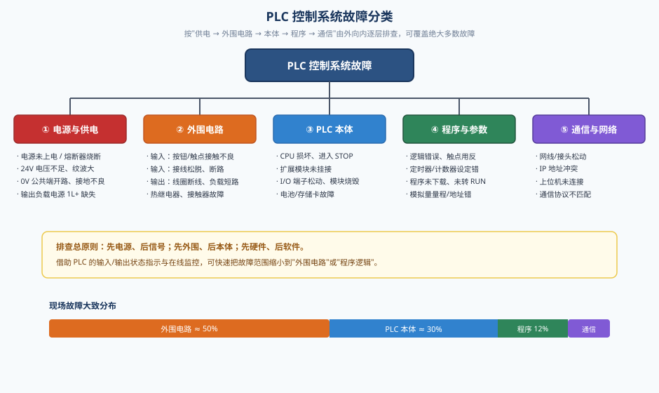
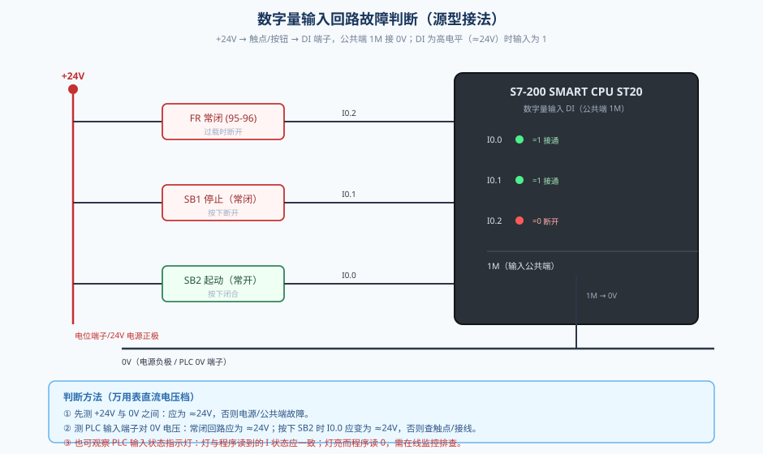
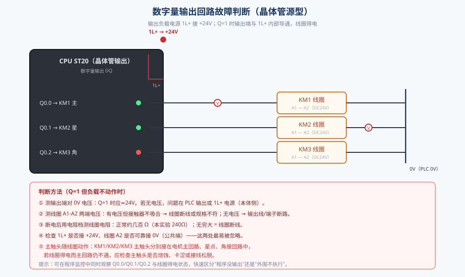
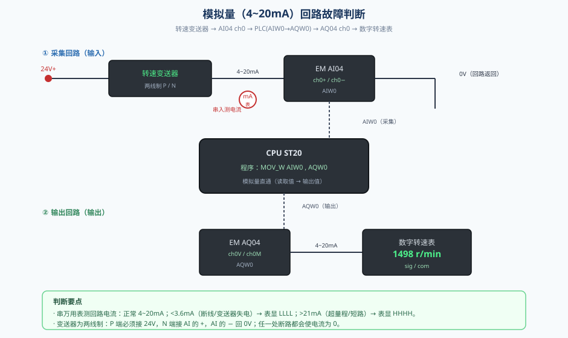
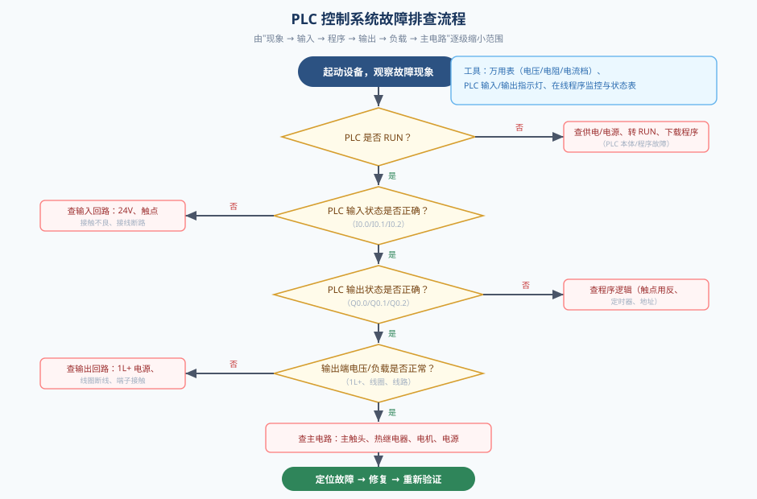
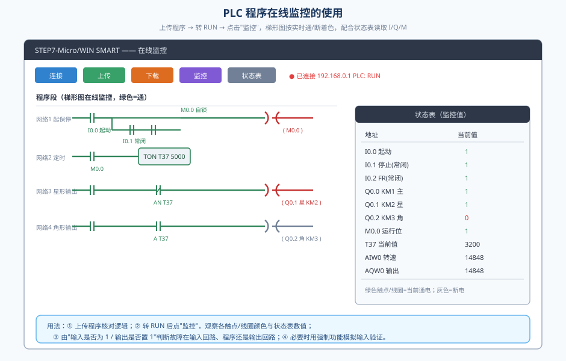
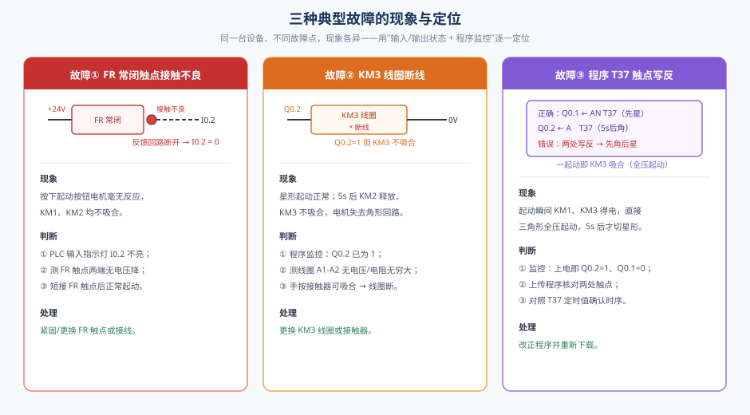

# PLC的联机操作与故障分析

> 适用对象：自动化、电气、机电一体化等专业学生
> 实验载体：S7-200 SMART PLC + 星三角降压起动控制电路（仿真）

---

## 一、实验系统与故障分析的意义

在现代工业控制中，PLC（可编程逻辑控制器）承担着逻辑运算、顺序控制、定时计数、模拟量处理等核心任务。一个完整的 PLC 控制系统，除了 PLC 主机本身，还包括电源、按钮/开关、接触器、热继电器、电动机等外围电路，以及变送器、模拟量模块、显示仪表等信号回路。系统一旦出现故障，往往表现为"设备不动作、动作异常、时好时坏"等现象，需要操作者具备"由现象到故障点"的分析与定位能力。

本实验的仿真系统如图 1 所示，它由三部分组成：

- **控制核心**：西门子 S7-200 SMART CPU ST20（12 点数字量输入 / 8 点数字量输出，晶体管源型），右侧依次挂接 EM AI04（4 路模拟量输入）和 EM AQ04（4 路模拟量输出）扩展模块；上位机安装 STEP7 编程软件，通过以太网口与 PLC 联机。
- **主电路**：三相电源经总开关 QF、主接触器 KM1 主触头、热继电器 FR 发热元件接到电动机 U1/V1/W1；电机尾端 U2/V2/W2 由 KM2（星形）与 KM3（三角形）两个接触器换接，实现星三角降压起动。
- **信号回路**：转速变送器把电机转速转换成 4~20mA 电流信号送入 AI04 的 0 号通道（AIW0），PLC 程序再把该值由 AQ04 的 0 号通道（AQW0）输出，驱动数字转速表显示。


故障分析的意义在于：**先分清故障属于哪一类，再按流程逐级缩小范围**。实践统计表明，PLC 控制系统的故障大约一半发生在外围电路，约三成在 PLC 本体，其余为程序与通信问题。因此，掌握外围电路的判断方法是本实验的重点。

---

## 二、PLC控制系统故障的分类与总体判断方法

按故障发生的部位，PLC 控制系统故障可分为五类（图 2）：

1. **电源与供电故障**：24V 电源未上电、熔断器烧断、电压不足、0V 公共端开路或接地不良、输出负载电源 1L+ 缺失。
2. **外围电路故障**：输入侧按钮/触点接触不良、接线松脱断路；输出侧接触器线圈断线、负载短路、线路断路；热继电器、接触器机械故障等。
3. **PLC 本体故障**：CPU 进入 STOP、程序丢失、扩展模块未挂接或损坏、I/O 端子松动。
4. **程序与参数故障**：逻辑错误、触点用反、定时器/计数器设定错误、模拟量量程或地址错误、程序未下载。
5. **通信与网络故障**：网线松动、IP 冲突、上位机未连接、协议不匹配。



总体判断应遵循三条基本原则：

- **先电源、后信号**：任何"完全不动"的故障，第一步都应确认 PLC 是否 RUN、供电是否正常。
- **先外围、后本体**：大部分故障在外围，不要一上来就怀疑 PLC 损坏。
- **先硬件、后软件**：先确认接线、触点、线圈，再排查程序逻辑。

判断的"四个抓手"是：**万用表（电压/电阻/电流档）、PLC 输入输出状态指示灯、上位机在线程序监控、状态表（I/Q/M/定时器值）**。

为便于快速定位，下表列出常见现象与可能原因，可作为现场排查的"第一反应"参考：

| 故障现象 | 可能的故障部位 | 首要检查动作 |
|----------|----------------|--------------|
| 设备完全不动，指示灯全灭 | 电源、PLC 未 RUN | 测 24V、看 RUN 灯 |
| 个别按钮无效 | 该输入支路（按钮/接线/24V） | 测 DI 端子对 0V 电压 |
| 所有输入无效 | 输入公共端 1M 开路 | 测 1M 与 0V 是否导通 |
| 程序读到输入但设备不动 | 输出回路、负载 | 看 Q 状态与输出端电压 |
| 输出有电压但负载不动作 | 线圈断线、负载损坏 | 测线圈电阻 |
| 动作时有时无 | 触点接触不良、接线松动 | 测触点压降、紧固端子 |
| 星形能起动、不能切角形 | 角接触器线圈/触头 | 看 Q0.1/Q0.2、测线圈 |
| 模拟量无显示或显示异常 | 变送器、4~20mA 回路 | 串表测电流 |

这张表说明：**同一种"设备不动"的背后，可能是电源、输入、程序、输出中的任意一环**，必须结合抓手逐级判断，不能凭经验臆断。

---

## 三、PLC外围电路故障的判断（重点）

外围电路是 PLC 与现场设备之间的桥梁，也是故障率最高的部分。下面按回路分别说明。

### 3.1 电源与供电回路

PLC 正常工作的前提是供电正确。以本系统为例，外部 24V 直流电源为控制回路供电：正极接 CPU 的 24V 端子，负极接 0V 端子；输入公共端 1M 接 0V（源型接法）；输出负载电源 1L+ 接 24V。

**判断步骤：**

1. 用万用表直流电压档测电源输出端，应为 24V±10%；若为 0，先查电源开关、熔断器、输入电源。
2. 测 PLC 的 24V 端子与 0V 端子之间电压，应与电源一致；若明显偏低，说明线路压降过大或接触不良。
3. 测 0V 公共端与输入公共端 1M 之间电阻，应接近 0Ω；若为无穷大，说明公共端开路，所有输入都会失效。
4. 观察 PLC 面板 RUN/STOP 指示灯：STOP 灯亮表示未运行，需检查模式开关、程序是否下载。

> 经验：电源故障的典型现象是"所有指示灯都不亮"或"指示灯亮度偏暗"；公共端故障则表现为"个别或全部输入始终无效"。

### 3.2 数字量输入回路

数字量输入回路把按钮、开关、触点等信号送入 PLC。本系统采用**源型接法**：+24V 电位端子经触点/按钮接到 DI 端子，公共端 1M 接 0V；当 DI 端子为高电平（≈24V）时，程序读到的输入为 1。对应关系为：FR 常闭 → I0.2，停止按钮（常闭）→ I0.1，起动按钮（常开）→ I0.0，如图 3。



**常见故障与判断方法：**

- **触点接触不良**：最典型的"软故障"。表现为时通时断、按按钮有时有效有时无效。判断时测触点两端电压：回路正常时触点两端几乎没有电压差；若触点两端出现 24V 电压差，说明触点处于断开或接触不良状态。
- **按钮/触点类型接错**：把常闭按钮当常开用（或反之），会导致按逻辑相反。可用万用表电阻档在断电状态下测触点常态的通断。
- **接线松脱或断路**：测 DI 端子对 0V 电压。正常情况下，常闭回路应约 24V；若为 0，说明该支路供电中断或线路断路。
- **验证方法**：按下按钮的同时观察 PLC 输入指示灯与在线监控中的 I 状态，二者应一致。若指示灯亮而程序读 0，说明程序未运行或点位映射有误；若指示灯不亮，问题一定在输入回路。

现场判断"接触不良"还有一个实用技巧：用万用表**直流电压档**，一只表笔固定在 0V，另一只表笔沿 "+24V → 触点 → DI 端子" 逐点测量。正常时，触点之前的点都应为 24V；若测得某点电压明显低于 24V 甚至接近 0V，则该点之前的连接存在接触电阻或断路。由于接触不良属于"软故障"，往往在设备振动、温度变化时出现，检修时应同时检查端子是否拧紧、导线是否压接良好，而不要只测一次就下结论。

### 3.3 数字量输出回路

输出回路把 PLC 的运算结果送到负载。本系统输出为**晶体管源型**：Q 端为 1 时，输出端与 1L+ 内部导通，负载（接触器线圈）得电。对应关系为：Q0.0 → KM1 线圈，Q0.1 → KM2 线圈，Q0.2 → KM3 线圈，线圈另一端接 0V，如图 4。



**常见故障与判断方法：**

- **输出电源 1L+ 未接**：这是最容易被忽略的故障。此时程序里 Q 为 1，但输出端没有电压，负载不动。应测 1L+ 与 0V 之间是否为 24V。
- **接触器线圈断线**：Q=1 时测线圈 A1-A2 两端有电压但接触器不吸合，断电后用电阻档测线圈电阻应为几百欧（本实验为 240Ω），无穷大即断线。
- **输出线路断路**：测输出端对 0V 电压，Q=1 时应约 24V；若为 0，问题在 PLC 输出或 1L+；若输出端有电压而线圈端无电压，则是线路断。
- **主触头故障**：线圈得电后主触头不闭合，多为主触头烧蚀、卡涩或接线松脱。此时接触器有吸合声但主回路不通，可用万用表测主触头上下端电压差判断。

### 3.4 接触器与热继电器

接触器是"以线圈控制主触头"的电磁开关，本系统用 KM1（主）、KM2（星）、KM3（角）三个接触器实现星三角换接。热继电器 FR 用于电动机过载保护，其发热元件串在主回路，常闭触点（95-96）作为过载反馈接至 PLC。

**判断要点：**

- 接触器不能吸合：查线圈回路（电压/电阻）、控制电源。
- 接触器不释放：多为触头熔焊或机械卡阻，需断电检修。
- 热继电器误动作或拒动：检查整定电流是否与电机额定电流匹配；过载动作后应查明过载原因再复位。
- 星三角换接的关键是 **KM2 与 KM3 不能同时吸合**（否则相间短路），程序或互锁回路必须保证先后顺序。

### 3.5 模拟量输入回路

模拟量输入回路把连续变化的物理量送入 PLC。本系统用两线制转速变送器把 0~2000 r/min 线性转换为 4~20mA，串接在 AI04 的 0 号通道上：24V → 变送器 P 端，变送器 N 端 → AI 的 ch0+，AI 的 ch0− → 0V，如图 5。



**常见故障与判断方法：**

- 在回路上串入万用表电流档测电流：正常为 4~20mA。电流为 0 说明回路断路或变送器失电；小于 3.6mA 通常为断线或变送器故障；大于 21mA 为超量程或短路。
- 注意**两线制**的特殊性：P 端必须接 24V，N 端接 AI 的 +，AI 的 − 回 0V；任一处接反或断路都会使电流为 0。
- 在程序监控中查看 AIW0 的数值，与变送器量程换算值对照，判断是"信号没进来"还是"程序没处理"。

### 3.6 模拟量输出回路

模拟量输出回路把 PLC 的数值转换成 4~20mA 驱动仪表。本系统 AQ04 的 0 号通道（AQW0）输出 4~20mA，接到数字转速表的 sig/com 端子。

**判断方法：**

- 数字转速表显示 `LLLL`（小于 3.6mA）说明输出电流过小或回路断路；显示 `HHHH`（大于 21mA）说明超量程。
- 用万用表电流档串入输出回路，核对输出电流与 AQW0 换算值是否一致。
- 若 AI 采集值正常而数字表不显示，应先看 AQW0 是否为 0（程序未执行直通指令），再看输出回路接线。

### 3.7 外围电路常用检测方法小结

| 方法 | 适用场合 | 要点 |
|------|----------|------|
| 电压法 | 判断回路是否带电、有无压降 | 常闭回路触点两端应无压降；有压降即接触不良 |
| 电阻法 | 断电判断触点通断、线圈好坏 | 必须先断电；线圈电阻应为有限值 |
| 电流法 | 4~20mA 模拟量回路 | 串入测量，正常 4~20mA |
| 短接法 | 快速判断某一触点是否故障 | 用导线短接触点，若故障消失即该触点问题 |
| 替代法 | 怀疑器件损坏 | 用同型号备件替换验证 |
| 状态指示法 | 快速缩小范围 | 结合 PLC 输入/输出指示灯与在线监控 |



---

## 四、PLC程序监控的使用

程序监控是判断"故障在程序还是在外围"的最有力手段。STEP7-Micro/WIN SMART 提供程序上传/下载、梯形图在线监控、状态表等功能。图 7 为在线监控界面示意。



### 4.1 建立在线连接

1. 用网线连接上位机与 PLC 的以太网口，设置两者 IP 在同一网段（本系统 PLC 为 192.168.0.1，上位机为 192.168.0.2）。
2. 在上位机中点击"连接"，建立在线连接；连接成功后界面会显示 PLC 型号与运行状态。
3. 将 PLC 模式开关拨到 RUN（或在软件中操作），使程序处于运行状态。

### 4.2 程序上传与核对

点击"上传"可从 PLC 读取当前正在运行的程序，并以梯形图形式显示。排查程序类故障时，**上传是关键一步**——因为实际运行的程序可能与工程文件不一致（被误改、误下载）。上传后逐条核对逻辑，尤其是输入条件、输出线圈、定时器触点。

### 4.3 梯形图在线监控

进入"监控"后，梯形图中的触点和线圈会按实时通/断状态着色：**绿色（通电）表示该触点闭合、线圈得电，灰色（断电）表示断开**。通过观察"输入触点是否闭合、输出线圈是否得电"，可以迅速判断：

- 输入触点不闭合 → 故障在输入回路或按钮/触点；
- 输入正常而输出不动作 → 故障在程序逻辑；
- 输出已得电而负载不动 → 故障在输出回路或负载。

### 4.4 状态表与强制

状态表可同时监视 I、Q、M、T、C、AIW、AQW 等地址的当前值。本实验可建立如下状态表：I0.0（起动）、I0.1（停止常闭）、I0.2（FR 常闭）、Q0.0/Q0.1/Q0.2（三个输出）、M0.0（运行位）、T37（延时值）、AIW0/AQW0（转速采集与输出）。观察它们的实时值，可把故障定位到具体环节。

必要时还可使用"强制"功能，临时把某个输入置为 1 或 0，验证程序逻辑是否正确（注意强制后务必及时取消，避免误动作）。

### 4.5 监控定位实例：延时触点写反

本实验程序用 T37 延时 5s 实现星→角换接，正确逻辑为：

```text
// 星形 KM2：运行且未到 5s
LD  M0.0
AN  T37
=   Q0.1

// 三角形 KM3：运行且延时到达
LD  M0.0
A   T37
=   Q0.2
```

若把两处写反（Q0.1 前用 T37 常开、Q0.2 前用 T37 常闭），一起动就会 Q0.2=1、Q0.1=0，电机直接角形全压起动，5s 后才切星形。**用在线监控一看便知**：上电瞬间 Q0.2 就点亮（绿色），而正常应先亮 Q0.1。由此可见，程序监控能快速区分"程序写错"与"外围故障"。

### 4.6 用状态表排查的三个实例

状态表把关键地址的实时值集中显示，是"用数据说话"的排查工具。以本系统为例：

- **实例一（输入回路）**：起动按钮按下时，状态表中 I0.0 仍为 0，而 I0.1、I0.2 均为 1。因为 I0.1/I0.2 是常闭回路，正常为 1；I0.0 不变化说明起动按钮支路有问题，进而检查按钮与接线。
- **实例二（输出回路）**：状态表中 Q0.2 已为 1，但画面中 KM3 线圈并未得电。说明程序输出正确，故障在输出回路（1L+ 未接、线圈断线或端子松动）。
- **实例三（程序逻辑）**：状态表中 M0.0 已置 1、T37 计时到 5000，但 Q0.1 与 Q0.2 的时序与预期相反，说明程序逻辑错误，应核对触点。

掌握"看懂状态表"，就能够在不动一根线的情况下，先把故障范围缩小到"输入 / 程序 / 输出"三者之一，再动手测量，效率成倍提高。

---

## 五、本实验三个典型故障的分析与处理

图 8 汇总了本实验设置的三个典型故障及其定位方法。



### 5.1 故障一：FR 常闭触点接触不良

- **故障点**：热继电器 FR 常闭触点（接 I0.2 的端子）接触不良。
- **现象**：按下起动按钮，电机毫无反应，KM1、KM2 均不吸合。
- **原因分析**：I0.2 由 FR 常闭触点经 +24V 提供，触点接触不良使反馈回路断开，I0.2 始终为 0；起保停程序中串接了 I0.2 条件，条件不满足则 PLC 不输出。
- **判断**：在线监控看到 I0.2=0；测 FR 触点两端出现 24V 压降；短接该触点后能正常起动，即可确认。
- **处理**：紧固或更换 FR 触点/接线，恢复后电机正常起动。

### 5.2 故障二：KM3 三角形接触器线圈断线

- **故障点**：KM3 接触器线圈断线。
- **现象**：星形起动正常；5s 后 KM2 释放、KM3 不吸合，电机失去角形回路而停转。
- **原因分析**：PLC 输出 Q0.2 已置 1，但线圈断线无法建立电磁力，接触器不能吸合；此时 KM2 已释放、KM3 未吸合，电机尾端悬空、失去回路。
- **判断**：在线监控看到 Q0.2=1；测线圈 A1-A2 无电压或电阻无穷大；手动按压接触器能吸合，说明线圈断。
- **处理**：更换 KM3 线圈或接触器，修复后 5s 正常切换为三角形运行。

### 5.3 故障三：程序编写错误（延时触点写反）

- **故障点**：PLC 程序中 Q0.1、Q0.2 前面的 T37 触点写反。
- **现象**：起动瞬间 KM1、KM3 得电，电机直接三角形全压起动（起动电流大），5s 后才切星形。
- **原因分析**：Q0.1（KM2 星）本应用 T37 常闭、Q0.2（KM3 角）本应用 T37 常开；写反后输出时序颠倒，星三角降压起动失去意义。
- **判断**：在线监控或状态表看到上电即 Q0.2=1、Q0.1=0；上传程序核对 T37 触点，即可发现。
- **处理**：改正程序并重新下载，恢复正常"先星后角"时序。

**三故障对照表：**

| 故障 | 现象 | 关键判据 | 处理 |
|------|------|----------|------|
| FR 常闭触点接触不良 | 完全不能起动 | I0.2=0，触点两端有 24V 压降 | 紧固/更换触点 |
| KM3 线圈断线 | 星形正常、无法切角形 | Q0.2=1 但 KM3 不吸合，线圈电阻无穷大 | 更换线圈/接触器 |
| 程序 T37 触点写反 | 一起动即全压角形 | 上电即 Q0.2=1、Q0.1=0 | 改正程序重新下载 |

---

## 六、故障处理的一般步骤与安全注意事项

综合以上内容，PLC 控制系统故障处理可按下列步骤进行：

1. **记录现象**：设备处于什么状态、按了哪个按钮、有什么声音/显示。
2. **确认供电与运行**：PLC 是否 RUN、24V 是否正常、公共端是否可靠。
3. **看输入**：用指示牌与在线监控确认各输入是否符合预期。
4. **看程序**：上传程序，在线监控，判断逻辑是否正确。
5. **看输出**：确认 Q 状态与实际输出端电压。
6. **查负载与线路**：线圈、触头、线路、主回路。
7. **定位并修复**：更换器件或改正程序。
8. **验证与记录**：重新起动验证，并记录故障现象、原因、处理方法。

**安全注意事项：**

- 检修主电路必须**断电、验电、挂牌**，严禁带电拆接线。
- 用电阻档测量前必须断电，避免损坏万用表或造成误判。
- 修改/下载程序前应保存原程序，避免程序丢失。
- 强制（Force）功能使用后必须及时取消，防止设备误动作。
- 热继电器过载动作后，应先查明并排除过载原因，再复位。

---

## 七、小结与思考题

本实验以星三角降压起动 PLC 控制系统为载体，围绕"故障判断与处理"这一核心，介绍了故障分类、外围电路（输入/输出/模拟量）的判断方法、程序在线监控的使用，以及三个典型故障的分析与处理。掌握"由现象到故障点"的分析思路，比记住某一个具体故障更重要。

**思考题：**

1. 按下起动按钮电机不动作，如何用万用表与在线监控在 3 分钟内把故障范围缩小到"输入回路 / 程序 / 输出回路"三者之一？
2. 星三角起动中，若 KM2 与 KM3 同时吸合会发生什么后果？程序中应如何避免？
3. 数字转速表显示 `LLLL`，可能的故障点有哪些？如何逐一排查？
4. 若上传的程序与工程文件不一致，说明可能出现什么问题？应如何规范程序管理？
5. 结合本实验的三个故障，总结"电气故障"与"程序故障"在现象上的异同。
