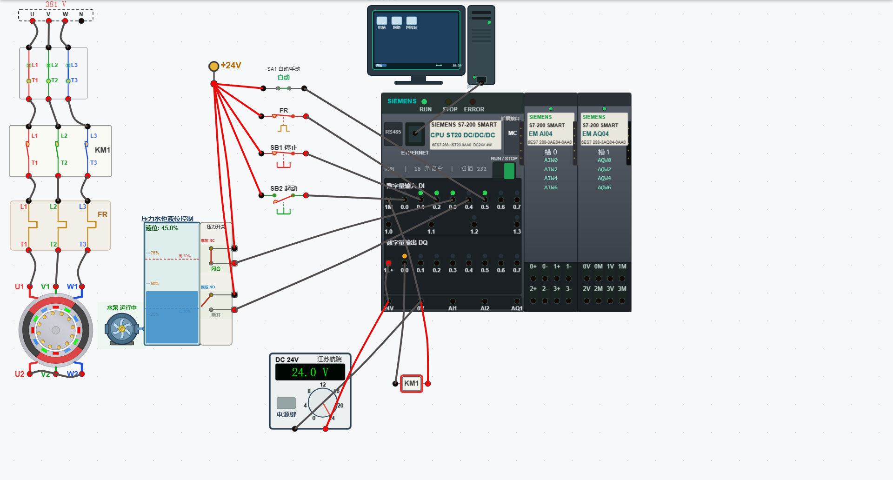
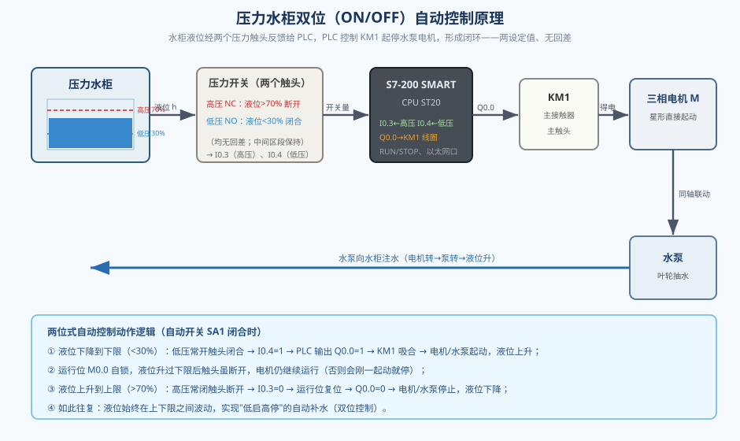
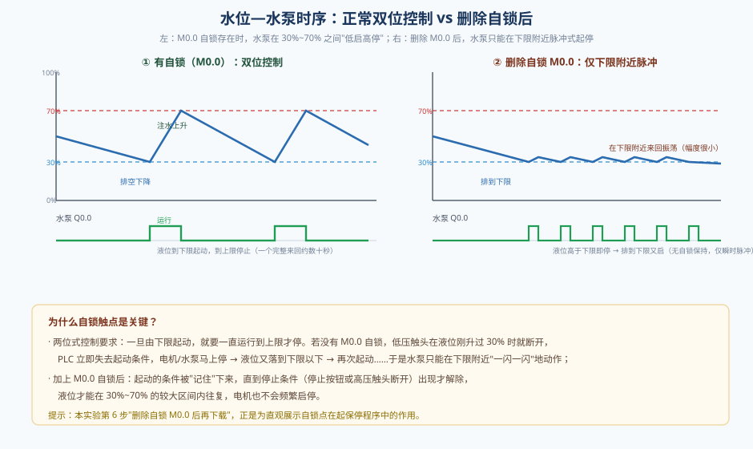
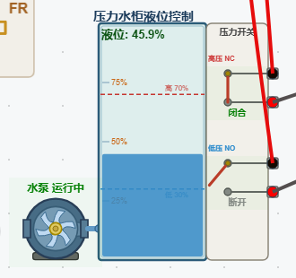
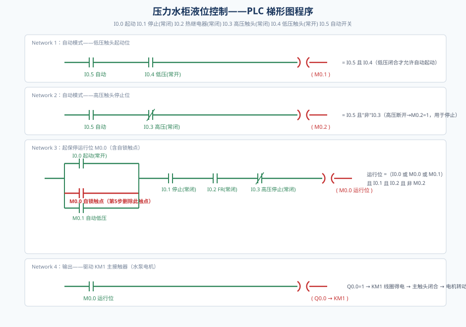
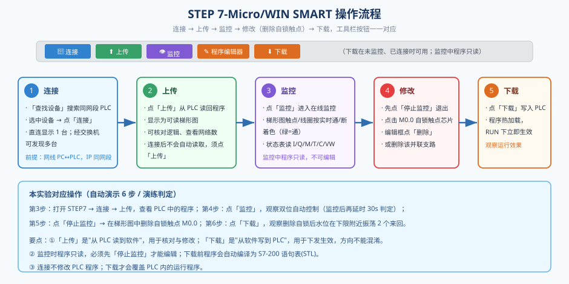
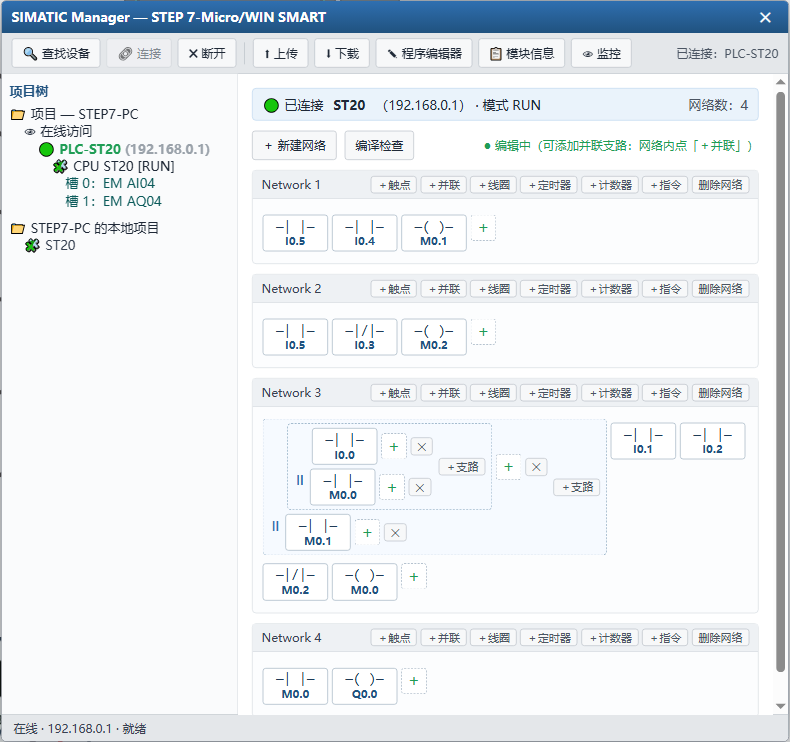
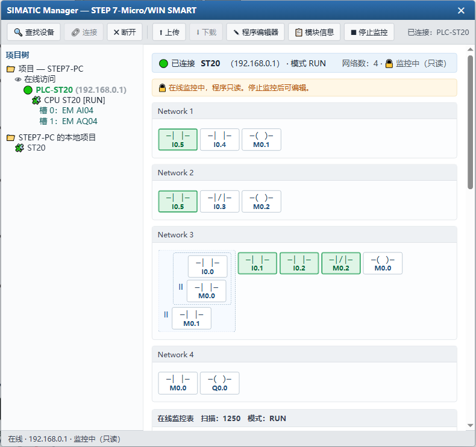
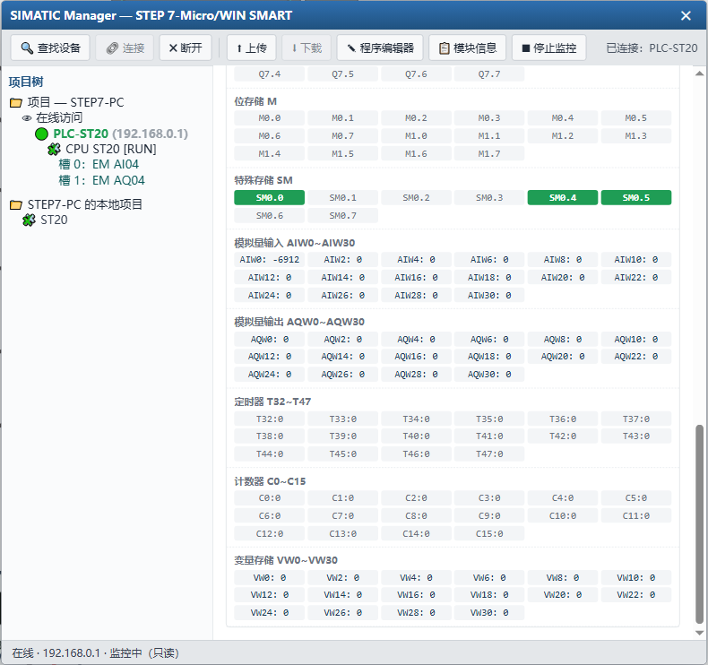
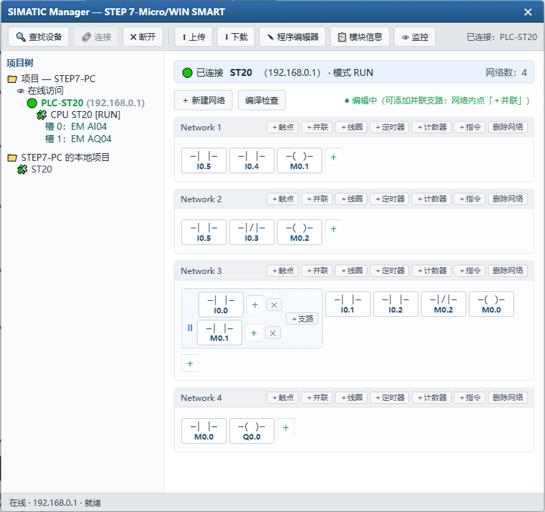

# PLC程序的上传与下载

> 适用实验：压力水柜液位 PLC 控制（西门子 S7-200 SMART CPU ST20）
> 实验平台：本仿真工程 `sys10_plclevel`（工具栏「自动接线 / 起动系统 / 自动演示 / 单步演示 / 演练 / 评估」）

---

## 一、实验目的与设备

本实验以"压力水柜液位控制"为载体，围绕西门子 S7-200 SMART 系列 PLC，完成小程序控制系统从**接线、上电、编程、上传、监控、修改到下载**的完整闭环，重点掌握：

1. 压力水柜**双位（ON/OFF）自动控制**的工作过程与两个压力触头的作用；
2. 用 STEP 7-Micro/WIN SMART（下称"STEP7 软件"）与 PLC **建立连接、上传程序、在线监控、修改程序、下载程序**的详细操作；
3. 读懂"起保停"程序中的**自锁触点**，理解为什么两位式控制离不开自锁，以及删除自锁后水位只能在下限附近"来回振荡"。

实验主要设备：三相交流电源（380 V）、三相空气开关 QF、交流接触器 KM1（线圈 DC 24 V / 主触头）、热继电器 FR、三相异步电动机 M（11 kW）、压力水柜（含水泵、压力开关）、DC 24 V 电源、起动/停止按钮、自动/手动开关 SA1、西门子 S7-200 SMART CPU ST20（12 DI / 8 DO，晶体管源型）、装有 STEP7 的上位机。



---

## 二、压力水柜双位自动控制原理

### 2.1 压力水柜与"压力—液位"的对应关系

压力水柜是一个密封柜体，柜内下部存水、上部为压缩空气。水泵向柜内补水时水增多、空气被压缩、柜内压力升高；向外用水时水减少、压力降低。因此，**柜内压力与液位一一对应**，用一个"压力开关"即可间接测量液位，并在两个设定点上输出开关量信号，无需再配专门的液位变送器。

本仿真中的压力水柜由三部分组成：左侧的水泵（叶轮随电机转动）、中间的水柜（动态水位、上下限标记线）、右侧的压力开关（两个触点及其开合动画）。其逻辑关联是：**电机运行 → 水泵转动 → 水柜液位上升；电机停止 → 水泵停 → 液位因排水而下降**。

### 2.2 两个压力触头与高低压设定值

压力开关内含两个整定值：**低压设定值**和**高压设定值**（本实验分别取 30% 与 70%），并引出两个触点：

- **低压动作常开触头（NO）**：液位**低于**低压设定值时**闭合**，高于时断开；用于发出"需要补水"的起动信号。
- **高压动作常闭触头（NC）**：液位**高于**高压设定值时**断开**，低于时闭合；用于发出"已补满"的停止信号。

两个触头在仿真中**均无回差**（单一阈值动作）：只要越过设定值就立即翻转，便于清晰观察动作点。

### 2.3 双位控制与自锁的必要性

"双位控制"又称 ON/OFF 控制：被控量只有"开"和"关"两个状态。它要求——

> 一旦因液位低而**起动**水泵，就要**一直运行到液位到达上限**才停止；否则液位刚升过下限，低压触头就断开，水泵刚起动就停，液位又落下、又起动……水泵只能在下限附近高频"闪动"，水柜永远补不满。

为此，程序中引入**运行位 M0.0**：由低压触头（或手动起动按钮）置位后**自锁**，直到"停止按钮"或"高压触头断开"给出停止条件才复位。这样，液位才能在 30%~70% 的较大区间内往复，电机也不会频繁启停。



图 2 给出了闭环关系：水柜液位 → 压力开关的两个触头 → PLC 输入 → PLC 程序 → 输出 Q0.0 → 接触器 KM1 → 三相电机 →（同轴联动）水泵 → 向水柜注水，形成闭环。四个动作要点：

1. **液位下降到下限（<30%）**：低压常开触头闭合 → I0.4 = 1 → PLC 输出 Q0.0 = 1 → KM1 吸合 → 电机、水泵起动，液位上升；
2. **运行位 M0.0 自锁**：液位升过下限后触头虽又断开，电机仍继续运行；
3. **液位上升到上限（>70%）**：高压常闭触头断开 → I0.3 = 0 → 运行位复位 → Q0.0 = 0 → 电机、水泵停止，液位下降；
4. **如此往复**，液位始终在上下限之间波动，实现"低启高停"的自动补水。

### 2.4 水位—水泵时序



图 3 左侧是**正常双位控制**的时序：液位从下限（30%）升到上限（70%）时水泵持续运行，到上限停泵，液位排到下限再启泵，一个完整来回通常数十秒。右侧是**删除自锁触点 M0.0 后**的时序：没有记忆作用，液位刚升过下限水泵即停，液位回落又启，于是水泵只能在下限附近脉冲式起停。这一点正是本实验第 5、6 步要重点观察的现象。

---

## 三、系统组成与电气接线

### 3.1 主电路

三相电源 `ac-3p`（380 V）经总开关 QF，接主接触器 **KM1 主触头**，再经热继电器 **FR 发热元件**，送至三相电动机 M 的首端 U1/V1/W1；电动机尾端 U2/V2/W2 短接成**星点**（简单直接起动，不再换接）。KM1 主触头是否闭合，由 PLC 输出 Q0.0 驱动 KM1 线圈决定。

### 3.2 控制回路与 I/O 分配

控制回路由 DC 24 V 供电。24 V 电位端子 `pterm-24` 引出多路，分别串接热继电器常闭触点、停止按钮、起动按钮、压力水柜触头、自动/手动开关后接入 PLC 的数字量输入；PLC 输出 Q0.0 接 KM1 线圈，线圈另一端回 0 V。I/O 分配见下表：

| 地址 | 名称 | 触点形式 | 信号含义（1 时） |
|---|---|---|---|
| I0.0 | SB2 起动按钮 | 常开 NO | 按下起动 |
| I0.1 | SB1 停止按钮 | 常闭 NC | 未按下（可运行） |
| I0.2 | FR 热继电器 | 常闭 NC | 未过载（可运行） |
| I0.3 | 压力水柜**高压**触头 | 常闭 NC | 液位 < 70% |
| I0.4 | 压力水柜**低压**触头 | 常开 NO | 液位 < 30% |
| I0.5 | SA1 自动/手动开关 | 单刀单掷 | 闭合 = 自动；断开 = 手动 |
| Q0.0 | KM1 主接触器线圈 | 输出 | 得电吸合，电机/水泵运行 |
| M0.0 | 运行位（起保停） | 内部位 | 电机应运行 |
| M0.1 | 自动低压起动位 | 内部位 | I0.5 且 I0.4 |
| M0.2 | 自动高压停止位 | 内部位 | I0.5 且"非"I0.3 |

> 注意：**压力水柜的两个触头接在 PLC 的输入端**（I0.3、I0.4），而不是输出端。它们是把"液位高低"这一物理量变成开关量送入 PLC 的**传感器信号**；PLC 的输出只有 Q0.0 一路，用于驱动接触器。



图 4 为压力水柜特写：左下水泵（与电机联动）、中间水柜（液位与高低限标记）、右侧压力开关。压力开关中"**高压 NC**"在上、"**低压 NO**"在下，引脚自右侧边缘引出：高压常闭→I0.3、低压常开→I0.4。

---

## 四、PLC 程序详细分析

### 4.1 程序清单（语句表 STL）

```text
// I0.0 起动  I0.1 停止(常闭)  I0.2 FR(常闭)
// I0.3 高压触头(常闭)  I0.4 低压触头(常开)  I0.5 自动/手动
LD     I0.5          // 网络1：自动模式——低压触头起动位
A      I0.4
=      M0.1

LD     I0.5          // 网络2：自动模式——高压触头停止位
AN     I0.3
=      M0.2

LD     I0.0          // 网络3：起保停运行位 M0.0
O      M0.0
O      M0.1
A      I0.1
A      I0.2
AN     M0.2
=      M0.0

LD     M0.0          // 网络4：输出驱动 KM1
=      Q0.0
END
```

### 4.2 逐网络分析



**网络 1（M0.1）**：`M0.1 = I0.5 AND I0.4`。只有在"自动"（I0.5=1）且"液位低于下限、低压触头闭合"（I0.4=1）时，自动低压起动位 M0.1 才为 1。它相当于"把低压触头并联到起动按钮上"。

**网络 2（M0.2）**：`M0.2 = I0.5 AND NOT I0.3`。只有在"自动"且"液位高于上限、高压触头断开"（I0.3=0）时，自动高压停止位 M0.2 才为 1。它相当于"把高压触头串联到停止回路中"。

**网络 3（M0.0，起保停）**：`M0.0 =（I0.0 或 M0.0 或 M0.1）且 I0.1 且 I0.2 且 非 M0.2`。可拆成三部分理解：

- **置位（"或"）**：手动起动按钮 I0.0、运行位自身 M0.0（**自锁**）、自动低压起动位 M0.1，三者任一为 1 即可保持运行；
- **串联的停止条件**：停止按钮 I0.1（常闭，未按=1）、热继电器 I0.2（常闭，未过载=1）必须都为 1，任一为 0 立即停机；
- **自动高压停止**：`AN M0.2` 表示只要 M0.2=1（自动且到达上限）就解除运行。

**网络 4（Q0.0）**：`Q0.0 = M0.0`。运行位为 1 时输出 Q0.0 得电，KM1 线圈吸合、主触头闭合，电机与水泵运行。

### 4.3 自动与手动两种模式

- **自动模式（SA1 闭合，I0.5 = 1）**：M0.1、M0.2 参与逻辑。液位到下限自动起动，到上限自动停止；同时手动起动/停止按钮仍然有效（"手动操作部分有效"）。
- **手动模式（SA1 断开，I0.5 = 0）**：M0.1、M0.2 恒为 0，压力触头**不参与控制**；此时只能靠**手动起动按钮 I0.0** 起动、**手动停止按钮 I0.1** 停止，运行位 M0.0 自锁保持。

### 4.4 程序设计的两个关键点

1. **用中间位 M0.1/M0.2 实现"自动"支路**，而不是直接把触头串并在 I/O 回路里。好处是：自动与手动模式切换只需一个开关 SA1，程序逻辑清晰，且不改变现场接线。
2. **自锁触点 M0.0**是两位式控制的核心。它让"起动"这一瞬时事件被记忆为持续运行，直到出现明确的停止条件。删除它，程序就退化为"液位在上下限之间随触头即时启停"，即图 3 右侧的脉冲振荡——这正是本实验要演示的对比。

---

## 五、STEP 7-Micro/WIN SMART 操作详解

上位机（`step7pc-1`，IP 192.168.0.2）与 PLC（`plc-1`，IP 192.168.0.1）用网线相连。**双击上位机屏幕**（或右键「打开 STEP7 编程软件」）即可打开软件界面。工具栏自左向右为：查找设备、连接、断开、上传、下载、程序编辑器、模块信息、监控。



### 5.1 连接（查找设备 → 连接）

1. 打开软件后先进入"查找设备"页，软件通过以太网搜索同一网段内的 PLC；
2. 直连时发现 1 台，经交换机时可发现多台；用单选按钮选中目标后，点工具栏「🔗 连接」；
3. 连接成功后，标题栏与状态栏显示"已连接 PLC-ST20（192.168.0.1）"，左侧项目树出现该 CPU 及其扩展模块（EM AI04、EM AQ04）。

> **注意**：连接只是建立在线通道，**不会读取也不会改动** PLC 中的程序。

### 5.2 上传（从 PLC 读回程序）

点工具栏「⬆ 上传」，软件把 PLC 中当前运行的程序读回，并**反编译为可读的梯形图**（含并联支路，可继续编辑）。上传后可核对：网络数（本程序为 4 个网络）、各触点与线圈的操作数是否正确。



图 7 中可见四个网络：网络 1（I0.5、I0.4 → M0.1）、网络 2（I0.5、¬I0.3 → M0.2）、网络 3（并联的 I0.0 / M0.0 / M0.1 → I0.1、I0.2、¬M0.2 → M0.0）、网络 4（M0.0 → Q0.0）。其中网络 3 的 **M0.0 并联支路就是自锁触点**。

> **易错点**：连接后软件不会自动读取程序，编辑器初始为空白；必须点「上传」才能看到 PLC 中的程序。若忘记上传就修改并下载，会用"空白/新建"程序覆盖 PLC 原程序。

### 5.3 监控（在线监视运行状态）

在**已连接**且 PLC **处于 RUN** 的前提下，点工具栏「👁 监控」进入在线监控：

- 梯形图上的触点、线圈按**实时通/断着色**：绿色表示当前为 1（导通/得电），灰色表示 0；
- 页面下方出现**在线监控表**，实时显示 I、Q、M、SM、AIW、AQW、T、C、VW 等过程映像的数值与扫描次数；
- 监控期间**程序只读**，不能编辑。



图 8 中，电机运行、液位处于中间区段时的状态为：I0.5（自动）=1、I0.3（高压，未到上限）=1、I0.4（低压，已过下限）=0；由于 M0.0 已自锁，网络 3 中 M0.0 触点、I0.1、I0.2、¬M0.2 均导通，线圈 M0.0 与 Q0.0 均为 1（绿色），电机持续运行。



图 9 为监控状态表，可逐位查看 I0.0~I0.7、Q0.0~Q0.7、M0.0~以及定时器/计数器/变量存储器的当前值，是判断"输入是否到位、程序是否正确、输出是否动作"的重要工具。

### 5.4 修改程序（本实验：删除自锁触点 M0.0）

1. 监控中程序只读，**先点「⏹ 停止监控」**退出监控，程序恢复可编辑；
2. 在网络 3 的并联支路中找到标号 **M0.0** 的触点芯片，点击它（或点击该支路右侧的删除按钮）将其删除；
3. 删除后网络 3 的并联支路只剩 I0.0 与 M0.1 两条，运行位不再自锁；
4. 可用「编译检查」按钮校验网络完整性（每个网络都应有输出）。



图 10 中网络 3 的并联支路已从"I0.0 / **M0.0** / M0.1"变为"I0.0 / M0.1"，自锁消失。对应的语句表由三路"或"变为两路"或"。

### 5.5 下载（写回 PLC 并运行）

点工具栏「⬇ 下载」，软件把编辑器中的梯形图**编译为 S7-200 语句表（STL）**后写入 PLC；PLC 在 RUN 状态下**热加载**新程序，立即按新逻辑运行。

> **区别**：「上传」是从 PLC **读到**软件（方向：PLC → 软件）；「下载」是从软件**写到** PLC（方向：软件 → PLC）。两者方向相反，切勿混淆。**只有下载才会改变 PLC 内的运行程序。**

下载"无自锁"程序后，回到仿真界面观察：由于运行位不再记忆，水泵只在液位低于下限时起动、液位一升过下限立即停止，于是**水位在下限（低压设定值）附近来回振荡**（对应图 3 右侧）。

### 5.6 五个操作对比

| 操作 | 方向 | 是否改变 PLC 程序 | 前提 |
|---|---|---|---|
| 连接 | 建立在线通道 | 否 | 网线已连、IP 同网段 |
| 上传 | PLC → 软件 | 否 | 已连接 |
| 监控 | 读过程映像 | 否 | 已连接、PLC 处于 RUN |
| 修改 | 编辑软件中的梯形图 | 否（仅改软件副本） | 已停止监控 |
| 下载 | 软件 → PLC | **是** | 已连接、未处于监控 |

---

## 六、实验操作流程（与仿真工作流对应）

本工程的自动演示/演练流程"**1. PLC程序的上传、监控、修改和下载**"共 6 步，与上文操作一一对应：

1. 点击「自动接线」完成全部接线，再点击「起动系统」上电并让 PLC 进入 RUN；
2. 合上「自动/手动」开关（转为自动），观察压力水柜双位自动控制（水泵自动起动一次、到上限自动停止一次）；
3. 打开 STEP7 界面，点击「连接」，再点击「上传」，查看 PLC 中的程序；
4. 点击「监控」进入在线监控，观察双位自动控制过程；
5. 点击「停止监控」退出监控，在梯形图中删除自锁触点 M0.0，完成程序修改；
6. 点击「下载」将修改后的程序写入 PLC，观察删除自锁后的运行效果——水位在下限附近来回振荡。

演示模式下，第 2、4 步会**等待水泵自动起动一次并在上限自动停止一次**；第 6 步会**等待水位在下限振荡 2 个来回**。演练/评估模式下，第 2、4 步在检测到"自动开关已闭合/已进入监控"后再延时 30 s 才跳步，第 6 步下载后延时 20 s 才跳步，以保证学员有充分的观察时间。

---

## 七、注意事项与常见问题

1. **接的是输入，不是输出**：压力水柜两触头（高压→I0.3、低压→I0.4）和自动开关（→I0.5）都是开关量**输入**信号，务必接在 PLC 的 DI 端子上。
2. **常开/常闭不要搞反**：高压是常闭（液位高→断开），低压是常开（液位低→闭合）。接反会导致"到上限不停"或"到下限不启"。
3. **必须让 PLC 处于 RUN**：STOP 状态下程序不执行，监控也看不到实时变化；「起动系统」会将 PLC 切到 RUN。
4. **监控中不能下载**：下载按钮在监控时被禁用，需先「停止监控」。
5. **自锁触点的作用**：删除 M0.0 后水泵会在下限附近高频起停，容易损坏电机——这正是实际系统中必须设置自锁与整定动作幅差（回差）的原因。
6. **下载覆盖风险**：连接后若未上传便新建并下载，会覆盖 PLC 原程序；规范做法是"先上传核对，再修改下载"。

---

## 八、思考与练习

1. 若把压力水柜的高压触头与低压触头的接线对调（高压接 I0.4、低压接 I0.3），程序应如何相应修改？
2. 若在程序中给两个触头之间加入约 5% 的**回差**（液压上限 70%、下限 65%），水位波形与水泵启停频率会如何变化？
3. 若把停止按钮 I0.1 由常闭改为常开接入，程序中的 `A I0.1` 应改成什么？为什么？
4. 在监控状态下用状态表观察 M0.0、Q0.0 与 I0.4 的变化，说明"低压触头一断开，为什么电机不立即停"。

---

## 九、附录：梯形图、语句表与过程映像

### 9.1 梯形图与语句表的对应

STEP7 软件既可用**梯形图（LAD）**编辑，也可用**语句表（STL）**编辑；下载时软件会把梯形图**编译**为语句表交给 PLC 执行，上传时则把语句表**反编译**为梯形图。本程序四个网络的对照关系如下：

| 网络 | 梯形图 | 语句表 |
|---|---|---|
| 1 | I0.5 串 I0.4 → 线圈 M0.1 | `LD I0.5 / A I0.4 / = M0.1` |
| 2 | I0.5 串 ¬I0.3 → 线圈 M0.2 | `LD I0.5 / AN I0.3 / = M0.2` |
| 3 | (I0.0 ∥ M0.0 ∥ M0.1) 串 I0.1 串 I0.2 串 ¬M0.2 → 线圈 M0.0 | `LD I0.0 / O M0.0 / O M0.1 / A I0.1 / A I0.2 / AN M0.2 / = M0.0` |
| 4 | M0.0 → 线圈 Q0.0 | `LD M0.0 / = Q0.0` |

语句表中：`LD` 表示一个逻辑块的开始，`A`/`AN` 表示与/与非，`O`/`ON` 表示或/或非，`=` 表示线圈输出。第 3 网络先由 `LD/O/O` 形成"或"逻辑块，再连续用 `A/AN` 与之相"与"，正好对应梯形图里"先并联、后串联"的结构。

### 9.2 过程映像与扫描周期

S7-200 SMART 采用**循环扫描**方式运行：先采样输入端子的状态写入**输入过程映像（I）**，再自顶向下执行用户程序、刷新**输出过程映像（Q）**与内部位（M、T、C 等），最后把 Q 映像送往输出端子，如此循环往复，一秒钟可扫描成百上千次。监控时看到的 I/Q/M 数值，就是最近一次扫描结束时的过程映像值；状态表中不断变化的"扫描次数"，正是扫描周期的计数。

### 9.3 操作速查

| 目标 | 操作 | 结果 |
|---|---|---|
| 与 PLC 建立在线通道 | 查找设备 → 选中 → 「连接」 | 标题栏显示"已连接"及 IP，但不读写程序 |
| 核对 PLC 中的程序 | 「上传」 | 梯形图显示在编辑器中（只读核对） |
| 观察实际运行 | 「监控」 | 触点/线圈实时着色 + 状态表数值 |
| 修改逻辑 | 「停止监控」→ 编辑梯形图 | 程序恢复可编辑 |
| 使修改生效 | 「下载」 | 编译后写入 PLC，RUN 下热加载立即运行 |
| 停止监视 | 「停止监控」 | 退出在线监控，可下载/编辑 |

> 一句话记忆：**连接是通路，上传是读，监控是看，修改是改稿，下载才是生效。** 读（上传）与写（下载）方向相反，是初学者最容易混淆的两个按钮。

---

*文档配套图件均位于本工程 `docs-img/` 目录；仿真界面图由实际工程运行截图得到，原理图、时序图、梯形图与操作流程图为本实验专用矢量图。*
