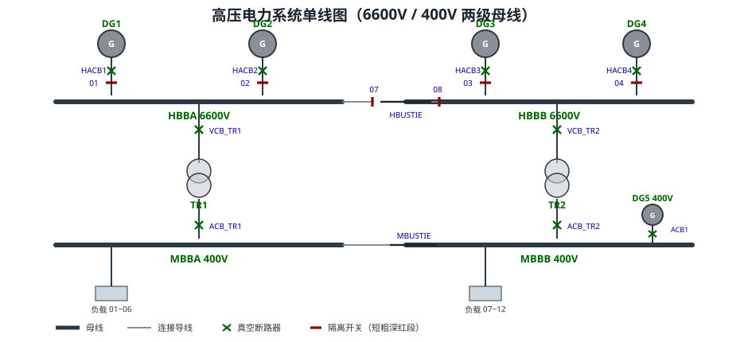
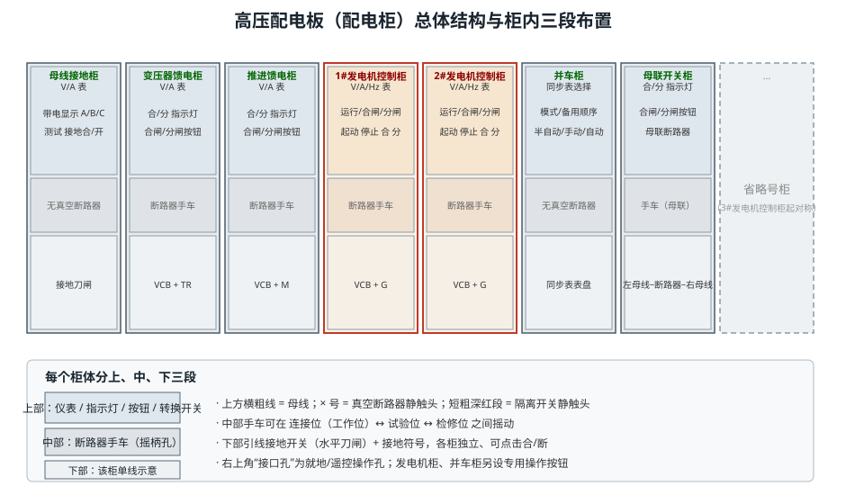
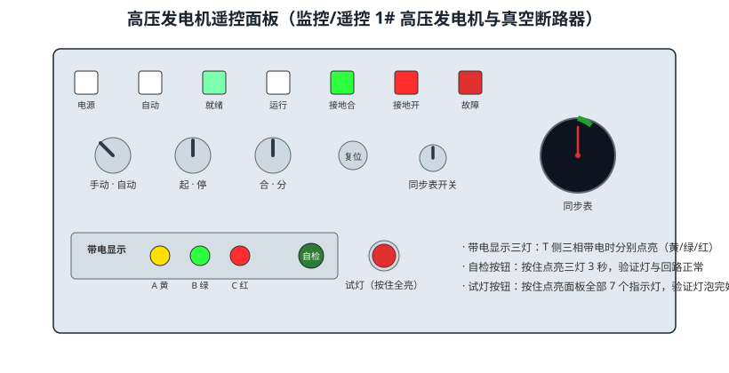
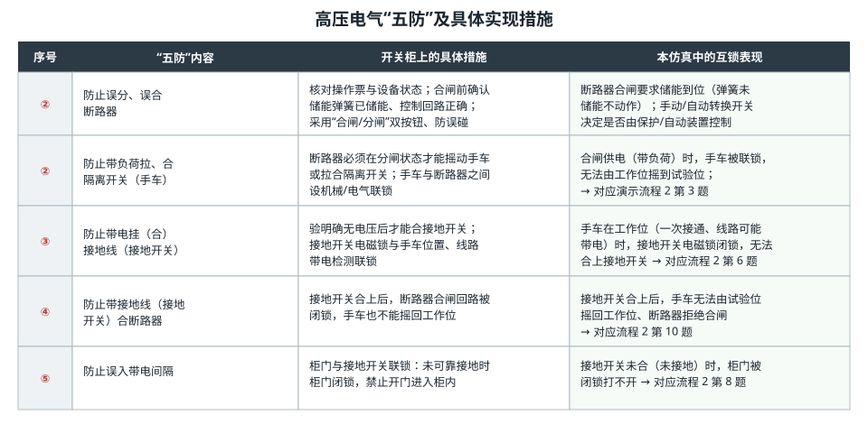
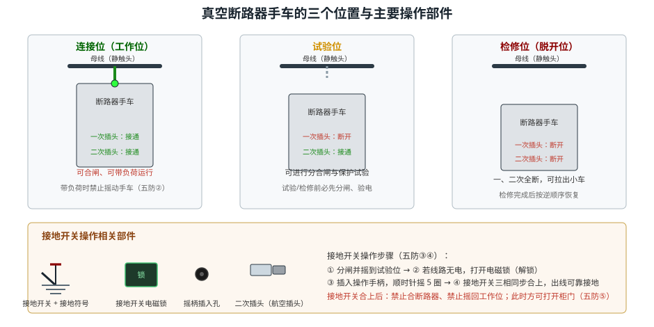
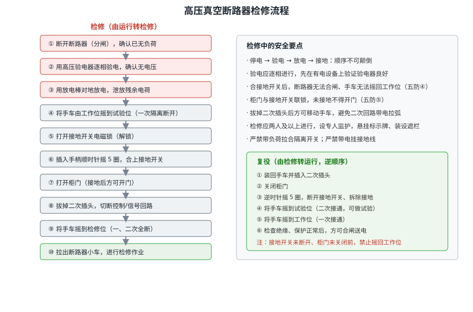
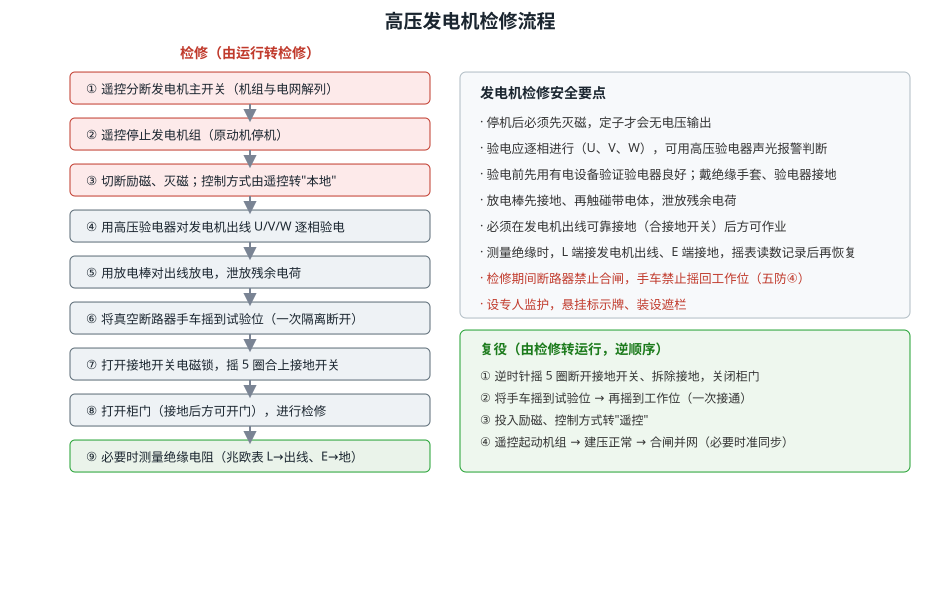

# 高压配电系统仿真

> **适用对象**：船舶/工业高压电力系统（6600V / 400V 配电）
> **配套仿真平台（本工程）**含三个自动演示流程，本文所述操作均可在软件中逐一演示：
> ① 高压电的检测与操作规程　② 高压操作的五防措施　③ 高压配电装置的操作及管理

---

## 一、概述

高压配电系统是船舶电站与大型工业装置的电能枢纽。它把发电机组发出的电能汇集到高压母线，再经母线分配、变压器降压后送往各类负载，同时承担电能的保护、测量、监视与操作任务。本仿真工程模拟的是一套典型的**两级母线**船舶高压电力系统。

### 1.1 系统组成

系统的核心是两条高压母线与若干台发电机、变压器和馈电支路：

- **主发电机** DG1～DG4：6600V 高压同步发电机，经各自的**真空断路器（HACB1～HACB4）**和**隔离开关（01～04）**接入高压母线。
- **辅助发电机** DG5：400V，经空气开关 ACB1 接入低压母线。
- **高压母线** HBBA（左）、HBBB（右）：由**母联支路**（隔离开关 07/08 + 母联断路器 HBUSTIE）连接，可并联运行或分段隔离。
- **日用变压器** TR1/TR2：把 6600V 降压为 400V，经原边真空断路器（VCB_TR1/VCB_TR2）和副边空气开关（ACB_TR1/ACB_TR2）向低压母线供电。
- **低压母线** MBBA、MBBB：由低压母联断路器 MBUSTIE 连接，向照明、日用负载等供电。

### 1.2 接地与安全特性

高压系统中性点经**接地电阻**接地（本工程为 500Ω，属于**高阻接地 / 小电流接地系统**）。这种系统的特点是：发生单相接地时，接地电流被中性点电阻限制得很小，系统**仍可短时继续运行**，但必须由**接地监视仪（绝缘监视装置）**及时报警，提醒值班人员排查。中性点接地电阻、接地监视仪、绝缘测试支路共同构成了本系统的"检测"环节，也是"高压电的检测与操作规程"流程的基础。

### 1.3 高压配电系统的功能与要求

高压配电系统承担四项基本功能：**汇集**（把各发电机的电能汇集到母线）、**分配**（把电能分配到各馈电支路和负载）、**变换**（经变压器实现 6600V/400V 电压变换）、**保护与监视**（通过断路器、保护装置和仪表实现故障切除与状态监视）。为了在故障或检修时不停电，系统还须具备**冗余性**：电压等级越高、容量越大，对供电连续性和安全性的要求也越高。

因此，高压配电系统的操作有两条铁律：一是**顺序性**（送电、停电、并车、解列都有严格顺序，不可颠倒）；二是**安全性**（任何操作都不得带电、带负荷进行）。本仿真平台的三个演示流程正是围绕这两条铁律设计的，目的是让学员在虚拟环境中反复练习，形成规范的操作习惯。

---

## 二、高压配电柜的结构与操作

高压配电柜（高压配电板）是高压设备的**集中操作与监视面板**。在软件中，勾选工具栏"高压配电柜"复选框即可显示；取消勾选则隐藏。

### 2.1 总体布置

配电板由一排标准柜体并排组成，本工程共 8 个柜：

| 柜名 | 主要功能 |
|------|----------|
| 母线接地柜 | 高压带电显示、接地开关（接地刀闸）操作 |
| 变压器馈电柜 | 向日用变压器馈电，含真空断路器与跌落/接地开关 |
| 推进馈电柜 | 向推进负载馈电 |
| 1#发电机控制柜 | 1# 发电机的起动/停止、合闸/分闸、接地开关 |
| 2#发电机控制柜 | 2# 发电机的起动/停止、合闸/分闸、接地开关 |
| 并车柜 | 同步表、模式选择、备用顺序选择，用于准同步并车 |
| 母联开关柜 | 高压母线母联断路器的合闸/分闸 |
| 省略号柜 | 表示 3# 发电机控制柜起对称省略 |

### 2.2 柜内三段式结构

每个柜体在竖直方向分为上、中、下三段，这也是识读配电柜的基本方法：

- **上部**：测量仪表（电压表 V、电流表 A、频率表 Hz）、指示灯、操作按钮和转换开关。电压/电流表监视该支路的电气量；运行/合闸/分闸指示灯反映机组与断路器状态；按钮用于起动、停止、合闸、分闸。
- **中部**：**断路器手车**。手车是可抽出的断路器本体，可在"连接位（工作位）—试验位—检修位"之间摇动；正面设有**摇柄插入孔**，用于摇动手车或接地开关。
- **下部**：该柜的**单线示意小图**，画出母线、真空断路器（× 符号）与接地开关（短粗深红段），直观反映该柜在系统中的地位。

柜体左上角或右上角还设有"接口孔"，用于就地和遥控操作。母线接地柜还特有**高压带电显示器**（A 黄 / B 绿 / C 红 三灯）与**测试按钮**。

### 2.3 高压发电机遥控面板

1#、2# 发电机除可就地操作外，还可在**高压发电机遥控面板**上监控与遥控。面板布局如图 3 所示：

- **第一排**共 7 个指示灯：电源、自动、就绪（READY）、运行、接地合（绿）、接地开（红）、故障。
- **第二排**："手动·自动"转换开关、"起·停"自复位开关、"合·分"自复位开关、复位按钮、同步表开关和同步表表盘。
- **第三排**：高压带电显示器（A/B/C 三灯）+ 自检按钮，以及**试灯按钮**（按住时点亮面板全部指示灯）。

**关键指示的判读**：

- "就绪"灯亮：发电机处于遥控、未运行、无故障状态，可以起动。
- "运行"灯亮：机组已起动建压。
- "接地合"绿灯亮 / "接地开"红灯亮：分别表示接地开关已合上（已接地）/ 未合上（未接地）。
- 带电显示三灯：断路器 T 侧（出线侧）三相带电时点亮，用于判断设备是否带电。

### 2.4 典型操作顺序（对应演示流程 1）

高压配电系统的送电与并车应严格按顺序进行，软件中"高压电的检测与操作规程"流程完整演示了下列操作：

**（1）单线图认识与模拟操作**

1. 勾选"单线图"，认识 DG1～DG4、HBBA/HBBB、母联、TR1/TR2 与低压母线的结构。
2. 开启 DG1 → 合上隔离开关 01 → 合上真空断路器 HACB1，使 DG1 向 HBBA 供电。
3. 合上母联两侧隔离开关 07、08 → 合上母联断路器 HBUSTIE，使 HBBA 与 HBBB 并联。
4. 合上 VCB_TR1、ACB_TR1，经 TR1 降压向低压母线供电；合上 MBUSTIE 使低压母线并联。

**（2）配电柜上的实际操作**

5. 确认并车柜"模式"开关处于**手动**。
6. 在 1# 发电机控制柜**遥控起动** 1# 机组，**合闸**向电网供电。
7. 在母联开关柜**合闸**，接通母联。
8. 手动起动 2# 机组，将**同步表选择开关**打到 2#；观察同步表指针旋转，**待指针转到 11 点（接近同相位）** 时合上 2# 机断路器并网。
9. **解列 1# 机组**（分闸），随后将 1# 发电机**接地**。

> **同步表原理**：同步表指针角度表示待并机与电网的**相位差**。指针转至 11 点附近时，待并机与电网电压接近同相位，此时合闸冲击电流最小，是最佳并网时机。

### 2.5 配电柜操作的一般规定

高压配电柜的操作应遵守以下一般规定：

- **凭票操作**：一切停送电操作均应有操作票，操作前核对设备名称、编号与状态，操作中逐项打勾、操作后复查。
- **双人监护**：重要操作由两人执行，一人操作、一人监护；监护人不得兼做其他工作。
- **状态确认**：操作前先看指示灯、再看机械指示（合/分闸指示牌、工作位圆盘），确认设备实际状态与操作票一致。
- **先模拟后实操**：复杂操作（如并车）可先在单线图上模拟，确认无误后到实物/配电柜上操作。
- **异常即停**：操作中出现异常声响、异味、指示异常时，应立即停止操作并报告。

软件中，配电柜上的合闸/分闸按钮、转换开关、接地开关等均可点击操作，与真实设备一一对应；操作时请注意面板上的指示灯与单线示意是否同步变化。

---

## 三、高压"五防"及具体实现措施

"五防"是高压电气操作的**强制性安全规则**，目的是防止人员误操作造成人身与设备事故。它通过**机械联锁、电气联锁和操作规程**共同实现。

### 3.1 五防内容与具体措施

① **防止误分、误合断路器**。操作前核对操作票与设备状态；合闸前确认储能弹簧已储能、控制回路正确；采用"合闸/分闸"双按钮、防误碰设计。

② **防止带负荷拉、合隔离开关（手车）**。断路器必须在**分闸状态**下才能摇动手车或拉合隔离开关，手车与断路器之间设机械/电气联锁。**软件表现**：断路器合闸供电（带负荷）时，手车被联锁，无法由工作位摇到试验位。

③ **防止带电挂（合）接地线（接地开关）**。必须**验明确无电压**后方可合接地开关；接地开关电磁锁与手车位置、线路带电检测联锁。**软件表现**：手车在工作位（一次接通、线路可能带电）时，接地开关电磁锁**闭锁**，无法合上接地开关。

④ **防止带接地线（接地开关）合断路器**。接地开关合上后，断路器合闸回路被闭锁，手车也不能摇回工作位。**软件表现**：接地开关合上后，手车无法由试验位摇回工作位、断路器拒绝合闸。

⑤ **防止误入带电间隔**。柜门与接地开关联锁：**未可靠接地时柜门闭锁**，禁止开门进入柜内。**软件表现**：接地开关未合（未接地）时，柜门被闭锁打不开；接地开关合上后才允许开门。

### 3.2 操作要点

- "五防"的核心逻辑是**"先想后果、再动手"**：每一次操作前先问自己"这一步会不会带负荷、会不会带电、有没有接地"。
- 软件中的互锁不是"限制"，而是对真实开关柜**机械程序锁**的模拟，用于帮助学员建立"什么状态下允许做什么操作"的安全直觉。
- 岗位规程要求：操作应由两人及以上进行、设专人监护，并执行操作票、悬挂标示牌、装设遮栏等措施。

### 3.3 "五防"的实现层次与典型误操作

"五防"并非只靠某一种装置，而是**机械联锁、电气联锁、操作规程**三个层次共同保障：

- **机械联锁（程序锁）**：用机械结构强制操作顺序，如"断路器合闸时手车无法摇动""接地开关未合柜门打不开"。
- **电气联锁**：用电磁锁、辅助触点和二次回路实现，如接地开关电磁锁、合闸回路闭锁。
- **操作规程**：用操作票、复诵、监护等制度约束人的行为，是最后一道防线。

与"五防"对应的**典型误操作**及其后果：

1. 带负荷拉隔离开关 → 隔离开关触头间产生强烈电弧，可能造成相间短路、人员烧伤。
2. 带电挂接地线 → 造成金属性三相短路，巨大短路电流损坏设备、危及人身。
3. 带接地线合断路器 → 合闸瞬间经接地线短路，断路器爆炸、母线受损。
4. 误入带电间隔 → 人员触电伤亡。

正因后果极其严重，软件把每条互锁都做成"不可逾越是安全"的硬约束，学员在演练模式下若能触发互锁（如合闸时摇手车被拒），恰恰说明安全措施生效。

---

## 四、高压真空断路器检修流程

真空断路器是高压配电装置中最核心的开关电器，其检修必须在**完全停电并接地**的条件下进行。理解其**手车三位置**是掌握检修流程的关键。

### 4.1 手车的三个位置

- **连接位（工作位）**：一次插头接通、二次插头接通，断路器可合闸带负荷运行。此时手车被联锁，**禁止摇动**。
- **试验位**：一次插头断开、二次插头仍接通，可进行分合闸与保护试验，但不能带负荷。
- **检修位（脱开位）**：一次、二次插头**全部断开**，断路器本体可完全拉出柜外检修。

主要操作部件包括：**摇柄插入孔**（摇动手车与接地开关）、**接地开关电磁锁**（未解锁不能操作接地开关）、**接地开关**（合上后使出线三相可靠接地）、**二次插头**（航空插头，切断控制/信号回路）与**柜门**。

### 4.2 检修（由运行转检修）流程

1. **断开断路器（分闸）**，确认已无负荷。
2. **验电**：用高压验电器逐相验电，确认无电压（验电前应先在有电设备上验证验电器良好）。
3. **放电**：用放电棒对地放电，泄放线路残余电荷。
4. 将手车由**工作位摇到试验位**，使一次隔离触头断开。
5. **打开接地开关电磁锁**（解锁）。
6. **插入手柄，顺时针摇 5 圈，合上接地开关**，使三相出线可靠接地。
7. **打开柜门**（接地后方可开门）。
8. **拔掉二次插头**，切断控制/信号回路。
9. 将手车**摇到检修位**（一、二次全断）。
10. **拉出断路器小车**，进行检修作业。

### 4.3 复役（由检修转运行）

按上述相反顺序恢复：装回小车并插入二次插头 → 关闭柜门 → 逆时针摇 5 圈断开接地开关、拆除接地 → 摇到试验位（二次接通，可做试验）→ 摇到工作位（一次接通）→ 检查绝缘、保护正常后方可合闸送电。**接地开关未断开、柜门未关闭前，禁止将手车摇回工作位。**

### 4.4 为什么要"验电、放电、接地"

- **验电**：断路器断开后，出线侧可能因**反送电、感应电压或绝缘损坏**而仍然带电，仅凭"断路器已分闸"并不能判定无电，必须用验电器实际测量。
- **放电**：线路（尤其是电缆、长母线）存在**分布电容**，停电后仍储存有残余电荷，不放电直接触可能导致电击；放电棒内部串有高阻值电阻，可在安全泄放的同时避免短路冲击。
- **接地**：在作业区域装设接地（合接地开关），使设备三相短接并接地，既能泄放残余电荷，又能防止突然来电，是检修人员最直接的**保命措施**。

手车的**机械联锁**正是围绕上述安全措施设计的：断路器未分闸不能摇手车（防带负荷）、手车未到试验位不能合接地开关（防带电接地）、接地开关未断开不能摇回工作位（防带接地线合闸）、未接地不能开门（防误入带电间隔）。

---

## 五、高压发电机检修流程

发电机检修与断路器检修同样遵循"停电—验电—放电—接地"的安全铁律，但增加了解列、停机与**灭磁**等发电机专有环节。

### 5.1 检修（由运行转检修）流程

1. **遥控分断发电机主开关**，使机组与电网解列。
2. **遥控停止发电机组**（原动机停机）。
3. **切断励磁、灭磁**，并将控制方式由"遥控"转为"本地"。
4. 用**高压验电器**对发电机出线 U/V/W **逐相验电**，确认无电压。
5. 用**放电棒**对出线放电，泄放残余电荷。
6. 将真空断路器手车**摇到试验位**（一次隔离断开）。
7. **打开接地开关电磁锁，摇 5 圈合上接地开关**，使出线可靠接地。
8. **打开柜门**（接地后方可开门），进行检修。
9. 必要时测量**绝缘电阻**：兆欧表 L 端接发电机出线、E 端接地，摇动手柄读取绝缘电阻并记录。

### 5.2 复役（由检修转运行）

逆顺序恢复：断开接地开关、拆除接地并关闭柜门 → 将手车摇到试验位再摇到工作位 → 投入励磁、控制方式转"遥控" → 遥控起动机组、建压正常后合闸并网（多机运行时需**准同步**并车）。

### 5.3 安全要点

- **灭磁先行**：停机后必须先灭磁，定子才会真正无电压输出。
- **逐相验电**：U、V、W 三相分别验电，先在有电设备上验证验电器良好，验电时戴绝缘手套、验电器接地端可靠接地。
- **可靠接地**：必须在出线**已合接地开关（或装设接地线）**后方可作业，防止反送电或残余电荷伤人。
- **绝缘测量**：兆欧表 L→出线、E→地，读数稳定后再记录，测完先放电再恢复接线。
- 检修期间断路器禁止合闸、手车禁止摇回工作位（五防④）；设专人监护，悬挂标示牌、装设遮栏。

### 5.4 验电器与兆欧表使用注意

**高压验电器**：使用前应先在**确知有电**的设备上试验，确认验电器指示正常；验电时戴绝缘手套，验电器的接地端必须可靠接地，对三相线路应**逐相验电**（不能只验一相）；雨、雪、雾及雷雨天气禁止使用普通验电器进行室外验电。

**兆欧表（摇表）**：测量前先将被测设备**停电并放电**，接线时 L 端（线路端）接被测导体、E 端（接地端）接地，摇动手柄保持约 120r/min，待指针稳定后读数；测量完毕应先断开 L 端再停止摇动，并对被测设备**放电**，防止残余电荷损坏仪表或伤人。绝缘电阻应记录并与历史数据和标准值比较，判断绝缘是否受潮或老化。

---

## 六、安全注意事项小结

1. **停送电顺序**：送电"由电源到负载"，停电"由负载到电源"；停电必须按"**停电 → 验电 → 放电 → 接地 → 挂牌 → 装遮栏**"的顺序执行。
2. **隔离开关（手车）不得带负荷操作**：拉合隔离开关必须在断路器分闸状态下进行。
3. **接地开关（接地线）不得带电挂接**：必须先验电确认无电。
4. **接地后禁止合断路器、禁止摇回工作位**：防止带接地线合闸造成短路。
5. **未接地不得开门**：防止误入带电间隔。
6. **并网必须准同步**：同步表指针接近 11 点时合闸，避免冲击电流与并列失败。
7. **操作监护**：重要操作由两人及以上执行，一人操作、一人监护。

### 6.1 典型案例警示

- **带负荷拉隔离开关**：某配电室在负荷未断的情况下拉隔离开关，触头间产生电弧引发相间短路，设备烧损、操作人员被电弧灼伤。教训：隔离开关只能"通断空载电流"，绝不可带负荷操作。
- **未验电即挂接地线**：操作人以为断路器分闸即无电，未验电便挂接地线，因线路存在反送电导致接地短路，接地线崩断伤人。教训：任何停电作业前必须**逐相验电**。
- **接地开关未拆除即合闸**：检修结束后忘记拆除接地开关便合闸送电，造成三相短路、断路器爆炸。教训：送电前必须检查接地开关确已断开（五防④的由来）。
- **误入带电间隔**：未确认接地便打开柜门进入带电间隔触电。教训：必须严格执行"未接地不开门"的柜门联锁与监护制度。

这些事故的共同点，都是**违反了"五防"中的某一条**。软件的互锁与流程设计，正是为了让学员在无风险的虚拟环境中"犯过这些错"，从而在真实岗位上不犯错。

---

## 附：仿真演示流程与本文对照

| 演示流程 | 主要步骤 | 本文对应章节 |
|----------|----------|--------------|
| 1. 高压电的检测与操作规程 | 单线图认识 → 模拟送电 → 配电柜遥控操作 → 手动准同步并车 → 解列并接地 | 二、2.4 |
| 2. 高压操作的五防措施 | 确认就绪 → 起动合闸 → 断路器无法摇试验位 → 分闸停机灭磁 → 摇试验位 → 接地 → 开门 | 三 |
| 3. 高压配电装置的操作及管理 | 自动接线起动 → 试灯 → 接地测试（报警/确认/复位）→ 停机灭磁 → 摇试验位接地 → 开柜门 → 摇脱开位 | 四、五 |

> **使用建议**：先在软件中依次运行上述三个"自动演示"流程，对照本文的图示与说明理解每一步的动作与联锁关系；再切换到"演练/评估"模式，独立完成操作并接受校验，最终形成规范的高压操作安全意识与技能。
