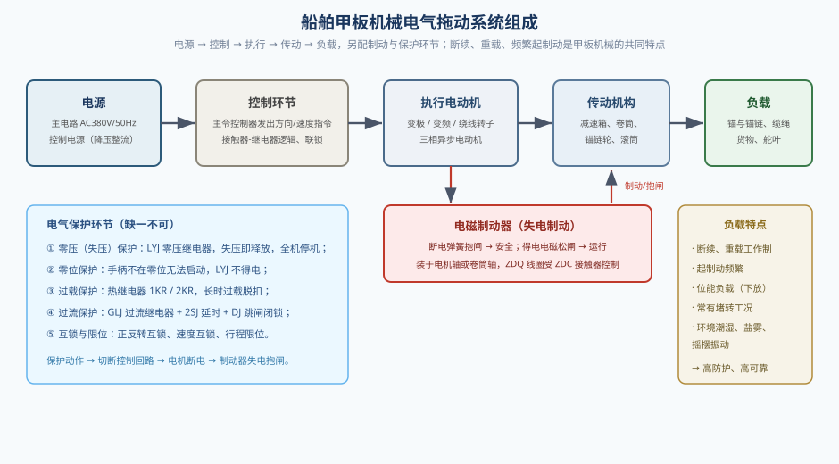
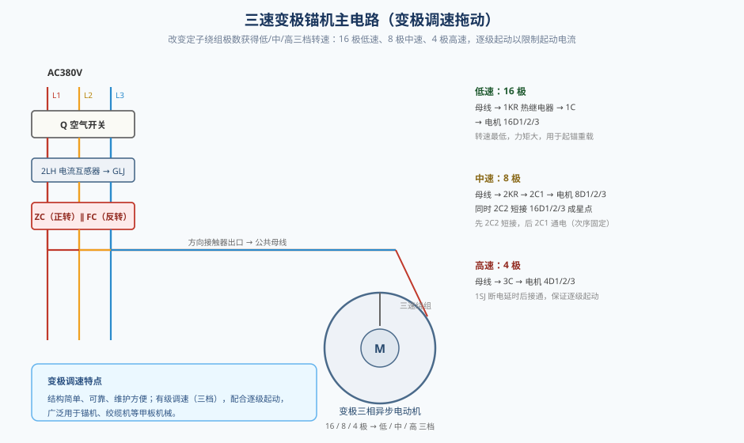
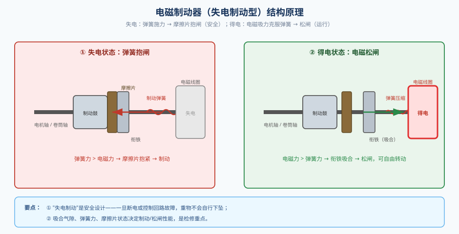
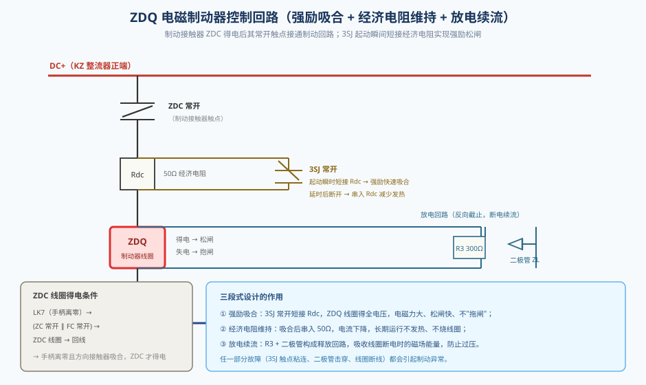
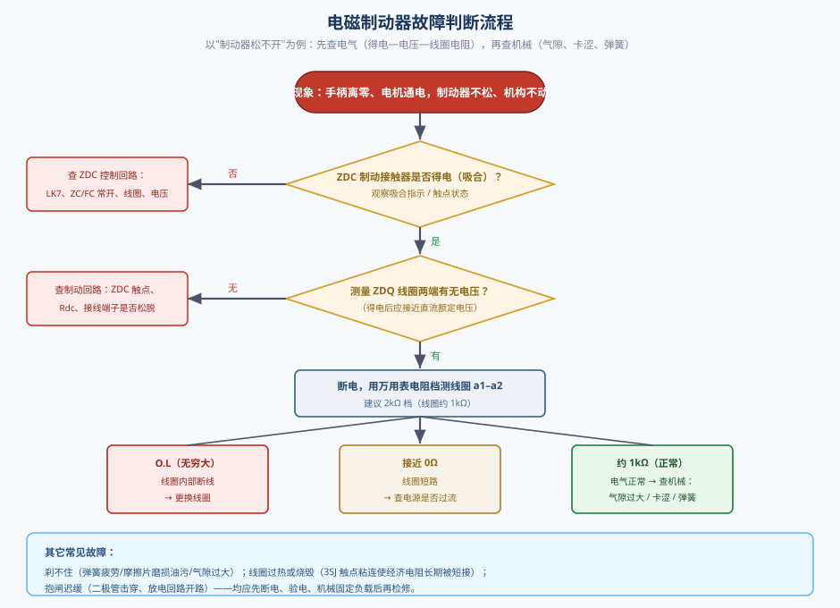

# 甲板机械的操作程序及故障处理

> 本文结合本仿真工程的三速锚机电路，重点讲解三项内容：**① 船舶常用甲板机械的电气拖动原理；② 电磁制动器在船舶设备中的应用；③ 电磁制动器常见故障的判断与处理**。文中电路元件位号与仿真工程一致，可对照演示操作学习。

---

## 一、船舶常用甲板机械的电气拖动原理

### 1.1 什么是甲板机械

船舶甲板机械指安装在露天甲板上、完成船舶作业的机械设备，主要包括**锚机、绞缆机（系缆绞车）、起货机、舵机、舷梯与吊艇装置**等。它们绝大多数由电动机拖动，是船舶"电力拖动"应用最集中、要求最高的场合之一。

甲板机械的负载具有鲜明的共同特点：

- **断续、重复短时工作制**，起、制动极其频繁；
- **负载转矩大且变化剧烈**，常有堵转、反转以及下放重物的**位能负载**工况；
- 工作环境恶劣——潮湿、盐雾、摇摆、振动，要求防护等级高、可靠性好；
- 必须配置**可靠的机械制动**与**多重电气保护**。

### 1.2 拖动系统的基本组成

任何一套甲板机械电力拖动系统，都可归纳为"电源—控制—执行—传动—负载"五个环节，并附有制动与保护环节，如图 1 所示。

1. **电源**：主电路为三相交流 380V/50Hz（大型船舶亦用 440V/60Hz）；控制电路经控制变压器降压、整流后供电（本工程为 DC24V）。
2. **控制**：主令控制器发出方向与速度指令，由接触器、继电器组成逻辑回路执行。
3. **执行**：三相异步电动机（变极、变频或绕线转子式）。
4. **传动**：减速箱、卷筒、锚链轮、缆索滚筒。
5. **负载**：锚与锚链、缆绳、货物、舵叶等。

### 1.3 常用调速与拖动方式

甲板机械常用的拖动方案有三类：

- **变极调速**：改变定子绕组的极数，得到低/中/高（如 16/8/4 极）三档转速。结构简单、可靠、维护方便，广泛用于锚机、绞缆机；
- **变频调速**：用变频器连续调节频率，调速范围宽、起制动平稳，多用于新型起货机、绞车；
- **绕线转子串电阻调速**：用于老式大功率起货机，通过切换转子外接电阻改变机械特性。

以本工程三速锚机为例（图 2）：三相电源经空气开关 Q、电流互感器 2LH 后，由正转接触器 ZC 或反转接触器 FC 接通公共母线；母线下分三条支路——低速经 1KR、1C 接通 16 极绕组，中速经 2KR、2C1 接通 8 极绕组（同时 2C2 把 16D1/2/3 短接成星点），高速经 3C 接通 4 极绕组。**中速必须先 2C2 短接、后 2C1 通电**，高速则须待 1SJ 断电延时到达后才允许 3C 吸合，从而实现"低速—中速—高速"**逐级起动，限制起动电流**。

### 1.4 电气保护环节

甲板机械一旦失控，后果严重，因此保护环节"缺一不可"（图 1）：

- **零压（失压）保护**：由零压继电器 LYJ 实现。控制电源接通且手柄在零位时 LYJ 得电并自锁；一旦失压，LYJ 释放，全机停机，防止电压恢复后设备自行起动。
- **零位保护**：手柄不在零位（零位触点 LK1 断开）时 LYJ 无法得电，保证带载自动起动被禁止。
- **过载保护**：热继电器 1KR（低速支路）、2KR（中速支路）长时间过载时脱扣，其常闭触点断开 LYJ 回路，全机停机。
- **过流保护**：高速运行时由 GLJ 过流继电器经 2SJ 延时、DJ 中间继电器自锁跳闸，自动切除高速档并闭锁。
- **互锁与限位**：正反转接触器互锁（ZC/FC 常闭互串）、速度接触器互锁，防止相间短路；主令控制器各档位触点实现顺序联锁。

**关键联动**：任何保护动作最终都通过切断控制回路使电机断电，而**电机断电又必然导致制动器失电抱闸**——这正是下一节要讲的"失电制动"安全设计。

---

## 二、电磁制动器在船舶设备中的应用

### 2.1 为什么甲板机械必须"失电制动"

甲板机械多为**位能负载**：起升的锚、货物一旦失去制动，会因自重自行下坠；同时船体摇摆、振动也易使机构滑移。因此普遍采用**失电制动型电磁制动器**：**断电时由弹簧施力抱闸，得电时由电磁吸力松闸**。这种"故障安全"（Fail-Safe）特性意味着：无论是停电还是控制回路故障导致线圈失电，机构都会被可靠制动，不会失控下坠。

### 2.2 结构与工作原理

电磁制动器主要由**制动弹簧、衔铁、摩擦片（闸瓦）、制动鼓、电磁线圈**组成，如图 3 所示。

- **得电（松闸）**：线圈通电产生电磁吸力，克服弹簧力把衔铁吸向铁芯，摩擦片与制动鼓脱开，电机轴可自由转动；
- **失电（抱闸）**：线圈断电，电磁吸力消失，弹簧把衔铁压向制动鼓，摩擦片抱紧，实现制动。

制动器的**气隙、弹簧力和摩擦片状态**直接决定松闸是否可靠、制动力矩是否足够，是日常检修的重点。

### 2.3 典型控制回路——强励吸合、经济电阻维持、放电续流

电磁制动器的线圈不是简单接电了事，而是有一套讲究的控制回路。以本工程 ZDQ 为例（图 4）：

- **得电条件**：手柄离零后 LK7 闭合，正转 ZC 或反转 FC 的常开触点闭合，**ZDC 制动接触器**线圈得电；ZDC 的常开触点再接通 ZDQ 制动器回路；
- **主回路**：DC+ → ZDC 常开 → 经济电阻 Rdc（50Ω）→ ZDQ 线圈 → DC−；
- **强励吸合**：**3SJ 的常开触点并接在 Rdc 两端**。起动瞬间 3SJ 得电、常开闭合，把经济电阻短接，ZDQ 线圈得到全电压，电磁力大、松闸快，避免"拖闸"引起电机堵转；
- **经济电阻维持**：制动器吸合后 ZDC 常闭触点断开，3SJ 线圈失电，经延时后其常开触点复位，把 50Ω 经济电阻串入线圈回路，线圈电流减小、维持吸合即可，从而**减少发热、防止烧毁**；
- **放电续流**：300Ω 电阻 R3 与二极管 ZL 串联后并接在线圈两端，构成**放电回路**，吸收线圈断电瞬间的磁场能量，防止过电压并加快抱闸。

### 2.4 应用场合

电磁制动器广泛用于**锚机、绞缆机、起货机、吊艇架、舵机**等需要可靠制动的甲板机械，也用于电梯、起重等场合。它常装在电动机轴伸或卷筒轴端，与电机的起停、换向、保护回路联动。

---

## 三、电磁制动器的常见故障判断与处理

电磁制动器的故障可分为**电气类**（线圈、电源、接触器、经济电阻、二极管）和**机械类**（气隙、卡涩、弹簧、摩擦片）。判断时遵循"**先电气、后机械；先外部、后内部；先断电、后检修**"的原则，流程见图 5。

### 3.1 故障现象一：制动器松不开（抱死）

**现象**：手柄离零、电机通电，但机构不动，制动器不松闸，电机被闸住**堵转**，电流剧增，最终过载保护动作停机。

**判断步骤**：

1. **查 ZDC 是否得电**。若 ZDC 未吸合，说明问题在其控制回路（LK7、ZC/FC 常开触点、ZDC 线圈或电压），应先排除；
2. **ZDC 得电后测 ZDQ 线圈两端电压**。若无电压，查制动回路接线、ZDC 触点、Rdc 及端子是否松脱；
3. **有电压但不松闸，则断电测量线圈电阻**（建议 2kΩ 档）。正常线圈电阻约 1kΩ；若读数为 **O.L（无穷大）说明线圈内部断线**，应更换线圈；若接近 0Ω 则为线圈短路，需检查电源是否过流。

> **本工程故障演示**：在故障设置界面勾选"**ZDQ 线圈断线**"后，将手柄推到"上升 1"，可见 ZC、1C、ZDC 均得电，但 ZDQ 始终显示"抱闸"，电机被闸住堵转，随后 1KR 过载动作停机。用数字万用表 2kΩ 电阻档测量线圈 a1–a2，读数显示 **O.L**，即可判定线圈断线；修复（取消勾选）后重新运行，ZDQ 松闸、电机恢复正常运转。

### 3.2 故障现象二：刹不住（松闸后不复位、制动力矩不足）

**原因**：制动弹簧疲劳或断裂、吸合气隙过大、摩擦片磨损或沾油、衔铁剩磁等。

**处理**：调整或更换弹簧；按说明书重新调整气隙；清洗或更换摩擦片；检查制动鼓表面是否拉伤。制动力矩不足会直接影响锚机、起货机的安全性，必须及时处理。

### 3.3 故障现象三：线圈过热或烧毁

**原因**：最常见的是**3SJ 常开触点粘连或误动作，使经济电阻长期被短接**，线圈长期承受全电压、大电流而过热；此外还有电源电压过高、绝缘老化、频繁操作等。

**处理**：检查并更换 3SJ 触点；核对线圈额定电压与电源是否匹配；测量线圈绝缘电阻；更换线圈时须按原额定电压、通电持续率选型。

### 3.4 故障现象四：经济电阻或放电回路故障

- **3SJ 触点粘连**：Rdc 被长期短接 → 线圈过热（见 3.3）；
- **二极管 ZL 击穿或开路**：放电回路失效 → 线圈断电时产生过电压，或抱闸迟缓、有异响。

**处理**：用万用表二极管档检测 ZL 正反向特性，损坏即更换；确认 R3、Rdc 阻值正常，接线牢固。

### 3.5 安全注意事项

1. 检修前**必须断电、验电**，并采取防止重物下坠的机械措施（如楔垫、机械锁定）；
2. 测量线圈电阻应在**断电状态**下进行，避免带电测量损坏仪表或触电；
3. 更换制动器或线圈时应成套核对**额定电压、制动力矩、气隙**等参数，不得随意代换；
4. 修复后应先空载点动试验，确认松闸、抱闸动作正常，再投入带载运行。

---

## 小结

1. 甲板机械多为**断续重载、频繁起制动、位能负载**，其电力拖动系统由"电源—控制—执行—传动—负载"构成，并配有零压、零位、过载、过流、互锁等保护，靠**逐级起动**限制起动电流。
2. 电磁制动器采用**失电制动**，断电弹簧抱闸、得电电磁松闸，是保证甲板机械安全的关键部件；其控制回路通过**强励吸合、经济电阻维持、放电续流**实现快速、可靠、不过热的制动动作。
3. 制动器故障判断应"**先电气、后机械**"：依次检查 ZDC 得电情况、ZDQ 线圈电压和线圈电阻（O.L 即断线），再检查气隙、卡涩、弹簧与摩擦片；处理时务必断电验电、参数匹配、先试后载。
