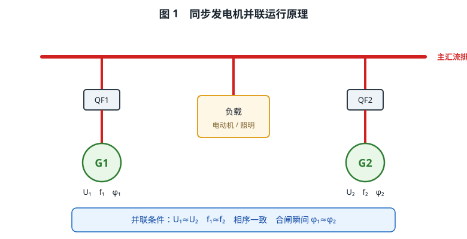
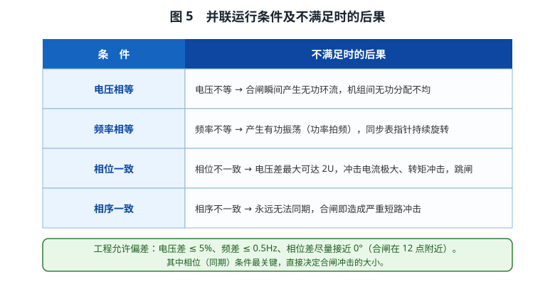
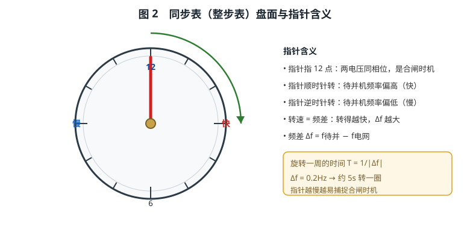
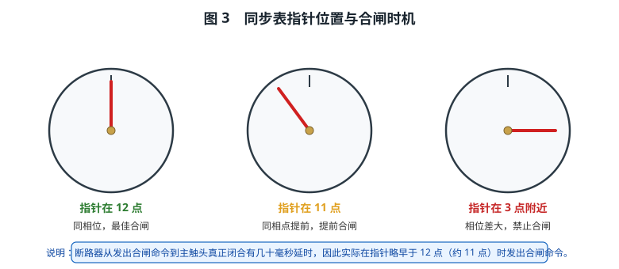
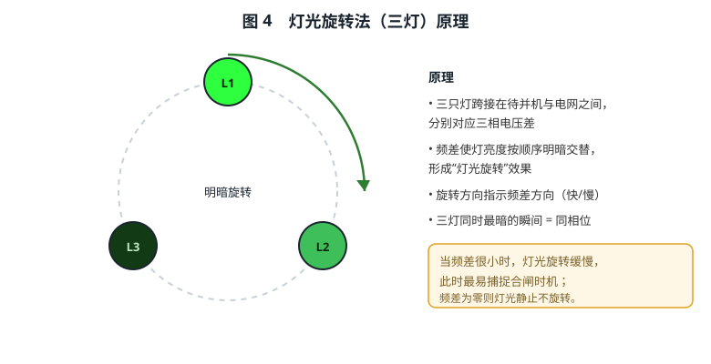
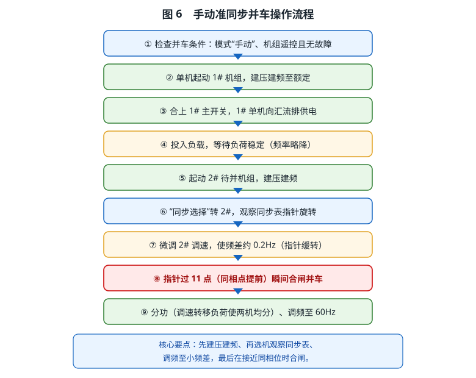
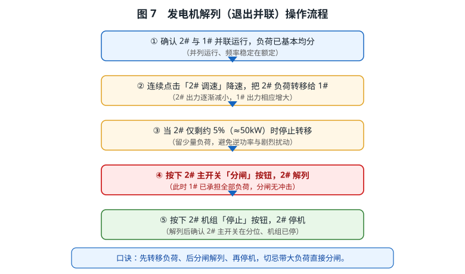

# 同步发电机并车和解列

> 本文结合低压配电板仿真，系统讲解同步发电机**并联运行的条件**、**同步表（整步表）的工作原理**以及**并车（并联）与解列（退出并联）的操作步骤**，并给出分功、调频等运行调节要点。文中配图与仿真操作一一对应，可作为实验预习、操作指导与复习资料。

---

## 一、为什么需要并联运行

在船舶电站、电厂和各类工业供电系统中，通常配置两台及以上的同步发电机。它们既可以单机运行，也可以在需要时把多台发电机**并联**到同一段母线上共同供电，这一过程称为**并车**（并列/并网）；把其中一台从母线上退出、停止向电网供电，则称为**解列**。

采用并联运行主要有以下意义：

1. **满足大容量负荷需求。** 单台发电机容量有限，当电网总负荷超过一台机组的额定容量时，必须增开机组并联运行，由多台机组共同承担负荷。
2. **提高供电可靠性。** 当一台机组故障或需要检修时，其余机组仍可继续供电；并联运行时还可以实现"先并后停"的**不停电换机**，保证重要负荷不中断。
3. **提高经济性。** 低负荷时只用一台机组、高负荷时多台并联，使各机组尽量运行在高效区，减少燃油消耗和设备磨损。
4. **改善供电质量。** 多台机组并联后，电网容量增大，抗冲击负荷能力增强，电压、频率更稳定。

发电机并联运行时，母线上所有在网机组的电压、频率必须完全一致——它们实际上是**同一电网上同频同相运行**。因此，把一台发电机并入已有电网，绝不是简单地把开关合上，而必须让待并机组满足严格的**同步条件**，并在合适的时机合闸。

---

## 二、同步发电机并联运行的条件

把待并发电机 G2 并入已由 G1 供电的电网，必须满足以下四个条件。

### 2.1 电压条件——电压幅值相等

待并机组的空载电压应与电网电压**幅值相等**（一般允许相差不超过额定电压的 5%），同时要求**波形一致**（都是正弦波）。

如果电压不等，合闸瞬间两台机组之间会因电压差而产生**无功环流**。电压差越大，环流越大，轻则造成无功分配不均、发电机发热，重则使保护动作跳闸。

### 2.2 频率条件——频率相等

待并机组的频率应与电网频率**相等**（工程上允许频差不超过 0.5Hz，手动并车时通常要求更小）。

如果频率不等，两台机组电压相量之间的夹角会随时间不断变化，产生**有功振荡**（功率"拍频"），同步表指针会持续旋转。频率差越大，指针转得越快，越难捕捉合闸时机。

### 2.3 相位条件——合闸瞬间相位一致

这是最关键、也最容易被忽视的条件。合闸瞬间，待并机电压与电网电压的**相位必须一致**（相位差接近 0°）。

如果相位不一致，即使电压幅值和频率都相等，两电压相量之间仍存在电压差。极端情况下（相位差 180°），电压差可达 **2 倍额定电压**，合闸将产生巨大的冲击电流和电磁转矩，使发电机、断路器和电网遭受严重冲击，往往直接导致并车失败、保护跳闸，甚至损坏设备。因此并车操作中"**看准相位**"至关重要。

### 2.4 相序条件——相序一致

待并机与电网的三相相序必须**一致**。相序不一致时，无论怎样调整频率和相位都无法真正同期，合闸即相当于两相短路，后果极其严重。相序在发电机安装、检修接线时即已确定，运行中一般不会改变，但首次并车前必须核对。

### 2.5 条件的工程允许偏差

实际运行中不必追求"绝对相等"，允许一定偏差：

| 条件 | 允许偏差 | 说明 |
|---|---|---|
| 电压差 | ≤ 5% 额定电压 | 相差越小，无功环流越小 |
| 频差 | ≤ 0.5Hz（手动并车常取 0.1～0.2Hz） | 频差小则同步表转得慢，易捕捉时机 |
| 相位差 | 尽量接近 0°（合闸在 12 点附近） | 最关键，直接决定冲击大小 |
| 相序 | 必须一致 | 安装检修时核对 |

---

## 三、同步表的工作原理

### 3.1 同步表的作用与结构

**同步表**（又称整步表、同期表）是手动准同步并车的核心指示仪表。它接在待并机电压与电网电压之间，用来同时指示两者的**频率差**和**相位差**，帮助操作人员判断并车条件是否满足、何时合闸最合适。

同步表盘面上有刻度和一根指针。指针指在 **12 点（正上方）** 表示待并机电压与电网电压**同相位**；指针偏离 12 点的角度，就代表两者的相位差。

### 3.2 指针旋转速度反映频率差

同步表指针会不停地旋转，其**旋转速度由两电压的频率差 Δf 决定**：

- 当待并机频率高于电网频率（Δf > 0）时，指针**顺时针**旋转；
- 当待并机频率低于电网频率（Δf < 0）时，指针**逆时针**旋转；
- 频差越大，指针转得越快；频差越小，指针转得越慢；当两者频率完全相等时，指针**静止不动**。

指针旋转一周所需的时间 T 与频差的关系为：

**T = 1 / |Δf|**

例如频差 Δf = 0.2Hz 时，指针约 5 秒转一圈；频差为 0.1Hz 时约 10 秒转一圈。可见频差越小，指针越慢，指针经过 12 点的时间越长，越容易准确合闸。因此手动并车时总是先把频差调得很小（约 0.1～0.2Hz），再进行合闸操作。

### 3.3 指针位置反映相位差

指针所处的**角度位置**，直接对应两电压的相位差：

- 指针在 **12 点**：相位差约 0°，是理想的合闸点；
- 指针顺时针偏离（如指向 3 点方向）：相位差为正；
- 指针逆时针偏离（如指向 9 点方向）：相位差为负。

由于断路器从接到合闸命令到主触头真正闭合存在几十毫秒的机械延时，若等到指针正对 12 点才发命令，实际合闸时相位已经"超前"了一点。因此实际操练中通常在指针**略早于 12 点、约 11 点位置**时提前发出合闸命令，使触头闭合瞬间恰好接近同相位。

### 3.4 灯光旋转法

除了指针式同步表，工程上还常用**灯光旋转法**（三灯法）作为同期指示。它用三只指示灯跨接在待并机与电网对应的三相之间，通过灯的明暗变化来判断相位关系：

- 当两电源存在频差时，三只灯的亮度会按顺序交替变化，看起来就像灯光在**旋转**；
- 灯光旋转的方向指示频差方向，旋转快慢反映频差大小；
- 当三只灯**同时最暗（或同时最亮）**的瞬间，即对应两电压同相位，此时可以合闸。

灯光旋转法与指针式同步表原理一致，可以互相印证，实际并车屏上常同时配置两者，便于观察。

---

## 四、并车操作步骤（手动准同步并车）

以"1# 机组已在网、需要并入 2# 机组"为例，手动准同步并车的标准步骤如下。

### 第 1 步　检查并车条件

并车前应确认：

- 电站运行模式处于**手动**（手动准同步并车必须由人工判断合闸时机，不能在自动/半自动模式下进行）；
- 待并机组控制方式为**遥控**（机旁位置时机组不受遥控，不能投入）；
- 机组**无故障**、"准备好"指示灯亮；
- 电网与待并机的电压、相序已核对一致。

在仿真中，点击并车屏"模式选择"开关确认在"手动"位，并点击机组"准备好"指示灯确认机组具备投入条件。

### 第 2 步　单机起动 1# 机组

按下 1# 机组的"起动"按钮，柴油机起动后带动发电机**建压建频**：电压由 0 逐渐升到额定（约 450V），频率由 0 升到额定（约 60Hz）。这一过程约需数秒，期间应观察电压表、频率表。

### 第 3 步　合上 1# 主开关，单机供电

当 1# 机组建压建频完成、电压频率稳定后，按下 1# 主开关"合闸"按钮。此时汇流排原无电，合闸无同期问题，1# 机组开始向汇流排供电。

### 第 4 步　投入负载，等待负荷稳定

汇流排带电后，各用电设备（如海水泵、淡水泵、滑油泵等）按顺序自动投入。随着负荷增加，发电机频率会因调速器的**调差特性**而略有下降（如降到约 59Hz）。等待负荷基本稳定后，再进入并车操作，避免负荷剧烈变化影响并车。

### 第 5 步　起动 2# 待并机组

按下 2# 机组的"起动"按钮，使 2# 机组同样完成建压建频。此时 2# 机组空载运行，其电压、频率已接近电网，但尚未合闸。

### 第 6 步　"同步选择"转 2#，观察同步表

把并车屏"同步选择"开关转到 **2#**，同步表即接入 2# 与电网之间，指针开始指示两者的相位关系。观察指针旋转方向判断 2# 频率偏高还是偏低，观察转速判断频差大小。

### 第 7 步　微调 2# 调速，使频差约 0.2Hz

通过 2# 调速开关（升速/降速）微调 2# 机组转速，使同步表指针缓慢旋转，即频差约为 **0.2Hz**。频差太小指针几乎不动、太大指针转得太快，都不利于准确合闸。

### 第 8 步　指针过 11 点，合闸并车

当同步表指针**顺时针转到 11 点（约在 12 点前 30°）**的瞬间，按下 2# 主开关"合闸"按钮。考虑到断路器的固有合闸延时，触头真正闭合时相位已接近同相位，从而实现**冲击最小的并车**。并车成功后，2# 与 1# 并联运行，同步表指针回到 12 点并停止（同频同相），此时可将"同步选择"开关转回"0"位关闭同步表。

> 若频差过大或相位偏差过大时强行合闸，并车保护会判定为"非同期"，使主开关跳闸并触发机组故障——这正是并车操作中必须看准同步表的原因。

### 第 9 步　分功与调频

并车后还要进行**负荷分配（分功）**和**频率调整（调频）**，使两台机组合理分担负荷、电网频率保持在额定值，详见第六节。

---

## 五、解列操作步骤

当电网负荷减小、不再需要两台机组并联时，应把其中一台解列退出。以解列 2# 机组为例：

1. **确认并联运行。** 确认 2# 与 1# 处于并联状态、负荷已基本均分、频率稳定。
2. **转移负荷。** 连续点击"2# 调速"开关**降速**，使 2# 出力逐渐减小、1# 出力相应增大，把 2# 所带的负荷逐步转移给 1#。
3. **保留少量负荷后停止转移。** 当 2# 出力降到约 **5%（约 50kW）** 时停止转移。留少量负荷可避免出现**逆功率**（即 2# 反而从电网吸收有功）和剧烈的功率扰动。
4. **分闸解列。** 按下 2# 主开关"分闸"按钮，把 2# 从电网解列。此时 1# 已承担全部负荷，分闸过程平稳、无冲击。
5. **停机。** 按下 2# 机组"停止"按钮，使 2# 机组停机。最后确认 2# 主开关在分位、机组确已停止。

**操作口诀：先转移负荷、后分闸解列、再停机，切忌带大负荷直接分闸。** 带大负荷直接分闸会使剩余机组瞬间过载、频率电压大幅波动，甚至造成全船停电。

---

## 六、分功与调频

并联运行后，如何让两台机组"各尽其责"，是保证电网稳定的关键。

### 6.1 有功功率分配与调速器

同步发电机并联运行时，**有功功率的分配由各机组的调速器（转速整定）决定**。调速开关（升速/降速）改变的是机组的空载转速整定值：整定值调高的机组会多带一些有功，整定值调低的机组则少带有功。

因此：

- 想让某台机组多带负荷，就**升速**；想让它少带负荷，就**降速**；
- 当两台机组出力不均时，通过调速开关把负荷从出力大的机组转移到出力小的机组，直到两机**出力基本均分**，这一过程即"分功"。

### 6.2 无功功率分配与励磁

与有功类似，**无功功率的分配由各机组的励磁电流（电压整定）决定**。励磁电流大的机组多发无功，励磁电流小的少发无功。当无功分配不均时，应调节励磁，使各机无功合理分配。若只调有功不调无功，可能出现某台机组电流偏大、功率因数恶化等问题。

### 6.3 调频调载

电网频率由所有在网机组的转速共同决定。当频率偏离额定值时，应**同步调整各机组的调速开关**（多台机组同升或同降）：

- 频率偏低 → 各机同时**升速**；
- 频率偏高 → 各机同时**降速**。

由于各机同升同降，机组的相对出力分配保持不变（"分功"结果不被破坏），而电网频率整体回到额定值。这种"成对调整、保持负荷分配、只改频率"的操作，就是**调频调载**的核心思想。

在本仿真中，可先单独升降某台机组实现负荷转移（分功），再同时升降两台机组把频率调回 60Hz（调频），从而直观体会两者的区别。

---

## 七、常见问题与注意事项

1. **非同期合闸。** 频差或相位差过大时合闸，会产生巨大冲击电流，导致跳闸甚至设备损坏。必须严格观察同步表，在频差小、指针过 12 点（提前到 11 点）时合闸。
2. **逆功率。** 解列前若把机组出力降得过低甚至为负，机组会从电网吸收有功（变成电动机运行），可能触发逆功率保护。因此解列时保留约 5% 负荷再分闸。
3. **无功环流。** 电压（励磁）不匹配会在机组间产生无功环流，造成无功分配不均、机组发热。并车前应确认电压接近。
4. **先建压建频再合闸。** 机组未完成建压建频（电压、频率未达额定）就合闸，等同于非同期合闸。
5. **操作顺序。** 并车遵循"先起机、再选机观察、调频、后合闸"；解列遵循"先转移负荷、后分闸、再停机"。

---

## 八、本仿真中的操作对照

低压配电板仿真中，与并车解列相关的操作元件与本文内容的对应关系如下：

| 元件（仿真） | 作用 | 对应知识 |
|---|---|---|
| 并车屏「模式选择」开关 | 半自动 / 手动 / 自动 | 手动准同步并车需在"手动"位 |
| 机组「起动 / 停止」按钮 | 起动、停机 | 建压建频、解列后停机 |
| 主开关「合闸 / 分闸」按钮 | 并入 / 退出电网 | 并车合闸、解列分闸 |
| 「同步选择」开关 | 0 / 1# / 2# / 3# | 选择待并机，接入同步表 |
| 同步表 + 灯光旋转法 | 指示频差与相位 | 判断合闸时机 |
| 「调速」开关（↺降 / ↻升） | 调整转速整定 | 分功、调频 |
| 机组「准备好」指示灯 | 遥控、无故障、停机时亮 | 并车条件检查 |

操作时，先确认模式与机组状态，再"单机起动→带载稳定→起动待并机→观察同步表→调频→合闸并车→分功调频"，解列时按"转移负荷→分闸→停机"执行。

---

## 九、思考与练习

1. 为什么并车时相位条件比电压、频率条件更关键？
2. 同步表指针旋转速度与频差有什么关系？为什么手动并车要把频差调到约 0.2Hz？
3. 为什么实际合闸要在指针转到 11 点（而不是正好 12 点）时发出合闸命令？
4. 解列时为什么要把负荷先转移到约 5% 再分闸，而不是直接分闸？
5. "分功"和"调频"在操作上有什么区别？为什么调频要两台机组同升同降？

---

*（全文约 4000 字，配图 7 幅，与低压配电板仿真操作对应）*
