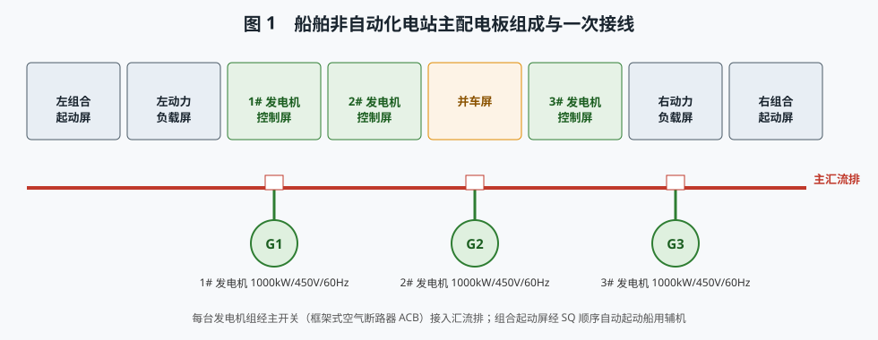
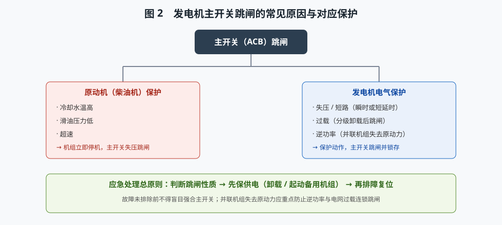
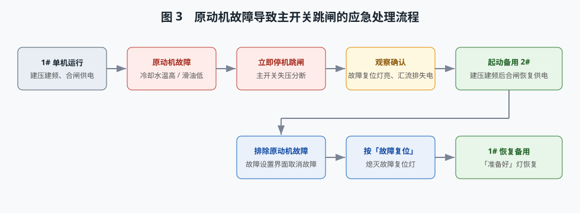
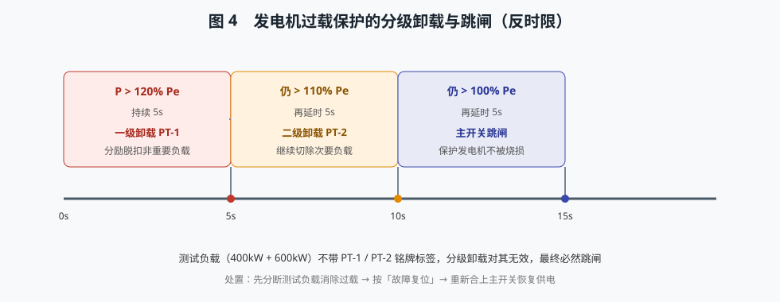
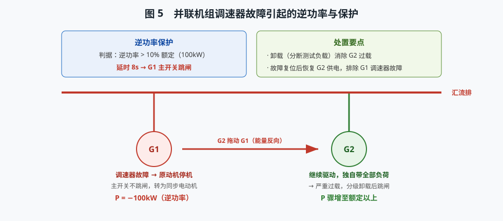
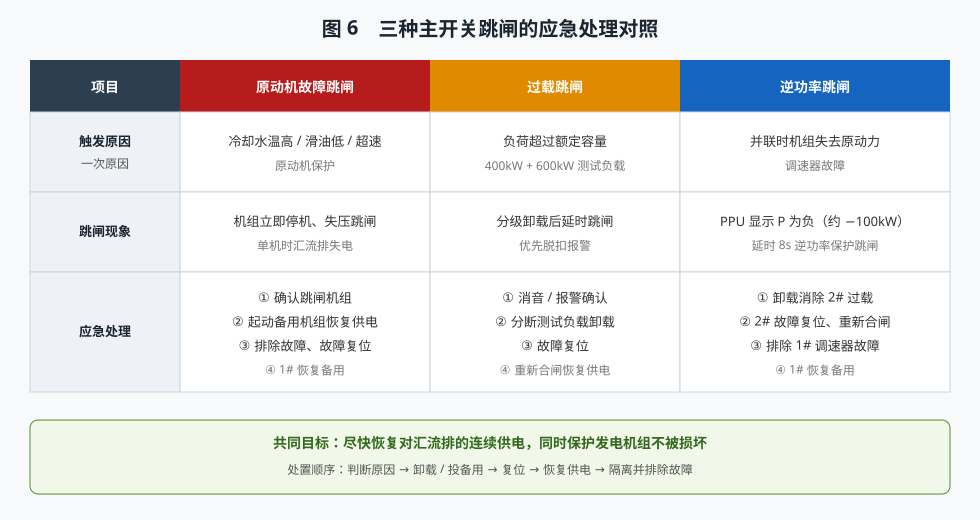

# 非自动化电站主开关跳闸的应急处理

> 本文结合低压配电板仿真，讲解船舶**非自动化电站**（无自动并车/自动换机的电站）中，发电机主开关（ACB）跳闸的常见原因、保护原理与应急处理方法，并给出三套可演示、可演练的操作流程：**原动机故障、过载、逆功率**。文中配图与仿真操作一一对应，可作为实验预习、操作指导与复习资料。

---

## 一、系统组成

主配电板由八面屏组成：左组合起动屏、左动力负载屏、1#/2#/3# 发电机控制屏、并车屏、右动力负载屏、右组合起动屏。每台主发电机额定 **1000kW / 450V / 60Hz**，经各自的**主开关（框架式空气断路器 ACB）**接入主汇流排；组合起动屏经 SQ 顺序自动起动燃油泵、滑油泵、淡水泵、海水泵等船用辅机。

非自动化电站的特点：**起动、并车、合分闸、故障处理主要依靠人工操作**，因此对值班人员的判断与应急能力要求更高。

---

## 二、主开关跳闸的原因与保护

主开关跳闸分为两大类：

1. **原动机（柴油机）保护**：冷却水温高、滑油压力低、超速等原动机故障时，机组**立即停机**，发电机失压，主开关随之跳闸。
2. **发电机电气保护**：失压、短路、**过载**、**逆功率**等保护动作使主开关跳闸。其中过载为**分级卸载后跳闸**，逆功率见于**并联机组失去原动力**。

保护动作后，控制屏「故障复位」灯亮，跳闸状态锁存，必须排除故障并按下「故障复位」才能重新投入。

**应急处理总原则**：先判断跳闸性质，再优先保障供电（卸载或起动备用机组），最后隔离并排除故障。**故障未排除前，严禁盲目强合主开关**。

---

## 三、流程一：原动机故障导致主开关跳闸

**现象**：单机运行时原动机故障 → 机组停机、主开关跳闸、汇流排失电、故障复位灯亮。

**处理步骤**：

1. 观察并确认跳闸现象与跳闸机组（故障复位灯亮、频率/功率归零）。
2. 手动起动**备用发电机组**（如 2#），建压建频（约 5s，450V/60Hz）后合上其主开关，**恢复汇流排供电**。
3. 在「故障设置」界面排除原动机故障，再按「故障复位」熄灭故障灯。
4. 确认「准备好」灯恢复，故障机组重新处于备用待命状态。

> 要点：先把电送出去，再处理故障机组；若备用机组容量不足，应优先保证重要负载。

---

## 四、流程二：发电机过载导致主开关跳闸

**现象**：单机运行、负荷稳定后投入 **400kW + 600kW 测试负载**，单机负荷超过额定（约 146%），过载保护启动。

**分级卸载原理（反时限）**：P > 120% 额定延时 5s → **一级卸载 PT-1**；仍 > 110% 延时 5s → **二级卸载 PT-2**；仍 > 100% 延时 5s → **主开关跳闸**。测试负载不带 PT-1/PT-2 铭牌标签，卸载对其无效，最终必然跳闸。

**处理步骤**：

1. 观察过载分级卸载与跳闸、优先脱扣报警灯闪亮。
2. 点击声光报警器「消音」「报警确认」。
3. **分断两台测试负载卸载**，消除过载原因。
4. 按「故障复位」，重新合上主开关恢复供电。

> 要点：不卸载就重新合闸，会再次过载跳闸；跳闸不等于发电机损坏，无需更换机组。

---

## 五、流程三：发电机逆功率跳闸

**现象**：1#、2# 并车并均分负荷后，投入 400kW + 600kW 测试负载；设置 **1# 调速器故障**，1# 原动机失去动力停机，但**主开关不跳闸**——1# 变成**同步电动机**，从电网吸收约 **100kW 逆功率（P 显示为负）**。逆功率保护延时 **8s** 后使 1# 主开关跳闸。

1# 跳闸后，全部负荷转移到 2#，2# 严重过载，经分级卸载后也跳闸。

**处理步骤**：

1. 观察 1# P 变为约 −100kW，逆功率保护 8s 后跳闸。
2. 观察 2# 过载分级卸载后跳闸、优先脱扣报警。
3. 报警消音、确认。
4. **卸载**（分断测试负载）消除 2# 过载，按 2#「故障复位」并重新合闸，**恢复 2# 供电**。
5. 在「故障设置」界面排除 1# 调速器故障，按「故障复位」，1# 恢复备用。

> 要点：并联机组失去原动力时，若主开关仍合闸，将由发电机变为电动机。逆功率保护正是为防止机组长时间作电动机运行而损坏原动机。

---

## 六、三套流程对照与仿真操作

在仿真平台顶部下拉框选择对应项目，即可用「自动演示 / 单步演示 / 演练 / 评估」四种模式学习。自动演示中，箭头会依次指向被操作的按钮、开关与仪表；演练与评估模式则依据 `check()` 判定每步是否完成。故障设置一律通过工具栏「故障设置」界面进行。

---

## 七、小结

| 跳闸类型 | 关键保护 | 处置要点 |
|---|---|---|
| 原动机故障 | 原动机保护（立即停机） | 起动备用机组恢复供电 → 排障 → 复位 |
| 过载 | 过载分级卸载（5s/级） | 卸载 → 复位 → 重新合闸 |
| 逆功率 | 逆功率保护（延时 8s） | 卸载保 2# → 恢复 2# 供电 → 排除 1# 故障 |

三种跳闸的**共同目标**都是：**尽快恢复对汇流排的连续供电，同时保护发电机组不被损坏**。掌握保护原理、遵循「先保供电、后除故障」的顺序，是应急处理的核心。
