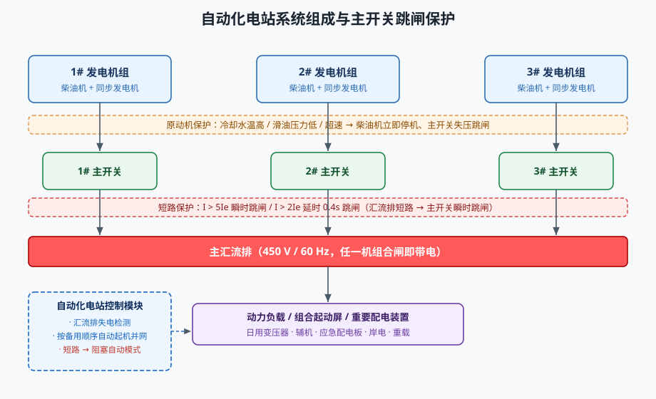
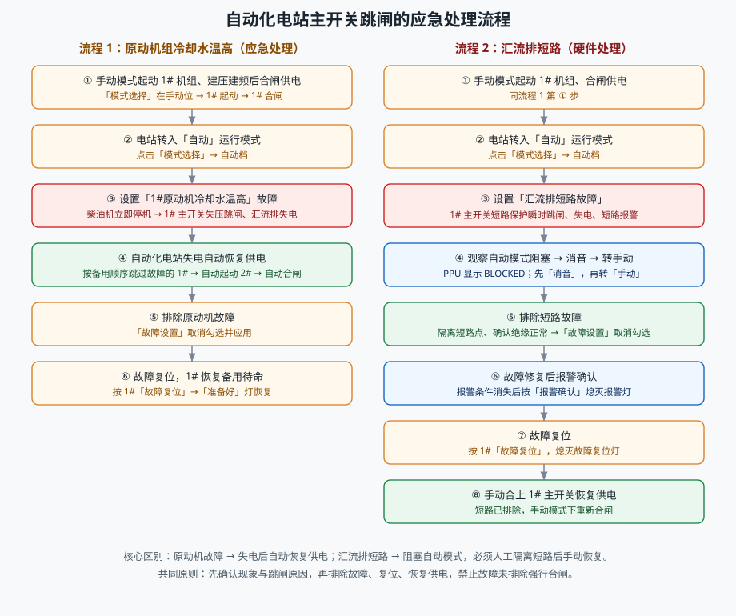

# 自动化电站主开关跳闸的应急处理

## 一、实训目的

本实训以船舶自动化电站为对象，通过仿真操作掌握：

1. 主配电板（低压配电板）的组成与操作；
2. 原动机保护、短路保护导致主开关跳闸的机理；
3. 自动化电站在失电后的自动恢复过程；
4. 主开关跳闸后的应急处理与硬件处理规范流程。

## 二、系统组成

低压配电板由 8 个屏组成：左组合起动屏、左动力负载屏、1#/2#/3# 发电机控制屏、并车屏、右动力负载屏、右组合起动屏。

- **发电机控制屏**：机组「起动 / 停止」「合闸 / 分闸」「故障复位」「自动同步 / 自动解列」按钮，PPU 液晶屏（电压 / 频率 / 电流 / 功率），以及运行、合闸、分闸、准备好指示灯。
- **并车屏**：「模式选择」开关（手动 / 半自动 / 自动）、「备用顺序」开关（123 / 231 / 312）、「同步选择」开关、同步表、三台机组调速开关，以及声光报警器（试灯 / 消音 / 报警确认）与地气灯。
- **主汇流排**贯穿全宽，任一机组主开关合闸即带电（红色），失电为蓝色。
- 其他：船舶低压电力系统单线图、重要配电装置（应急发电机机旁控制箱、应急配电板、岸电箱、重载问询、应急风油切断）。

## 三、主开关跳闸的典型原因与保护原理

**（1）原动机保护动作跳闸。** 柴油机冷却水温高、滑油压力低或超速时，原动机保护立即使机组停机；发电机失压，主开关失压分闸，同时点亮「故障复位」灯。此时机组已退出运行，属"先停机、后跳闸"。

**（2）短路保护动作跳闸。** 汇流排短路时短路电流巨大，主开关短路保护瞬时跳闸（I > 5Ie 瞬时、I > 2Ie 延时 0.4 s），切断短路点以保护发电机与人身安全。

其他保护还有：失压保护（U < 40%Ue 瞬时、< 70%Ue 延时 3 s）、过载分级卸载、逆功率保护。

**自动化电站的行为**：

- 运行模式为「自动」且检测到汇流排失电时，按备用顺序自动起动可用机组、建压后自动合闸恢复供电，故障机组被自动跳过；
- 检测到短路时立即**阻塞**自动模式（PPU 显示 BLOCKED），不自动起机、不自动合闸，防止对短路点反复送电。

## 四、操作流程 1：原动机组冷却水温高的应急处理

1. **正常运行准备（手动模式）**：确认「模式选择」在手动位，按 1#「起动」按钮，建压建频后按 1#「合闸」，由 1# 单机供电。
2. **转入自动模式**：点击「模式选择」开关到自动位。
3. **设置故障**：打开「故障设置」勾选「1#原动机冷却水温高」并应用 → 1# 柴油机立即停机、1# 主开关跳闸、汇流排失电。
4. **观察自动恢复**：自动电站检测失电，按备用顺序识别并跳过故障的 1#，自动起动 2# 机组，建压后自动合闸，恢复供电。
5. **排除故障**：取消勾选「1#原动机冷却水温高」并应用。
6. **故障复位**：按 1#「故障复位」，1# 恢复备用待命。

## 五、操作流程 2：汇流排短路的硬件处理

1. **正常运行准备（手动模式）**：同流程 1 第 1 步。
2. **转入自动模式**。
3. **设置故障**：勾选「汇流排短路故障」并应用 → 1# 主开关短路保护瞬时跳闸、汇流排失电、短路报警。
4. **消音并转手动**：观察 PPU 显示 BLOCKED（自动模式阻塞），**先按「消音」**，再将「模式选择」**转回手动**。
5. **排除短路**：取消勾选「汇流排短路故障」并应用，确认汇流排绝缘正常。
6. **报警确认**：故障修复、报警条件消失后，按「报警确认」熄灭报警灯。
7. **故障复位**：按 1#「故障复位」。
8. **恢复供电**：手动重新合上 1# 主开关。

要点：短路未排除前，自动模式保持阻塞；强行合闸会再次对短路点送电、扩大故障，必须遵循"选择性保护 + 人工确认"。

## 六、报警处理与故障复位

- **消音**：蜂鸣器停响，报警灯由闪烁转常亮。
- **报警确认**：仅当所有报警条件均已消失后才可确认，熄灭报警灯；报警未消失时不能确认。
- **故障复位**：故障排除后按下，熄灭「故障复位」灯，机组重新具备投入（备用）条件。

## 七、仿真操作与教学模式

工具栏提供：自动接线、起动系统、故障设置、重置系统、任务选择、自动演示 / 单步演示 / 演练 / 评估、选择仪表，以及单线图 / 主配电板 / 其他配电装置的显示切换。

四种教学模式：

- **自动演示**：系统自动按流程演示，并用闪烁箭头指示每一步的操作部件；
- **单步演示**：点击下一步逐步演示；
- **演练**：学员按提示自行操作，系统检测是否完成；
- **评估**：隐藏未执行步骤，用于考核。

## 八、思考题

1. 原动机冷却水温高时，主开关为什么会跳闸？自动化电站如何恢复供电？
2. 汇流排短路时，自动电站为什么阻塞自动模式而不自动恢复？正确的处理步骤是什么？
3. 「故障复位」与「报警确认」有何区别？为什么短路故障要先排除、再确认？
