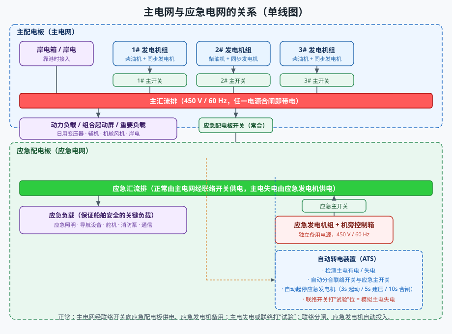
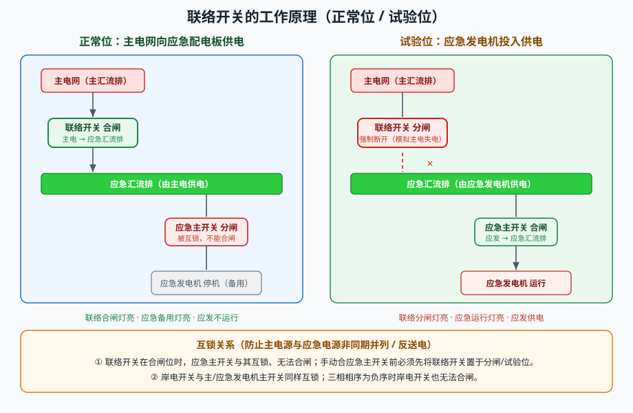
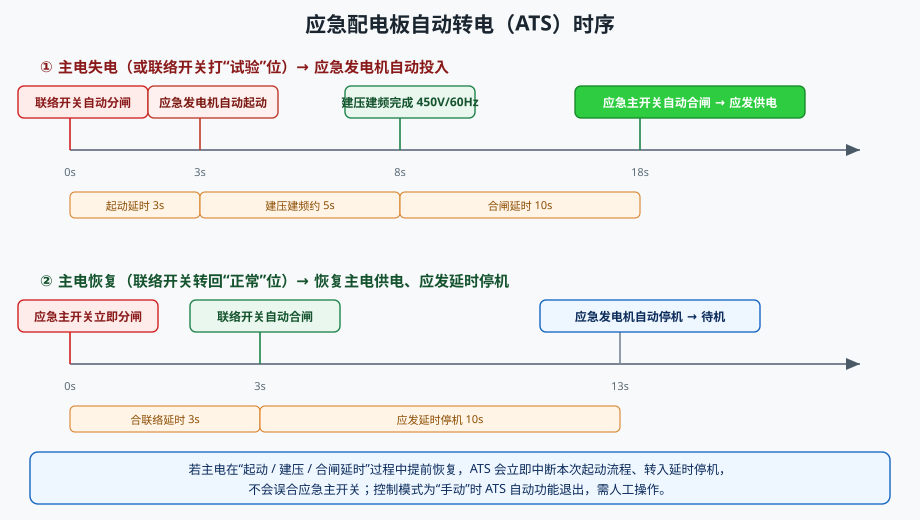
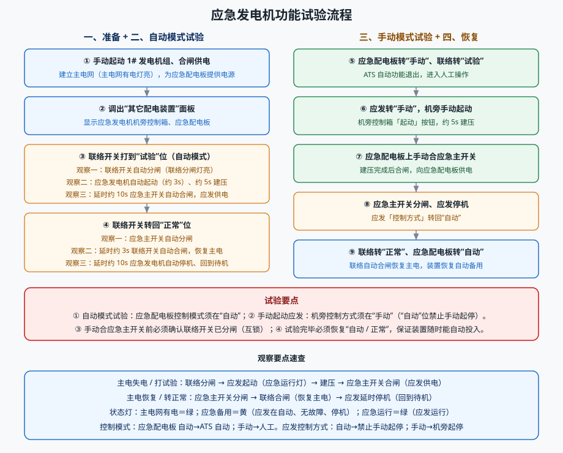

# 船舶应急配电板的功能测试

> 适用对象：船舶低压电力系统 / 应急配电板与应急发电机
> 配套仿真平台（本工程）含自动演示流程「1. 应急配电板的功能测试」，本文所述操作均可在软件中逐一演示。
> 本文重点：**主电网与应急电网的关系、联络开关的工作原理、应急发电机的试验方法**。

---

## 一、概述

应急配电板是船舶安全的重要保证。船舶正常航行时由主电网向全船供电；一旦主电网失电，应急配电板必须在无人干预下自动切换到应急发电机，向应急照明、导航设备、舵机、消防泵、通信等**保证船舶安全的关键负载**供电。因此，应急配电板的核心就是"**主电网与应急电网的可靠切换**"，其切换由**联络开关**和**自动转电装置（ATS）**完成。

本实验的目标是：**① 看懂主电网与应急电网的关系 → ② 理解联络开关的分合与互锁 → ③ 掌握应急发电机自动 / 手动两种试验方法**。

---

## 二、主电网与应急电网的关系

### 2.1 主电网（主配电板）

- **电源**：1# / 2# / 3# 主发电机组（柴油机 + 同步发电机，450 V / 60 Hz），靠港时还可由**岸电**供电；
- **主汇流排**：任一主发电机运行且其主开关合闸，或岸电开关合闸，主汇流排即带电；
- **供电对象**：全船动力负载、组合起动屏、日用负载，以及**经联络开关送出的应急配电板**。

### 2.2 应急电网（应急配电板）

- **电源**：应急发电机组（独立于主发电机的后备电源），经**应急主开关**接入应急汇流排；
- **应急汇流排**：向应急负载供电；
- **机旁控制箱**：设有控制方式（手动 / 自动）、起动 / 停止按钮和调频旋钮。

### 2.3 两者的关系

| 工况 | 联络开关 | 应急主开关 | 应急发电机 | 应急汇流排由谁供电 |
|------|---------|-----------|-----------|------------------|
| 主电正常 | 合闸 | 分闸 | 停机（备用） | 主电网（经联络开关） |
| 主电失电 / 打试验 | 分闸 | 合闸 | 运行 | 应急发电机 |
| 主电恢复 | 先分后合 | 分闸 | 延时停机 | 主电网（经联络开关） |

> **要点**：主电网与应急电网**不能长期并列运行**。应急电源只作后备，靠联络开关与应急主开关的互锁，保证任一时刻只有一路电源供应急汇流排，防止非同期并列和应急电源向主电网反送电。

---

## 三、联络开关的工作原理

联络开关是连接主汇流排与应急汇流排的"咽喉"，安装在应急配电板上，有**正常位**与**试验位**两个操作位置，并配有一对"联络合闸 / 联络分闸"指示灯。

### 3.1 两个位置的含义

- **正常位**：联络开关接受 ATS 自动控制。主电有电→合闸，由主电网向应急配电板供电；主电失电→分闸，为应急发电机投入让路。
- **试验位**：**强制**把联络开关断开，等效于"**模拟主电网失电**"。它用于在不影响主电网的前提下，检验应急电源能否自动投入——这是应急配电板功能试验的关键操作。

### 3.2 自动转电（ATS）逻辑

- **失电转电**（主电失电或联络打"试验"）：联络开关自动分闸 → 延时 **3 s** 起动应急发电机 → 约 **5 s** 建压建频（450 V / 60 Hz）→ 延时 **10 s** 合应急主开关 → 应急电网供电。全过程无需人工干预。
- **主电恢复**（联络转回"正常"）：应急主开关**立即**（失压）分闸 → 延时 **3 s** 合联络开关恢复主电供电 → 延时 **10 s** 应急发电机自动停机、回到待机。
- **中途恢复**：若主电在"起动 / 建压 / 合闸延时"过程中提前恢复，ATS 会**立即中断**本次起动流程并转入延时停机，绝不误合应急主开关。

### 3.3 互锁关系

- 联络开关在**合闸位**时，应急主开关与其互锁、**无法合闸**；因此手动合应急主开关前，必须先把联络开关置于分闸 / 试验位；
- 岸电开关与主 / 应急发电机主开关同样互锁；岸电相序为负序时岸电开关也无法合闸。

---

## 四、应急发电机的试验方法

试验分"**自动模式功能试验**"和"**手动模式功能试验**"两部分，操作与观察步骤如下：

### 4.1 准备

1. **手动起动 1# 发电机组**，建压建频后合上 1# 主开关，建立主电网（应急配电板"主电网有电"灯亮）；
2. 调出"其它配电装置"面板，显示应急发电机机旁控制箱与应急配电板。

### 4.2 自动模式功能试验

3. 将联络开关由"正常"打到"**试验**"位，依次观察：
   - 联络开关**自动分闸**（联络分闸灯亮）；
   - 应急发电机**自动起动**（应急运行灯亮），约 5 s 建压；
   - 延时约 10 s，**应急主开关自动合闸**，应急配电板转为应发供电。
4. 将联络开关转回"**正常**"位，依次观察：
   - 应急主开关**自动分闸**；
   - 延时约 3 s，**联络开关自动合闸**，恢复主电供电；
   - 延时约 10 s，**应急发电机自动停机**，回到待机。

### 4.3 手动模式功能试验

5. 将应急配电板"控制模式"转到"**手动**"，联络开关转到"**试验**"位（ATS 自动功能退出）；
6. 将应急发电机机旁"控制方式"转到"**手动**"，按机旁"起动"按钮**手动起动**应急发电机；
7. 待建压建频（450 V / 60 Hz）后，在应急配电板上**手动合上应急主开关**，向应急配电板供电；
8. 按下应急主开关"分闸"，再按机旁"停止"按钮使应急发电机**停机**，并将应发"控制方式"转回"**自动**"。

### 4.4 恢复

9. 将联络开关转回"**正常**"位，再将应急配电板"控制模式"转回"**自动**"，联络开关自动合闸恢复主电供电、应急发电机恢复自动备用。

### 4.5 试验注意事项

- 自动模式试验：应急配电板控制模式须在"**自动**"，否则 ATS 不动作；
- 手动起停应发：机旁控制方式须在"**手动**"，"自动"位禁止手动起停；
- 手动合应急主开关前须确认联络开关已分闸（**互锁**）；
- 试验完毕必须恢复"**自动 / 正常**"，保证装置随时能自动投入。

---

## 五、常见现象与判别

| 现象 | 原因 | 处理 |
|------|------|------|
| 打"试验"位后应发不自动起动 | 控制模式或应发控制方式在"手动" | 转回"自动"后再试 |
| 应急主开关无法合闸 | 联络开关仍在合闸位（互锁） | 先将联络开关打到"试验"/分闸位 |
| 应发已运行但合闸灯不亮 | 尚未建压建频完成 | 等待约 5 s 至 450 V / 60 Hz |
| 手动按"起动"无反应 | 控制方式在"自动" | 转到"手动"位 |

---

## 六、思考与练习

1. 为什么主电网与应急电网之间必须设置互锁，而不允许长期并列运行？
2. 联络开关"试验"位与"正常位 + 主电真正失电"两种情况下，应急配电板的动作有何异同？
3. 若主电在应急发电机"建压"过程中恢复，应急配电板会怎样动作？
4. 应急发电机自动停机为什么设约 10 s 延时？若过短会有什么问题？

---

*本文档依据本工程仿真平台的自动演示流程「应急配电板的功能测试」编写，与软件中的操作步骤一一对应，可作为应急配电板与应急发电机实训的参考资料。*
