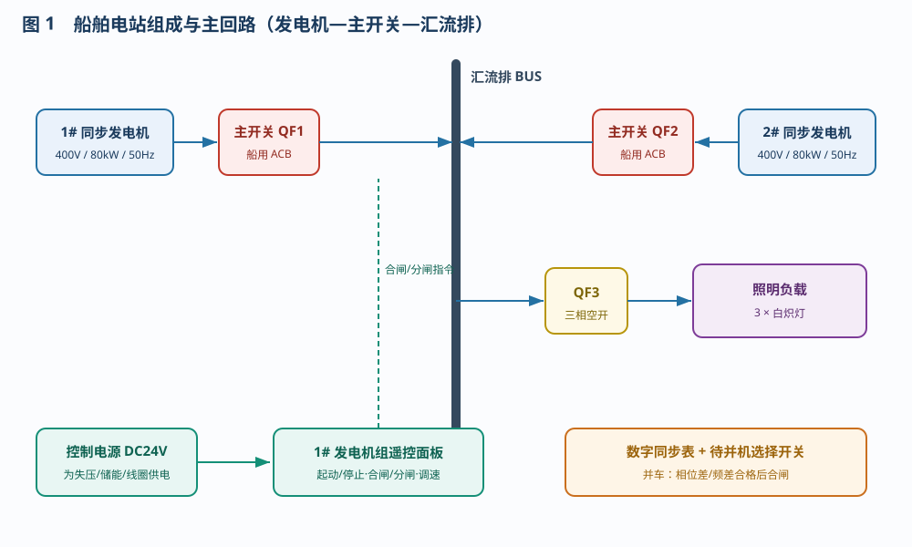
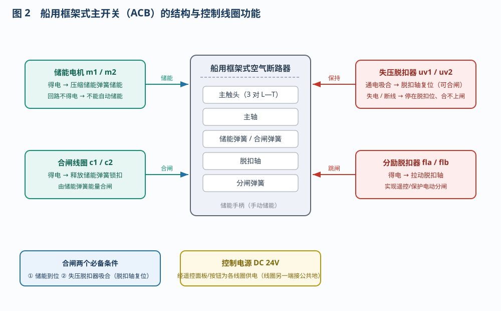
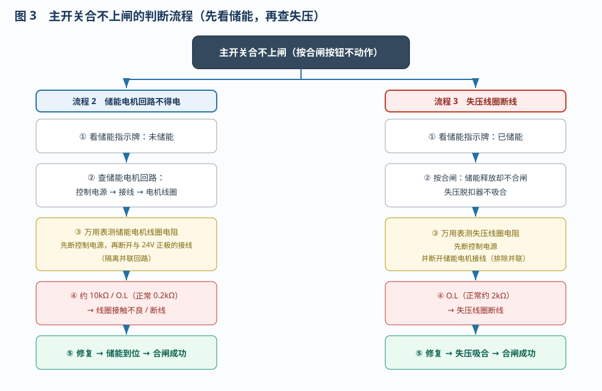

# 发电机主开关的故障判断及处理

> 适用对象：船舶电气 / 轮机专业。配套本仿真平台的六条自动演示流程。
> 六条流程：① 主开关储能、合闸、分闸；② 合不上闸的判断（储能电机回路不得电）；③ 合不上闸的判断（失压线圈断线）；④ 冷却水温高导致主开关跳闸的应急处理；⑤ 过载故障导致主开关跳闸的应急处理；⑥ 短路故障导致主开关跳闸的应急处理。

---

## 一、实验目的

1. 认识船舶电站的组成：同步发电机 → 主开关（船用框架式空气断路器）→ 汇流排 → 负载；
2. 掌握主开关的储能、合闸、分闸操作，理解储能电机、合闸线圈、失压脱扣器、分励脱扣器的作用；
3. 掌握"合不上闸"两种典型原因（储能电机回路不得电、失压线圈断线）的判断方法；
4. 掌握主开关跳闸（冷却水温高、过载、短路）的应急处理原则。

## 二、系统组成与主回路

本站为两机并联船舶电站：两台同步发电机（400V / 80kW / 50Hz）各经一台主开关接入汇流排，汇流排再经 QF3 输出照明负载。1#、2# 机组各配一台遥控面板（起动/停止、合闸/分闸、调速），数字同步表与待并机选择开关用于并车。控制电源 DC24V 为主开关的各控制线圈供电。

## 三、主开关的结构与控制线圈

船用框架式空气断路器（ACB）由储能弹簧、主轴、三对主触头、脱扣轴、分闸弹簧及控制线圈组成。四个控制线圈的作用见表 1。

**表 1　控制线圈及其作用**

| 线圈 | 端子 | 作用 |
|------|------|------|
| 储能电机 | m1 / m2 | 得电压缩储能弹簧储能；回路不得电则不能自动储能 |
| 合闸线圈 | c1 / c2 | 得电释放储能弹簧锁扣，由弹簧能量合闸 |
| 失压脱扣器 | uv1 / uv2 | 通电吸合使脱扣轴复位（允许合闸）；失电或断线则停在脱扣位、合不上闸 |
| 分励脱扣器 | fla / flb | 得电拉动脱扣轴，实现遥控 / 保护电动分闸 |

> **合闸必备两个条件：① 储能到位；② 失压脱扣器吸合（脱扣轴复位）。缺一即合不上闸。**

## 四、操作流程 1：储能、合闸、分闸

1. **手动储能**：连续按压主开关"储能手柄"5 次，储能指示牌由"未储能"变为"已储能"；
2. **电动储能**：点击"自动接线"接通控制电源与各线圈回路，储能电机得电自动储能到位；
3. **遥控合闸**：按住 1# 遥控面板"合闸"按钮，合闸线圈得电释放储能弹簧锁扣，主开关合闸向汇流排供电；
4. **遥控分闸**：按住"分闸"按钮，分励脱扣线圈得电拉动脱扣轴分闸；
5. **手动合闸 / 分闸**：按主开关本体的"手动合闸 / 手动分闸"按钮，作为备用操作方式。

工具栏常用按钮：**自动接线**（一键接好全船线路）、**起动系统**（起动发电机组）、**故障设置**（选择并应用故障场景）、**重置系统**；下拉框选择操作项目后，用**自动演示 / 单步演示 / 演练 / 评估**四种模式学习。

## 五、故障设置

在工具栏【故障设置】中勾选并应用，即可注入下列故障：

| 故障 | 现象 |
|------|------|
| 储能电机线圈接触不良 | 电机电流不足、不能自动储能 → 合不上闸（手动储能仍可） |
| 失压线圈断线 | 失压脱扣器不吸合 → 合不上闸 / 失压跳闸 |
| 1#机冷却水温高 | 单机运行时原动机保护停机、母线失压；并机运行时逆功率 |
| 1#机欠压故障 | 调压器（AVR）故障，输出电压跌至约 200V，欠压保护延时约 2s 跳闸 |
| 汇流排干线短路 | 短路保护瞬时动作，两台主开关跳闸、全船失电 |

## 六、合不上闸的判断（流程 2 / 3）

判断口诀：**先看储能、再查失压**。

- **储能指示牌显示"未储能"** → 储能电机回路不得电（流程 2）。检查控制电源与接线，再用万用表测量**储能电机线圈**电阻：测量前先切断控制电源、再断开线圈与 24V 正极的接线（隔离并联回路）。正常约 0.2kΩ；接触不良约 10kΩ（2kΩ 档显示 O.L），断线为 O.L。
- **储能指示牌显示"已储能"**，但按下合闸时储能释放却不合闸、且失压脱扣器不吸合 → 失压线圈断线（流程 3）。用万用表测量**失压线圈**电阻（测量前先断开储能电机接线，排除并联影响）：正常约 2kΩ，断线为 O.L。

查明原因并修复（更换线圈 / 恢复接线）后，储能到位，即可正常合闸。

## 七、主开关跳闸的应急处理（流程 4 / 5 / 6）

跳闸后先判明原因，再按不同原因处理，见表 2。

**表 2　三种跳闸故障的现象与处理**

| 流程 | 原因 | 现象 | 处理 |
|------|------|------|------|
| 4 | 冷却水温高 | 原动机保护停机、母线失压、失压跳闸、全船失电 | 先起动备用机组恢复供电、投入重要负载；查明并排除冷却水温高的原因后重新并车 |
| 5 | 过载 | 发电机仍在运行，负载随主开关跳闸而断开 | 减小 / 切除部分负载后，直接合闸恢复供电 |
| 6 | 汇流排短路 | 短路电流大，两台主开关瞬时跳闸 | 查明并隔离短路点、确认绝缘合格后方可合闸，严禁强行合闸 |

共同原则：**先恢复供电、后查排故障**；处理前先判明是"原动机 / 发电机故障"还是"电网故障"。

## 八、通用判断方法要点

1. **先看指示、先判现象，再动手测量**，避免盲目拆线；
2. 测电阻、拆接线一律**先断电**，严禁带电操作；
3. 线圈与其它回路**并联**时（储能电机与失压线圈共用 24V 正极与接地），测量前须断开相应接线，才能测到真实阻值；
4. 合不上闸先查"储能 → 合闸线圈 / 脱扣回路"；跳闸先分"原动机故障"与"电网故障"。

## 九、思考与练习

1. 主开关合闸必须同时满足哪两个条件？缺一会出现什么现象？
2. 储能指示牌显示未储能、主开关合不上闸，应如何判断与排除？
3. 测量储能电机线圈电阻前，为什么要断开它与 24V 正极的接线？
4. 冷却水温高、过载、短路三种跳闸，在现象与处理上有哪些异同？

---

*本文档依据本工程仿真平台的六条操作流程编写，与自动演示一一对应，可作为船用发电机主开关（ACB）操作与故障判断的实训参考资料。*
